服务熔断http://config-3344.com:3344/config-test.yml

# SpringCloud

## 1.认识微服务

随着互联网行业的发展，对服务的要求也越来越高，服务架构也从单体架构逐渐演变为现在流行的微服务架构。这些架构之间有怎样的差别呢？

### 1.0.学习目标

了解微服务架构的优缺点


### 1.1.单体架构

**单体架构**：将业务的所有功能集中在一个项目中开发，打成一个包部署。


单体架构的优缺点如下：

**优点：**

- 架构简单
- 部署成本低

**缺点：**

- 耦合度高（维护困难、升级困难）


### 1.2.分布式架构

**分布式架构**：根据业务功能对系统做拆分，每个业务功能模块作为独立项目开发，称为一个服务。


分布式架构的优缺点：

**优点：**

- 降低服务耦合
- 有利于服务升级和拓展

**缺点：**

- 服务调用关系错综复杂


分布式架构虽然降低了服务耦合，但是服务拆分时也有很多问题需要思考：

- 服务拆分的粒度如何界定？
- 服务之间如何调用？
- 服务的调用关系如何管理？

人们需要制定一套行之有效的标准来约束分布式架构。


### 1.3.微服务

微服务的架构特征：

- 单一职责：微服务拆分粒度更小，每一个服务都对应唯一的业务能力，做到单一职责
- 自治：团队独立、技术独立、数据独立，独立部署和交付
- 面向服务：服务提供统一标准的接口，与语言和技术无关
- 隔离性强：服务调用做好隔离、容错、降级，避免出现级联问题


微服务的上述特性其实是在给分布式架构制定一个标准，进一步降低服务之间的耦合度，提供服务的独立性和灵活性。做到高内聚，低耦合。

因此，可以认为**微服务**是一种经过良好架构设计的**分布式架构方案** 。

但方案该怎么落地？选用什么样的技术栈？全球的互联网公司都在积极尝试自己的微服务落地方案。

其中在Java领域最引人注目的就是SpringCloud提供的方案了。

### 1.4.SpringCloud

SpringCloud是目前国内使用最广泛的微服务框架。官网地址：https://spring.io/projects/spring-cloud。

SpringCloud集成了各种微服务功能组件，并基于SpringBoot实现了这些组件的自动装配，从而提供了良好的开箱即用体验。

其中常见的组件包括：


另外，SpringCloud底层是依赖于SpringBoot的，并且有版本的兼容关系，如下：


我们课堂学习的版本是 Hoxton.SR10，因此对应的SpringBoot版本是2.3.x版本。


### 1.5.总结

- 单体架构：简单方便，高度耦合，扩展性差，适合小型项目。例如：学生管理系统

- 分布式架构：松耦合，扩展性好，但架构复杂，难度大。适合大型互联网项目，例如：京东、淘宝

- 微服务：一种良好的分布式架构方案

  ①优点：拆分粒度更小、服务更独立、耦合度更低

  ②缺点：架构非常复杂，运维、监控、部署难度提高

- SpringCloud是微服务架构的一站式解决方案，集成了各种优秀微服务功能组件


### 1.6.服务拆分和远程调用

任何分布式架构都离不开服务的拆分，微服务也是一样。

服务拆分原则

这里我总结了微服务拆分时的几个原则：

- 不同微服务，不要重复开发相同业务
- 微服务数据独立，不要访问其它微服务的数据库
- 微服务可以将自己的业务暴露为接口，供其它微服务调用


2.2.服务拆分示例

其结构如下：


约定>配置>编码

## 2. 微服务架构编码构建

### IDEA新建project工作空间

总父工程——POM——project——module

#### 微服务cloud整体聚合父工程Project

##### 父工程步骤

###### 1.New Project


###### 2.聚合总工程名字


###### 3.Maven选版本


###### 4.工程名字


###### 5.字符编码


###### 6.注解生效激活


###### 7.java编译版本选8


###### 8.File Type过滤


父工程目录


##### 父工程POM

```xml
 <!-- 统一管理jar包版本 -->
  <properties>
    <project.build.sourceEncoding>UTF-8</project.build.sourceEncoding>
    <maven.compiler.source>1.8</maven.compiler.source>
    <maven.compiler.target>1.8</maven.compiler.target>
    <junit.version>4.12</junit.version>
    <log4j.version>1.2.17</log4j.version>
    <lombok.version>1.18.22</lombok.version>
    <mysql.version>5.1.47</mysql.version>
    <druid.version>1.2.8</druid.version>
    <mybatis.spring.boot.version>2.2.2</mybatis.spring.boot.version>
  </properties>

  <!-- 子模块继承之后，提供作用：锁定版本+子modlue不用写groupId和version  -->
  <dependencyManagement>
    <dependencies>
      <!--spring boot 2.2.2-->
      <dependency>
        <groupId>org.springframework.boot</groupId>
        <artifactId>spring-boot-dependencies</artifactId>
        <version>2.2.2.RELEASE</version>
        <type>pom</type>
        <scope>import</scope>
      </dependency>
      <!--spring cloud Hoxton.SR1-->
      <dependency>
        <groupId>org.springframework.cloud</groupId>
        <artifactId>spring-cloud-dependencies</artifactId>
        <version>Hoxton.SR1</version>
        <type>pom</type>
        <scope>import</scope>
      </dependency>
      <!--spring cloud alibaba 2.1.0.RELEASE-->
      <dependency>
        <groupId>com.alibaba.cloud</groupId>
        <artifactId>spring-cloud-alibaba-dependencies</artifactId>
        <version>2.1.0.RELEASE</version>
        <type>pom</type>
        <scope>import</scope>
      </dependency>

      <dependency>
        <groupId>mysql</groupId>
        <artifactId>mysql-connector-java</artifactId>
        <version>${mysql.version}</version>
      </dependency>
      <dependency>
        <groupId>com.alibaba</groupId>
        <artifactId>druid</artifactId>
        <version>${druid.version}</version>
      </dependency>
      <dependency>
        <groupId>org.mybatis.spring.boot</groupId>
        <artifactId>mybatis-spring-boot-starter</artifactId>
        <version>${mybatis.spring.boot.version}</version>
      </dependency>
      <dependency>
        <groupId>junit</groupId>
        <artifactId>junit</artifactId>
        <version>${junit.version}</version>
      </dependency>
      <dependency>
        <groupId>log4j</groupId>
        <artifactId>log4j</artifactId>
        <version>${log4j.version}</version>
      </dependency>
      <dependency>
        <groupId>org.projectlombok</groupId>
        <artifactId>lombok</artifactId>
        <version>${lombok.version}</version>
        <optional>true</optional>
      </dependency>
    </dependencies>
  </dependencyManagement>

  <build>
    <plugins>
      <plugin>
        <groupId>org.springframework.boot</groupId>
        <artifactId>spring-boot-maven-plugin</artifactId>
        <configuration>
          <fork>true</fork>
          <addResources>true</addResources>
        </configuration>
      </plugin>
    </plugins>
  </build>

</project>
 

```


Maven中的 dependencyManagement 和 dependencies


跳过单元测试


父工程创建完成执行mvn:install将父工程发布到仓库方便子工程继承


------

### Rest微服务工程构建

支付模块构建


#### 构建步骤

##### 1.cloud-provider-payment8001微服务提供者支付Module模块

###### 建cloud-provider-payment8001


###### 改POM文件

```xml
<dependencies>
        <!-- https://mvnrepository.com/artifact/org.springframework.boot/spring-boot-starter-web -->
        <dependency>
            <groupId>org.springframework.boot</groupId>
            <artifactId>spring-boot-starter-web</artifactId>
        </dependency>

        <!-- https://mvnrepository.com/artifact/org.springframework.boot/spring-boot-starter-web -->
        <dependency>
            <groupId>org.springframework.boot</groupId>
            <artifactId>spring-boot-starter-actuator</artifactId>
        </dependency>

        <!-- https://mvnrepository.com/artifact/org.springframework.boot/spring-boot-starter-web -->
        <dependency>
            <groupId>org.mybatis.spring.boot</groupId>
            <artifactId>mybatis-spring-boot-starter</artifactId>
        </dependency>

        <!-- https://mvnrepository.com/artifact/com.alibaba/druid -->
        <dependency>
            <groupId>com.alibaba</groupId>
            <artifactId>druid-spring-boot-starter</artifactId>
            <version>1.2.8</version>
        </dependency>

        <!-- https://mvnrepository.com/artifact/mysql/mysql-connector-java -->
        <dependency>
            <groupId>mysql</groupId>
            <artifactId>mysql-connector-java</artifactId>
        </dependency>

        <!-- https://mvnrepository.com/artifact/org.springframework.boot/spring-boot-starter-jdbc -->
        <dependency>
            <groupId>org.springframework.boot</groupId>
            <artifactId>spring-boot-starter-jdbc</artifactId>
        </dependency>

        <!-- https://mvnrepository.com/artifact/org.springframework.boot/spring-boot-devtools -->
        <dependency>
            <groupId>org.springframework.boot</groupId>
            <artifactId>spring-boot-devtools</artifactId>
            <scope>runtime</scope>
            <optional>true</optional>
        </dependency>

        <!-- https://mvnrepository.com/artifact/org.projectlombok/lombok -->
        <dependency>
            <groupId>org.projectlombok</groupId>
            <artifactId>lombok</artifactId>
            <optional>true</optional>
        </dependency>

        <!-- https://mvnrepository.com/artifact/org.springframework.boot/spring-boot-starter-test -->
        <dependency>
            <groupId>org.springframework.boot</groupId>
            <artifactId>spring-boot-starter-test</artifactId>
            <scope>test</scope>
        </dependency>

    </dependencies>
```

###### 写YML

```properties
server:
  port: 8001  #服务端口号

spring:
  application:
    name: cloud-payment-service    #服务名称
  datasource:
    type: com.alibaba.druid.pool.DruidDataSource      #当前数据源操作类型
    driver-class-name: com.mysql.jdbc.Driver          #mysql驱动包
    url: jdbc:mysql://localhost:3306/db2019?useUnicode=true&characterEncoding=utf-8&useSSL=false
    username: root
    password: root

mybatis:
  mapperLocations: classpath:mapper/*.xml
  type-aliases-package: com.lxyk.springcloud.pojo    #所有别名类所在包
```

###### 主启动

```java
@SpringBootApplication
public class PaymentMain8001 {
    public static void main(String[] args) {
        SpringApplication.run(PaymentMain8001.class,args);
    }
}
```

###### 业务类

1，建表SLQ

```sql
DROP TABLE IF EXISTS `payment`;
CREATE TABLE `payment` (
  `id` bigint(20) NOT NULL AUTO_INCREMENT,
  `serial` varchar(200) DEFAULT NULL,
  PRIMARY KEY (`id`)
) ENGINE=InnoDB DEFAULT CHARSET=utf8;
```

2，pojo实体类

主实体Payment

```java
@Data
@AllArgsConstructor
@NoArgsConstructor
public class Payment implements Serializable {
    private Long id;
    private String serial;
}
```

Json封装体CommonResult

```java
//返回前端通用的json串
@Data
@AllArgsConstructor
@NoArgsConstructor
public class CommonResult <T>{

    private Integer code;     //编码
    private String message;   //信息提示
    private T data;           //泛型写什么就是什么

    public CommonResult(Integer code,String message){
        this(code,message,null);
    }
}
```

3，dao

接口PaymentDao

```java
@Mapper
public interface PaymentDao {
    public int create(Payment payment);  //写操作

    public Payment getPaymentById(@Param("id") Long id);   //读操作
}
```

PaymentMapper.xml

```xml
<?xml version="1.0" encoding="UTF-8"?>
<!DOCTYPE mapper PUBLIC "-//mybatis.org//DTD Mapper 3.0//EN" "http://mybatis.org/dtd/mybatis-3-mapper.dtd">
<mapper namespace="com.lxyk.springcloud.dao.PaymentDao">
    <!--有时候在开发中需要向表中插入自增ID，这个时候领域模型如果想要获取该ID的值，
    就需要在相应的mapper文件中添加useGeneratedKeys="true" keyProperty="id"-->
    <insert id="create" parameterType="Payment" useGeneratedKeys="true" keyProperty="id">
            insert into payment(serial) values(#{serial});
    </insert>

    <resultMap id="BaseResultMap" type="com.lxyk.springcloud.pojo.Payment">
        <id column="id" property="id" jdbcType="BIGINT"/>
        <id column="serial" property="serial" jdbcType="VARCHAR"/>
    </resultMap>
    <select id="getPaymentById"  parameterType="Long" resultMap="BaseResultMap">
            select * from payment where id=#{id}
    </select>
</mapper>
```

4，servcie

接口PaymentService

```java
public interface PaymentService {
    public int create(Payment payment);  //写操作

    public Payment getPaymentById(@Param("id") Long id);   //读操作
}
```

PaymentServiceImpl

```java
@Service
public class PaymentServiceImpl implements PaymentService {
    //@Autowired
    @Resource
    private PaymentDao paymentDao;

    @Override
    public int create(Payment payment) {
        return paymentDao.create(payment);
    }

    @Override
    public Payment getPaymentById(Long id) {
        return paymentDao.getPaymentById(id);
    }
}
```

5，controllerr

```java
@RestController
@Slf4j
public class PaymentController {
    //@Autowired
    @Resource
    private PaymentService paymentService;

    @PostMapping(value = "/payment/create")
    public CommonResult create(Payment payment){
        int result = paymentService.create(payment);
        log.info("********插入结果："+result);
        if (result > 0){
            return new CommonResult(200,"插入数据库成功",result);
        }else {
            return new CommonResult(444,"插入数据库失败",null);
        }
    }

    @GetMapping(value = "/payment/get/{id}")
    public CommonResult getPaymentById(@PathVariable("id") Long id){
        Payment payment = paymentService.getPaymentById(id);
        log.info("*******查询结果："+payment);
        if (payment != null){
            return new CommonResult(200,"查询数据库成功",payment);
        }else {
            return new CommonResult(444,"没有对应记录，查询ID"+id,null);
        }
    }
}
```

###### 测试

http://localhost:8001/payment/get/1


postman模拟post    （浏览器对post请求不好支持，我们用postman工具模拟）


------

##### 2.热部署Devtools

1，添加依赖

```xml
<!-- https://mvnrepository.com/artifact/org.springframework.boot/spring-boot-devtools -->
<dependency>
    <groupId>org.springframework.boot</groupId>
    <artifactId>spring-boot-devtools</artifactId>
   <scope>runtime</scope>
    <optional>true</optional>
</dependency>
```

2，在父工程添加插件

```xml
下一段配置黏贴到父工程当中的pom里
 
<build>
  <plugins>
    <plugin>
      <groupId>org.springframework.boot</groupId>
      <artifactId>spring-boot-maven-plugin</artifactId>
      <configuration>
        <fork>true</fork>
        <addResources>true</addResources>
      </configuration>
    </plugin>
  </plugins>
</build>
```

3，设置打开√上


4，快捷键


5.重启IDEA

------


##### 3.cloud-consumer-order80微服务消费者订单Module模块

###### 建cloud-consumer-order80


###### 改POM

```xml
 <dependencies>
        <!-- https://mvnrepository.com/artifact/org.springframework.boot/spring-boot-starter-web -->
        <dependency>
            <groupId>org.springframework.boot</groupId>
            <artifactId>spring-boot-starter-web</artifactId>
        </dependency>

        <!-- https://mvnrepository.com/artifact/org.springframework.boot/spring-boot-starter-web  -->
        <dependency>
            <groupId>org.springframework.boot</groupId>
            <artifactId>spring-boot-starter-actuator</artifactId>
        </dependency>

        <!-- https://mvnrepository.com/artifact/org.springframework.boot/spring-boot-devtools -->
        <dependency>
            <groupId>org.springframework.boot</groupId>
            <artifactId>spring-boot-devtools</artifactId>
            <scope>runtime</scope>
            <optional>true</optional>
        </dependency>

        <!-- https://mvnrepository.com/artifact/org.projectlombok/lombok -->
        <dependency>
            <groupId>org.projectlombok</groupId>
            <artifactId>lombok</artifactId>
            <optional>true</optional>
        </dependency>

        <!-- https://mvnrepository.com/artifact/org.springframework.boot/spring-boot-starter-test -->
        <dependency>
            <groupId>org.springframework.boot</groupId>
            <artifactId>spring-boot-starter-test</artifactId>
            <scope>test</scope>
        </dependency>
    </dependencies>

```

###### 写YML

```properties
server:
  port: 80
```

###### 主启动

```java
@SpringBootApplication
public class OrderMain80 {
    public static void main(String[] args) {
        SpringApplication.run(OrderMain80.class,args);
    }
}
```

###### 业务类


Payment实体类

```java
@Data
@AllArgsConstructor
@NoArgsConstructor
public class Payment implements Serializable {
    private Long id;
    private String serial;
}
```

CommonResult

```java
//返回前端通用的json串
@Data
@AllArgsConstructor
@NoArgsConstructor
public class CommonResult <T>{

    private Integer code;     //编码
    private String message;   //信息提示
    private T data;           //泛型写什么就是什么

    public CommonResult(Integer code,String message){
        this(code,message,null);
    }
}
```

首说RestTemplate是什么？


官网及使用

官网地址：
https://docs.spring.io/spring-framework/docs/5.2.2.RELEASE/javadoc-api/org/springframework/web/client/RestTemplate.html


config配置类  ApplicationContextConfig

```java
@Configuration
public class ApplicationContextConfig {
    @Bean
    public RestTemplate getRestTemplate(){
        return new RestTemplate();
    }
}
```

创建controller

```java
@RestController
@Slf4j
public class OrderController {

    public static final String PAYMENT_URL = "http://localhost:8001";

    //@Autowired
    @Resource
    private RestTemplate restTemplate;

    @GetMapping("/consumer/payment/create")
    public CommonResult<Payment> create(Payment payment) {
        return restTemplate.postForObject(PAYMENT_URL + "/payment/create", payment, CommonResult.class);  //写操作
    }

    @GetMapping("/consumer/payment/get/{id}")
    public CommonResult<Payment> getPayment(@PathVariable("id") Long id){
        return restTemplate.getForObject(PAYMENT_URL+"/payment/get/"+id,CommonResult.class);
    }

}
```

###### 测试

先启动cloud-provider-payment8001

再启动cloud-consumer-order80


http://localhost/consumer/payment/get/1


http://localhost:8001/payment/get/1


写操作

http://localhost/consumer/payment/create?serial=hhh


插入数据库成功 ，返回200，我们再看数据库，会发现，有主键，没有内容？？？？


不要忘记@RequestBody注解


在次访问   http://localhost/consumer/payment/create?serial=wakaka


再次查看数据库，发现内容插入进去了


------

##### 4.工程重构

###### 观察问题


###### 新建   cloud-api-commons模块


###### POM

```xml
 <dependencies>
        <!-- https://mvnrepository.com/artifact/org.springframework.boot/spring-boot-devtools -->
        <dependency>
            <groupId>org.springframework.boot</groupId>
            <artifactId>spring-boot-devtools</artifactId>
            <scope>runtime</scope>
            <optional>true</optional>
        </dependency>

        <dependency>
            <groupId>org.projectlombok</groupId>
            <artifactId>lombok</artifactId>
           <optional>true</optional>
        </dependency>

        <!-- https://mvnrepository.com/artifact/cn.hutool/hutool-all -->
        <dependency>
            <groupId>cn.hutool</groupId>
            <artifactId>hutool-all</artifactId>
            <version>5.1.0</version>
        </dependency>
    </dependencies>

```

###### pojo实体

Payment实体类

```java
@Data
@AllArgsConstructor
@NoArgsConstructor
public class Payment implements Serializable {
    private Long id;
    private String serial;
}
```

CommonResult

```java
//返回前端通用的json串
@Data
@AllArgsConstructor
@NoArgsConstructor
public class CommonResult <T>{

    private Integer code;     //编码
    private String message;   //信息提示
    private T data;           //泛型写什么就是什么

    public CommonResult(Integer code,String message){
        this(code,message,null);
    }
}
```


###### maven命令clean install


###### 订单80和支付8001分别改造

删除各自的原先有过的pojo文件夹

cloud-consumer-order80   		 的pojo删除   然后黏贴POM内容

cloud-provider-payment8001     的pojo删除   然后黏贴POM内容

各自黏贴POM内容

```xml
 <!--引入自己定义的api通用包，可以使用Payment支付Entity-->
        <dependency>
            <groupId>com.lxyk.springcloud</groupId>
            <artifactId>cloud-api-commons</artifactId>
            <version>1.0-SNAPSHOTa</version>
        </dependency>
```

目前工程样图


一次修改  处处使用    万丈高楼平地起   一切都要靠地基！

------

## 3. Eureka服务注册与发现

### Eureka基础知识

#### 1. 什么是服务治理


#### 2. 什么是服务注册


#### 3. Eureka两组件


------

### 单机Eureka构建步骤

#### 	IDEA生成eurekaServer端服务注册中心（类似物业公司）

##### 		建Module  cloud-eureka-server7001


##### 		 改POM

```xml
 <dependencies>
        <!-- https://mvnrepository.com/artifact/org.springframework.cloud/spring-cloud-starter-eureka-server -->
        <dependency>
            <groupId>org.springframework.cloud</groupId>
            <artifactId>spring-cloud-starter-netflix-eureka-server</artifactId>
        </dependency>
     
 	    <!--引入自己定义的api通用包，可以使用Payment支付Entity-->
        <dependency>
            <groupId>com.lxyk.springcloud</groupId>
            <artifactId>cloud-api-commons</artifactId>
            <version>1.0-SNAPSHOTa</version>
        </dependency>

        <!-- https://mvnrepository.com/artifact/org.springframework.boot/spring-boot-starter-web -->
        <dependency>
            <groupId>org.springframework.boot</groupId>
            <artifactId>spring-boot-starter-web</artifactId>
        </dependency>

        <!-- https://mvnrepository.com/artifact/org.springframework.boot/spring-boot-starter-web  -->
        <dependency>
            <groupId>org.springframework.boot</groupId>
            <artifactId>spring-boot-starter-actuator</artifactId>
        </dependency>

        <!-- https://mvnrepository.com/artifact/org.springframework.boot/spring-boot-devtools -->
        <dependency>
            <groupId>org.springframework.boot</groupId>
            <artifactId>spring-boot-devtools</artifactId>
            <scope>runtime</scope>
            <optional>true</optional>
        </dependency>

        <!-- https://mvnrepository.com/artifact/org.projectlombok/lombok -->
        <dependency>
            <groupId>org.projectlombok</groupId>
            <artifactId>lombok</artifactId>
        </dependency>

        <!-- https://mvnrepository.com/artifact/org.springframework.boot/spring-boot-starter-test -->
        <dependency>
            <groupId>org.springframework.boot</groupId>
            <artifactId>spring-boot-starter-test</artifactId>
            <scope>test</scope>
        </dependency>

        <dependency>
            <groupId>junit</groupId>
            <artifactId>junit</artifactId>
        </dependency>

    </dependencies>

```

##### 		写YML	

```properties
server:
  port: 7001

eureka:
  instance:
    hostname: localhost  #eureka服务端的实例名字
  client:
    #表识不向注册中心注册自己
    register-with-eureka: false
    #表示自己就是注册中心，职责是维护服务实例，并不需要去检索服务
    fetch-registry: false
    service-url:
    #设置与eureka server交互的地址查询服务和注册服务都需要依赖这个地址
      defaultZone: http://${eureka.instance.hostname}:${server.port}/eureka/
```

##### 		主启动

```java
@SpringBootApplication
@EnableEurekaServer
public class EurekaMain7001 {
    public static void main(String[] args) {
        SpringApplication.run(EurekaMain7001.class,args);
    }
}
```

##### 	   测试

http://localhost:7001/


#### EurekaClient端cloud-provider-payment8001将注册进EurekaServer成为服务提供者provider（类似乐学对外提供授课服务)

##### 	改造：cloud-provider-payment8001

##### 	改POM

```xml
 <!-- https://mvnrepository.com/artifact/org.springframework.cloud/spring-cloud-starter-eureka-server -->
        <dependency>
            <groupId>org.springframework.cloud</groupId>
            <artifactId>spring-cloud-starter-netflix-eureka-client</artifactId>
        </dependency>
```

##### 	写YML

```properties
eureka:
  client:
    #表示是否将自己注册进EurekaServer默认true
    register-with-eureka: true
    #是否从EurekaServer抓取已有的注册信息，默认true，单节点无所谓，集群必须设置true才能配合ribbon使用负载均衡
    fetchRegistry: true
    service-url:
      defaultZone: http://localhost:7001/eureka
```

##### 	主启动

```java
@EnableEurekaClient
@SpringBootApplication
public class PaymentMain8001 {
    public static void main(String[] args) {
        SpringApplication.run(PaymentMain8001.class,args);
    }
}
```

##### 	测试

先要启动EurekaServe

先启动：cloud-eureka-server7001

在启动：cloud-provider-payment8001

访问：http://localhost:7001/


微服务注册名配置说明


##### 	自我保护机制


#### EurekaClient端cloud-consumer-order80将注册进EurekaServer成为服务消费者consumer,（类似来乐学上课消费的各位同学）

##### 	改造：cloud-consumer-order80

##### 	POM

```xml
 <!-- https://mvnrepository.com/artifact/org.springframework.cloud/spring-cloud-starter-eureka-server -->
        <dependency>
            <groupId>org.springframework.cloud</groupId>
            <artifactId>spring-cloud-starter-netflix-eureka-client</artifactId>
        </dependency>
```

##### 	写YML

```properties
spring:
  application:
    name: cloud-order-service

eureka:
  client:
    #表示是否将自己注册进EurekaServer默认true
    register-with-eureka: true
    #是否从EurekaServer抓取已有的注册信息，默认true，单节点无所谓，集群必须设置true才能配合ribbon使用负载均衡
    fetchRegistry: true
    service-url:
      defaultZone: http://localhost:7001/eureka
```

##### 	主启动

```java
@SpringBootApplication
@EnableEurekaClient
public class OrderMain80 {
    public static void main(String[] args) {
        SpringApplication.run(OrderMain80.class,args);
    }
}
```

##### 	测试

先要启动EurekaServer，7001服务

再要启动服务提供者provider，8001服务

最后启动 cloud-consumer-order80

访问：http://localhost:7001/        eureka服务器   


http://localhost/consumer/payment/get/1


#### bug

大家注意yml的层次空格


### 集群Eureka构建步骤

#### Eureka集群原理说明


解决办法：搭建Eureka注册中心集群，实现负载均衡+故障容错


------

#### EurekaServer集群环境构建步骤

##### 参考cloud-eureka-server7001

##### 新建cloud-eureka-server7002

##### 改POM

```xml
<dependencies>
    <!-- https://mvnrepository.com/artifact/org.springframework.cloud/spring-cloud-starter-eureka-server -->
    <dependency>
        <groupId>org.springframework.cloud</groupId>
        <artifactId>spring-cloud-starter-netflix-eureka-server</artifactId>
    </dependency>

    <!--引入自己定义的api通用包，可以使用Payment支付Entity-->
    <dependency>
        <groupId>com.lxyk.springcloud</groupId>
        <artifactId>cloud-api-commons</artifactId>
        <version>1.0-SNAPSHOTa</version>
    </dependency>

    <!-- https://mvnrepository.com/artifact/org.springframework.boot/spring-boot-starter-web -->
    <dependency>
        <groupId>org.springframework.boot</groupId>
        <artifactId>spring-boot-starter-web</artifactId>
    </dependency>

    <!-- https://mvnrepository.com/artifact/org.springframework.boot/spring-boot-starter-web  -->
    <dependency>
        <groupId>org.springframework.boot</groupId>
        <artifactId>spring-boot-starter-actuator</artifactId>
    </dependency>

    <!-- https://mvnrepository.com/artifact/org.springframework.boot/spring-boot-devtools -->
    <dependency>
        <groupId>org.springframework.boot</groupId>
        <artifactId>spring-boot-devtools</artifactId>
        <scope>runtime</scope>
        <optional>true</optional>
    </dependency>

    <!-- https://mvnrepository.com/artifact/org.projectlombok/lombok -->
    <dependency>
        <groupId>org.projectlombok</groupId>
        <artifactId>lombok</artifactId>
    </dependency>

    <!-- https://mvnrepository.com/artifact/org.springframework.boot/spring-boot-starter-test -->
    <dependency>
        <groupId>org.springframework.boot</groupId>
        <artifactId>spring-boot-starter-test</artifactId>
        <scope>test</scope>
    </dependency>

    <dependency>
        <groupId>junit</groupId>
        <artifactId>junit</artifactId>
    </dependency>
        
    </dependencies>
```

##### 修改映射配置

找到C:\Windows\System32\drivers\etc路径下的hosts文件

修改映射配置添加进hosts文件

127.0.0.1  eureka7001.com

127.0.0.1  eureka7002.com


##### 写YML（以前单机）


现在的集群版本

7001

```properties
server:
  port: 7001

eureka:
  instance:
    hostname: eureka7001.com    #eureka服务端的实例名字
  client:
    register-with-eureka: false    #表识不向注册中心注册自己
    fetch-registry: false   #表示自己就是注册中心，职责是维护服务实例，并不需要去检索服务
    service-url:
      defaultZone: http://eureka7002.com:7002/eureka/    #设置与eureka server交互的地址查询服务和注册服务都需要依赖这个地址
```

7002

```properties
server:
  port: 7002

eureka:
  instance:
    hostname: eureka7002.com #eureka服务端的实例名字
  client:
    register-with-eureka: false    #表识不向注册中心注册自己
    fetch-registry: false   #表示自己就是注册中心，职责是维护服务实例，并不需要去检索服务
    service-url:
      defaultZone: http://eureka7001.com:7001/eureka/     #设置与eureka server交互的地址查询服务和注册服务都需要依赖这个地址
```

##### 主启动(复制cloud-eureka-server7001的主启动类到7002即可)

```java
@SpringBootApplication
@EnableEurekaServer
public class EurekaMain7002 {
    public static void main(String[] args) {
        SpringApplication.run(EurekaMain7002.class,args);
    }
}
```

先启动7001

在启动7002

访问：http://eureka7001.com:7001/


访问：http://eureka7002.com:7002/


集群搭建完毕！！

**将8001和80都注册到  7001和7002上**


#### 将支付服务8001微服务发布到上面2台Eureka集群配置中

8001的yml

```properties
service-url:
  defaultZone: http://eureka7001.com:7001/eureka,http://eureka7002.com:7002/eureka  #集群版
```

#### 将订单服务80微服务发布到上面2台Eureka集群配置中

80的yml

```properties
service-url:
  defaultZone: http://eureka7001.com:7001/eureka,http://eureka7002.com:7002/eureka  #集群版
```

#### 测试01

先要启动EurekaServer，7001/7002服务

再要启动服务提供者provider，8001服务

再要启动消费者，80

访问：http://eureka7001.com:7001/


访问：http://eureka7002.com:7002/


访问：http://localhost/consumer/payment/get/1


#### 支付服务提供者8001集群环境构建


##### 参考cloud-provider-payment8001

##### 新建cloud-provider-payment8002

##### 改POM

```xml
<dependencies>
        <!-- https://mvnrepository.com/artifact/org.springframework.cloud/spring-cloud-starter-eureka-server -->
        <dependency>
            <groupId>org.springframework.cloud</groupId>
            <artifactId>spring-cloud-starter-netflix-eureka-client</artifactId>
        </dependency>

        <!--引入自己定义的api通用包，可以使用Payment支付Entity-->
        <dependency>
            <groupId>com.lxyk.springcloud</groupId>
            <artifactId>cloud-api-commons</artifactId>
            <version>1.0-SNAPSHOTa</version>
        </dependency>

        <!-- https://mvnrepository.com/artifact/org.springframework.boot/spring-boot-starter-web -->
        <dependency>
            <groupId>org.springframework.boot</groupId>
            <artifactId>spring-boot-starter-web</artifactId>
        </dependency>

        <!-- https://mvnrepository.com/artifact/org.springframework.boot/spring-boot-starter-web -->
        <dependency>
            <groupId>org.springframework.boot</groupId>
            <artifactId>spring-boot-starter-actuator</artifactId>
        </dependency>

        <!-- https://mvnrepository.com/artifact/org.springframework.boot/spring-boot-starter-web -->
        <dependency>
            <groupId>org.mybatis.spring.boot</groupId>
            <artifactId>mybatis-spring-boot-starter</artifactId>
        </dependency>

        <!-- https://mvnrepository.com/artifact/com.alibaba/druid -->
        <dependency>
            <groupId>com.alibaba</groupId>
            <artifactId>druid-spring-boot-starter</artifactId>
            <version>1.2.8</version>
        </dependency>

        <!-- https://mvnrepository.com/artifact/mysql/mysql-connector-java -->
        <dependency>
            <groupId>mysql</groupId>
            <artifactId>mysql-connector-java</artifactId>
        </dependency>

        <!-- https://mvnrepository.com/artifact/org.springframework.boot/spring-boot-starter-jdbc -->
        <dependency>
            <groupId>org.springframework.boot</groupId>
            <artifactId>spring-boot-starter-jdbc</artifactId>
        </dependency>

        <!-- https://mvnrepository.com/artifact/org.springframework.boot/spring-boot-devtools -->
        <dependency>
            <groupId>org.springframework.boot</groupId>
            <artifactId>spring-boot-devtools</artifactId>
            <scope>runtime</scope>
            <optional>true</optional>
        </dependency>

        <!-- https://mvnrepository.com/artifact/org.projectlombok/lombok -->
        <dependency>
            <groupId>org.projectlombok</groupId>
            <artifactId>lombok</artifactId>
            <optional>true</optional>
        </dependency>

        <!-- https://mvnrepository.com/artifact/org.springframework.boot/spring-boot-starter-test -->
        <dependency>
            <groupId>org.springframework.boot</groupId>
            <artifactId>spring-boot-starter-test</artifactId>
            <scope>test</scope>
        </dependency>

    </dependencies>

```

##### 写YML

```properties
server:
  port: 8002  #服务端口号

spring:
  application:
    name: cloud-payment-service    #服务名称
  datasource:
    type: com.alibaba.druid.pool.DruidDataSource      #当前数据源操作类型
    driver-class-name: com.mysql.jdbc.Driver          #mysql驱动包
    url: jdbc:mysql://localhost:3306/db2019?useUnicode=true&characterEncoding=utf-8&useSSL=false
    username: root
    password: root

eureka:
  client:
    #表示是否将自己注册进EurekaServer默认true
    register-with-eureka: true
    #是否从EurekaServer抓取已有的注册信息，默认true，单节点无所谓，集群必须设置true才能配合ribbon使用负载均衡
    fetchRegistry: true
    service-url:
      #defaultZone: http://localhost:7001/eureka
      defaultZone: http://eureka7001.com:7001/eureka,http://eureka7002.com:7002/eureka  #集群版

mybatis:
  mapperLocations: classpath:mapper/*.xml
  type-aliases-package: com.lxyk.springcloud.pojo    #所有别名类所在包

```

**8002   复制  8001  的mapper   controller   dao  service    8002就是8001的克隆版本**

##### 主启动类

```java
@SpringBootApplication
@EnableEurekaClient
public class PaymentMain8002 {
    public static void main(String[] args) {
        SpringApplication.run(PaymentMain8002.class,args);
    }
}
```

##### 修改8001/8002的Controller

```java
@RestController
@Slf4j
public class PaymentController {
    //@Autowired
    @Resource
    private PaymentService paymentService;

    @Value("${server.port")
    private String serverPort;

    @PostMapping(value = "/payment/create")
    public CommonResult create(@RequestBody Payment payment){
        int result = paymentService.create(payment);
        log.info("********插入结果："+result);
        if (result > 0){
            return new CommonResult(200,"插入数据库成功,serverPort:"+serverPort,result);
        }else {
            return new CommonResult(444,"插入数据库失败",null);
        }
    }

    @GetMapping(value = "/payment/get/{id}")
    public CommonResult getPaymentById(@PathVariable("id") Long id){
        Payment payment = paymentService.getPaymentById(id);
        //log.info("*******查询结果："+payment+"\t"+"O(∩_∩)O哈哈~");
        if (payment != null){
            return new CommonResult(200,"查询成功,serverPort:"+serverPort,payment);
        }else {
            return new CommonResult(444,"没有对应记录，查询ID："+id,null);
        }
    }


}
```


##### 测试

先要启动EurekaServer，7001/7002服务

再要启动服务提供者provider，8001/8002服务

再要启动消费者，80

访问：http://eureka7001.com:7001/


访问：


访问：http://localhost:8001/payment/get/1


访问：http://localhost:8002/payment/get/1


再次访问：http://localhost/consumer/payment/get/1


发现不管怎么访问   都是8001端口     因为我们80订单服务的地址是写死的


------

#### 负载均衡

##### bug

订单服务访问地址不能写死

```java
public static final String PAYMENT_URL = "http://CLOUD-PAYMENT-SERVICE";
```

启动访问报错：


##### 使用@LoadBalanced注解赋予RestTemplate负载均衡的能力

ApplicationContextBean       提前说一下Ribbon的负载均衡功能

```java
@Configuration
public class ApplicationContextConfig {

    @Bean
    @LoadBalanced   //使用 @LoadBalanced 注解赋予  RestTemplate  负载均衡的能力
    public RestTemplate getRestTemplate(){
        return new RestTemplate();
    }
}
```

#### 测试02

先要启动EurekaServer，7001/7002服务

再要启动服务提供者provider，8001/8002服务

再启动80服务

访问：http://localhost/consumer/payment/get/1

结果 ：负载均衡效果达到

8001/8002端口交替出现


Ribbon和Eureka整合后Consumer可以直接调用服务而不用再关心地址和端口号，且该服务还有负载功能了


------


### actuator微服务信息完善

#### 主机名称：服务名称修改

修改cloud-provider-payment8001    YML

```properties
instance:
    instance-id: payment8001
```

修改cloud-provider-payment8002    YML

```properties
instance:
    instance-id: payment8001
```


健康检查


#### 访问信息有ip信息提示

修改cloud-provider-payment8001    YML

```properties
eureka:
  client:
    register-with-eureka: true
    fetchRegistry: true
    service-url:
      defaultZone: http://eureka7001.com:7001/eureka,http://eureka7002.com:7002/eureka  #集群版
  instance:
    instance-id: payment8001
    prefer-ip-address: true		#访问路劲可以显示IP地址

```

修改cloud-provider-payment8002	YML

```properties
eureka:
  client:
    register-with-eureka: true
    fetchRegistry: true
    service-url:
      defaultZone: http://eureka7001.com:7001/eureka,http://eureka7002.com:7002/eureka  #集群版
  instance:
    instance-id: payment8001
    prefer-ip-address: true		#访问路劲可以显示IP地址

```

重启服务：可以看见本机ip


------


### 服务发现Discovery

对于注册进eureka里面的微服务，可以通过服务发现来获得该服务的信息

#### 修改cloud-provider-payment8001的Controller

修改cloud-provider-payment8002的Controller          8002和8001一样

```java
@Resource
private DiscoveryClient discoveryClient;
 
 
@GetMapping(value = "/payment/discovery")
public Object discovery(){
    List<String> services = discoveryClient.getServices();
    for (String element : services) {
        log.info("***** element:"+element);
    }
    List<ServiceInstance> instances = discoveryClient.getInstances("CLOUD-PAYMENT-SERVICE");
    for (ServiceInstance instance : instances) {
        log.info(instance.getServiceId()+"\t"+instance.getHost()+"\t"+instance.getPort()+"\t"+instance.getUri());
    }
    return this.discoveryClient;
}
 
```

#### 8001主启动类

```java
@SpringBootApplication
@EnableEurekaClient
@EnableDiscoveryClient
public class PaymentMain8001 {
    public static void main(String[] args) {
        SpringApplication.run(PaymentMain8001.class,args);
    }
}
```


#### 自测

先要启动EurekaServer，7001/7002服务

再启动8001/8002主启动类，80,需要稍等一会

http://localhost:8001/payment/discovery


------


### Eureka自我保护

#### 故障现象


#### 导致原因

一句话：某时刻某一个微服务不可用了，Eureka不会立刻清理，依旧会对微服务的信息进行保存，属于CAP里面的AP分支


#### 怎么禁止自我保护（一般生产环境中不会禁止自我保护）

注册中心eureakeServer端7001

出厂默认，自我保护机制是开启的    eureka.server.enable-self-preservation = true

使用eureka.server.enable-self-preservation = false可以禁用自我保护模式

关闭效果    在eurekaServer端7001处设置关闭自我保护机制

YML文件修改

```properties
server:
  port: 7001

eureka:
  instance:
    hostname: eureka7001.com    #eureka服务端的实例名字
  client:
    register-with-eureka: false    #表识不向注册中心注册自己
    fetch-registry: false   #表示自己就是注册中心，职责是维护服务实例，并不需要去检索服务
    service-url:
      #集群指向其它eureka
      #defaultZone: http://eureka7002.com:7002/eureka/    #设置与eureka server交互的地址查询服务和注册服务都需要依赖这个地址
      #单机版就是自己
      defaultZone: http://eureka7001.com:7001/eureka/
  server:
    #关闭自我保护机制，保证不可用服务被及时剔除
    enable-self-preservation: false
    eviction-interval-timer-in-ms: 2000   #2秒钟
```

生产者客户端eureakeClient端8001

修改YML文件（集群版改为单机版）

加上配置

eureka.instance.lease-renewal-interval-in-seconds=30         单位为秒（默认是30秒）

eureka.instance.lease-expiration-duration-in-seconds=90     单位为秒（默认是90秒）

```properties
server:
  port: 8001  #服务端口号

spring:
  application:
    name: cloud-payment-service    #服务名称
  datasource:
    type: com.alibaba.druid.pool.DruidDataSource      #当前数据源操作类型
    driver-class-name: com.mysql.jdbc.Driver          #mysql驱动包
    url: jdbc:mysql://localhost:3306/db2019?useUnicode=true&characterEncoding=utf-8&useSSL=false
    username: root
    password: root

eureka:
  client:
    #表示是否将自己注册进EurekaServer默认true
    register-with-eureka: true
    #是否从EurekaServer抓取已有的注册信息，默认true，单节点无所谓，集群必须设置true才能配合ribbon使用负载均衡
    fetchRegistry: true
    service-url:
      #单机版
      defaultZone: http://localhost:7001/eureka
      #集群版
      #defaultZone: http://eureka7001.com:7001/eureka,http://eureka7002.com:7002/eureka
  instance:
    instance-id: payment8001
    #访问路劲可以显示IP地址
    prefer-ip-address: true
    #Eureka客户端向服务端发送心跳的时间间隔，单位为秒（默认是30秒）
    lease-renewal-interval-in-seconds: 1
    #Eureka服务端在收到最后一次心跳后等待时间上限，单位为秒（默认是90秒），超时剔除服务
    lease-expiration-duration-in-seconds: 2

mybatis:
  mapperLocations: classpath:mapper/*.xml
  type-aliases-package: com.lxyk.springcloud.pojo    #所有别名类所在包


```

测试

7001和8001都配置完成

启动7001

启动8001

访问：http://eureka7001.com:7001/


关闭8001服务    再次访问：http://eureka7001.com:7001/      马上被删除了


------

恢复到集群模式

## 4.Ribbon负载均衡服务调用

### 概述

#### 是什么


#### 官网资料

https://github.com/Netflix/ribbon/wiki/Getting-Started

Ribbon目前也进入维护模式


未来替换方案


#### 能干嘛

LB（负载均衡）


集中式LB


进程内LB


前面我们讲解过了80通过轮询负载访问8001/8002

一句话：负载均衡+RestTemplate调用

------


### Ribbon负载均衡演示

#### 架构说明


总结：Ribbon其实就是一个软负载均衡的客户端组件，他可以和其他所需请求的客户端结合使用，和eureka结合只是其中的一个实例。

#### POM


#### 二说RestTemplate的使用

官网


getForObject方法/getForEntity方法


在80服务的controller添加此代码

```java
 @GetMapping("/consumer/payment/getForEntity/{id}")
    public CommonResult<Payment> getPayment2(@PathVariable("id") Long id){
        ResponseEntity<CommonResult> entity = restTemplate.getForEntity(PAYMENT_URL + "/payment/get/" + id, CommonResult.class);

        if (entity.getStatusCode().is2xxSuccessful()){
            return entity.getBody();
        }else {
            return new CommonResult<>(444,"操作失败");
        }
    }
```

postForObject/postForEntity


```java

    @GetMapping("/consumer/payment/create")
    public CommonResult<Payment> create(Payment payment) {
        //return restTemplate.postForObject(PAYMENT_URL + "/payment/create", payment, CommonResult.class);  //写操作
        return restTemplate.postForEntity(PAYMENT_URL + "/payment/create", payment, CommonResult.class).getBody();
    }
```

访问：http://localhost/consumer/payment/getForEntity/1	


GET请求方法

POST请求方法

建议使用：getForObject()方法

------


### Ribbon核心组件IRule

#### IRule:根据特定算法从服务列表中选取一个要访问的服务


Ribbon自带的七种


#### 如何替换（负载规则）

修改cloud-consumer-order80

注意配置细节


新建package

com.lxyk.myrule


上面包下新建MySelfRule规则类

```java
@Configuration
public class MySelfRule {

    @Bean
    public IRule myRule(){
        return new RandomRule();//定义为随机
    }
}
```

主启动类添加@RibbonClient

```java
@SpringBootApplication
@EnableEurekaClient
@RibbonClient(name = "CLOUD-PAYMENT-SERVICE",configuration = MySelfRule.class)
public class OrderMain80 {
    public static void main(String[] args) {
        SpringApplication.run(OrderMain80.class,args);
    }
}
```

测试

启动 7001 / 7002

启动8001 / 8002

启动80

访问：http://localhost/consumer/payment/get/1


------

恢复默认轮询      注释主启动类


### Ribbon负载均衡算法


#### 原理


#### RoundRobinRule源码

#### 手写

自己试着写一个本地负载均衡器试试

7001/7002集群启动

8001/8002微服务改造    controller

```java
@GetMapping(value = "/payment/lb")
public String getPaymentLB(){
    return serverPort;
}
```

80订单微服务改造

1.ApplicationContextBean去掉@LoadBalanced

```java
@Configuration
public class ApplicationContextConfig {

    @Bean
    //@LoadBalanced   //使用 @LoadBalanced 注解赋予  RestTemplate  负载均衡的能力
    public RestTemplate getRestTemplate(){
        return new RestTemplate();
    }
}
```

2.LoadBalancer接口

```java
public interface LoadBalancer {
    //收集服务器总共有多少台能够提供服务的机器，并放到list里面
    ServiceInstance instances(List<ServiceInstance> serviceInstances);
}
```

3.MyLB

```java
@Component
public class MyLB implements LoadBalancer {

    private AtomicInteger atomicInteger = new AtomicInteger(0);

    //坐标
    private final int getAndIncrement(){
        int current;
        int next;
        do {
            current = this.atomicInteger.get();
            next = current >= 2147483647 ? 0 : current + 1;
        }while (!this.atomicInteger.compareAndSet(current,next));  //第一个参数是期望值，第二个参数是修改值是
        System.out.println("*******第几次访问，次数next: "+next);
        return next;
    }

    @Override
    public ServiceInstance instances(List<ServiceInstance> serviceInstances) {  //得到机器的列表
        int index = getAndIncrement() % serviceInstances.size(); //得到服务器的下标位置
        return serviceInstances.get(index);
    }

}
```

4.OrderController

```java
@RestController
@Slf4j
public class OrderController {

    //public static final String PAYMENT_URL = "http://localhost:8001";
    public static final String PAYMENT_URL = "http://CLOUD-PAYMENT-SERVICE";

    //@Autowired
    @Resource
    private RestTemplate restTemplate;

    @Resource
    private LoadBalancer loadBalancer;

    @Resource
    private DiscoveryClient discoveryClient;


    @GetMapping("/consumer/payment/create")
    public CommonResult<Payment> create(Payment payment) {
        return restTemplate.postForObject(PAYMENT_URL + "/payment/create", payment, CommonResult.class);  //写操作
        //return restTemplate.postForEntity(PAYMENT_URL + "/payment/create", payment, CommonResult.class).getBody();
    }

    @GetMapping("/consumer/payment/get/{id}")
    public CommonResult<Payment> getPayment(@PathVariable("id") Long id){
        return restTemplate.getForObject(PAYMENT_URL+"/payment/get/"+id,CommonResult.class);
    }

    @GetMapping("/consumer/payment/getForEntity/{id}")
    public CommonResult<Payment> getPayment2(@PathVariable("id") Long id){
        ResponseEntity<CommonResult> entity = restTemplate.getForEntity(PAYMENT_URL + "/payment/get/" + id, CommonResult.class);

        if (entity.getStatusCode().is2xxSuccessful()){
            return entity.getBody();
        }else {
            return new CommonResult<>(444,"操作失败");
        }
    }

    @GetMapping(value = "/consumer/payment/lb")
    public String getPaymentLB(){
        List<ServiceInstance> instances = discoveryClient.getInstances("CLOUD-PAYMENT-SERVICE");
        if (instances == null || instances.size() <= 0){
            return null;
        }
        ServiceInstance serviceInstance = loadBalancer.instances(instances);
        URI uri = serviceInstance.getUri();
        return restTemplate.getForObject(uri+"/payment/lb",String.class);
    }
}
```

5.测试

http://localhost/consumer/payment/lb


项目结构图


------


## 5.OpenFeign服务接口调用

### 概述

#### OpenFeign是什么


Feign是一个声明式的web服务客户端，让编写web服务客户端变得非常容易，只需创建一个接口并在接口上添加注解即可

GitHub：https://github.com/spring-cloud/spring-cloud-openfeign

------

#### 能干嘛


------

#### Feign和OpenFeign两者区别


------

### OpenFeign使用步骤

#### 接口+注解       

微服务调用接口+@FeignClient

#### 新建cloud-consumer-feign-order80项目

Feign在消费端使用


#### POM

```xml
 <!--openfeign-->
    <dependencies>
        <dependency>
            <groupId>org.springframework.cloud</groupId>
            <artifactId>spring-cloud-starter-openfeign</artifactId>
        </dependency>
        <dependency>
            <groupId>org.springframework.cloud</groupId>
            <artifactId>spring-cloud-starter-netflix-eureka-client</artifactId>
        </dependency>
      
        <!--引入自己定义的api通用包，可以使用Payment支付Entity-->
        <dependency>
            <groupId>com.lxyk.springcloud</groupId>
            <artifactId>cloud-api-commons</artifactId>
            <version>1.0-SNAPSHOTa</version>
        </dependency>

        <dependency>
            <groupId>org.springframework.boot</groupId>
            <artifactId>spring-boot-starter-web</artifactId>
        </dependency>

        <dependency>
            <groupId>org.springframework.boot</groupId>
            <artifactId>spring-boot-starter-actuator</artifactId>
        </dependency>

        <dependency>
            <groupId>org.springframework.boot</groupId>
            <artifactId>spring-boot-devtools</artifactId>
            <scope>runtime</scope>
            <optional>true</optional>
        </dependency>

        <dependency>
            <groupId>org.projectlombok</groupId>
            <artifactId>lombok</artifactId>
            <optional>true</optional>
        </dependency>
        <dependency>
            <groupId>org.springframework.boot</groupId>
            <artifactId>spring-boot-starter-test</artifactId>
            <scope>test</scope>
        </dependency>
    </dependencies>
```

#### YML

```properties
server:
  port: 80
eureka:
  client:
    register-with-eureka: false
    service-url:
      defaultZone: http://eureka7001.com:7001/eureka, http://eureka7002.com:7002/eureka
```

#### 主启动类

```java
@SpringBootApplication
@EnableFeignClients
public class OrderFeignMain80 {
    public static void main(String[] args) {
        SpringApplication.run(OrderFeignMain80.class,args);
    }
}
```

#### 业务类

业务逻辑接口+@FeignClient配置调用provider服务

新建PaymentFeignService接口并新增注解@FeignClient

```java
@Component
@FeignClient(value = "CLOUD-PAYMENT-SERVICE")
public interface PaymentFeignService {
    
    @GetMapping(value = "/payment/get/{id}")
    public CommonResult getPaymentById(@PathVariable("id") Long id);
}
```

控制层Controller

```java
@RestController
@Slf4j
public class OrderFeignController {
    @Resource
    private PaymentFeignService paymentFeignService;

    @GetMapping(value = "/consumer/payment/get/{id}")
    public CommonResult<Payment> getPaymentById(@PathVariable("id") Long id){
        return paymentFeignService.getPaymentById(id);
    }

}
```


#### 测试

先启动2个eureka集群7001/7002

再启动2个微服务8001/8002

启动OpenFeign启动

访问：http://localhost/consumer/payment/get/1


Feign自带负载均衡配置项

#### 小总结


------

### OpenFeign超时控制

#### 超时设置，故意设置超时演示出错情况

服务提供方8001故意写暂停程序

```java
 //超时测试
    @GetMapping(value = "/payment/feign/timeout")
    public String paymentFeignTimeout(){
        try { TimeUnit.SECONDS.sleep(3); }catch (Exception e) {e.printStackTrace();}
        return serverPort;
    }
```

服务消费方80添加超时方法PaymentFeignService

```java
 @GetMapping(value = "/payment/feign/timeout")
    public String paymentFeignTimeout();
```

服务消费方80添加超时方法OrderFeignController

```java
  @GetMapping(value = "/consumer/payment/feign/timeout")
    public String paymentFeignTimeout(){
        //openfeign 底层是ribbon，客户端一般默认等待是1秒钟
        return paymentFeignService.paymentFeignTimeout();
    }
```

测试

启动7001/7002

启动8001，在启动80

访问：http://localhost:8001/payment/feign/timeout


8001正常访问，没有任何程序的问题，只不过耗时超过3秒钟


访问：http://localhost/consumer/payment/feign/timeout

错误页面：读取超时


------

OpenFeign默认等待一秒钟，超过后报错

是什么


OpenFeign默认支持Ribbon


YML文件里需要开启OpenFeign客户端超时控制

```properties
#设置feign客户端超时时间（OpenFeign默认支持ribbon）
ribbon:
  #指的是建立连接所用时间，适用于网咯状态正常的情况下，两端连接所用的时间
  ReadTimeout:  5000
  #指的是建立连接后从服务器读取到可用资源所用的时间
  ConnectTimeout: 5000
```

访问：http://localhost/consumer/payment/feign/timeout


------


### OpenFeign日志打印功能

日志打印功能

是什么


日志级别


配置日志bean     建config包  在下面建FeignConfig类

```java
@Configuration
public class FeignConfig {
    @Bean
    Logger.Level feignLoggerLevel(){
        return Logger.Level.FULL;
    }
}
```

YML文件里需要开启日志的Feign客户端

```properties
logging:
  level:
    # feign 日志以什么级别监控哪个接口
    com.lxyk.springcloud.service.PaymentFeignService: debug
```

后台日志查看

访问：http://localhost/consumer/payment/get/1


控制台


------


## 6.Hystrix断路器

### 概述

#### 分布式系统面临的问题

高内聚，低耦合


#### 是什么


#### 能干嘛

> 服务降级
>
> 服务熔断
>
> 接近实时的监控

#### 官网资料

https://github.com/Netflix/Hystrix/wiki/How-To-Use

#### Hystrix官宣，停更进维

https://github.com/Netflix/Hystrix

> 被动修复bugs
>
> 不再接受合并请求
>
> 不再发布新版本

------

### Hystrix重要概念

#### 服务降级

服务器忙，请稍候再试，不让客户端等待并立刻返回一个友好提示，fallback


哪些情况会触发降级

> 程序运行异常
>
> 超时
>
> 服务熔断触发服务降级
>
> 线程池/信号量打满也会导致服务降级

#### 服务熔断

> 类比保险丝达到最大服务访问后，直接拒绝访问，拉闸限电，然后调用服务降级的方法并返回友好提示
>
> 就是保险丝
>
> 服务的降级->进而熔断->恢复调用链路

#### 服务限流

> 秒杀高并发等操作，严禁一窝蜂的过来拥挤，大家排队，一秒钟N个，有序进行

------


### hystrix案例

#### 构建

##### 新建cloud-provider-hystrix-payment8001

##### POM

```xml
  <dependencies>
        <!--新增hystrix-->
        <dependency>
            <groupId>org.springframework.cloud</groupId>
            <artifactId>spring-cloud-starter-netflix-hystrix</artifactId>
        </dependency>
        
        <dependency>
            <groupId>org.springframework.cloud</groupId>
            <artifactId>spring-cloud-starter-netflix-eureka-client</artifactId>
        </dependency>
        
        <!--引入自己定义的api通用包，可以使用Payment支付Entity-->
        <dependency>
            <groupId>com.lxyk.springcloud</groupId>
            <artifactId>cloud-api-commons</artifactId>
            <version>1.0-SNAPSHOTa</version>
        </dependency>

        <dependency>
            <groupId>org.springframework.boot</groupId>
            <artifactId>spring-boot-starter-web</artifactId>
        </dependency>

        <dependency>
            <groupId>org.springframework.boot</groupId>
            <artifactId>spring-boot-starter-actuator</artifactId>
        </dependency>

        <dependency>
            <groupId>org.springframework.boot</groupId>
            <artifactId>spring-boot-devtools</artifactId>
            <scope>runtime</scope>
            <optional>true</optional>
        </dependency>

        <dependency>
            <groupId>org.projectlombok</groupId>
            <artifactId>lombok</artifactId>
            <optional>true</optional>
        </dependency>
        <dependency>
            <groupId>org.springframework.boot</groupId>
            <artifactId>spring-boot-starter-test</artifactId>
            <scope>test</scope>
        </dependency>
    </dependencies>
```

##### YML

```properties
server:
  port: 8001


eureka:
  client:
    register-with-eureka: true    #表识不向注册中心注册自己
    fetch-registry: true   #表示自己就是注册中心，职责是维护服务实例，并不需要去检索服务
    service-url:
      # defaultZone: http://eureka7002.com:7002/eureka/    #设置与eureka server交互的地址查询服务和注册服务都需要依赖这个地址
      defaultZone: http://eureka7001.com:7001/eureka/
#  server:
#    enable-self-preservation: false
spring:
  application:
    name: cloud-provider-hystrix-payment
#    eviction-interval-timer-in-ms: 2000
```

##### 主启动

```java
@SpringBootApplication
@EnableEurekaClient
public class PaymentHystrixMain8001 {
    public static void main(String[] args) {
        SpringApplication.run(PaymentHystrixMain8001.class,args);
    }
}
```


##### 业务类

**PaymentService**

```java
@Service
public class PaymentService {

    //成功
    public String paymentInfo_OK(Integer id){
        return "线程池："+Thread.currentThread().getName()+"paymentInfo_OK,id"+id+"\t"+"O(∩_∩)O哈哈~";
    }
    //失败
    public String paymentInfo_TimeOut(Integer id){
        int timeNumber = 3;
        try { TimeUnit.SECONDS.sleep(timeNumber);
        }catch (Exception e) {
            e.printStackTrace();
        }
        return "线程池："+Thread.currentThread().getName()+"   paymentInfo_TimeOut,id：  "+id+"\t"+"呜呜呜"+" 耗时(秒)"+timeNumber;
    }
    
}
```


**PaymentController**

```java
@RestController
@Slf4j
public class PaymentController {

    @Resource
    private PaymentService paymentService;

    @Value("${server.port}")
    private String serverPort;

    @GetMapping("/payment/hystrix/ok/{id}")
    public String paymentInfo_OK(@PathVariable("id") Integer id){
        String result = paymentService.paymentInfo_OK(id);
        log.info("******result"+result);
        return result;
    }

    @GetMapping("/payment/hystrix/timeout/{id}")
    public String paymentInfo_TimeOut(@PathVariable("id") Integer id){
        String result = paymentService.paymentInfo_TimeOut(id);
        log.info("*******result:"+result);
        return result;
    }

}
```


##### 正常测试

启动eureka7001

启动cloud-provider-hystrix-payment8001

访问：http://eureka7001.com:7001/


访问：http://localhost:8001/payment/hystrix/ok/1


每次调用耗费3秒钟：http://localhost:8001/payment/hystrix/timeout/1


上述module均OK：以上述为根基平台，从正确->错误->降级熔断->恢复

------


#### 高并发测试

##### Jmeter压测测试

开启Jmeter，来20000个并发压死8001，20000个请求都去访问paymentInfo_TimeOut服务


保存线程组


启动压力测试


访问：http://localhost:8001/payment/hystrix/ok/31

访问：http://localhost:8001/payment/hystrix/timeout/31

看演示结果

两个都在自己转圈圈

**为什么会被卡死？**

> **tomcat的默认的工作线程数被打满了，没有多余的线程来分解压力和处理。**


**Jmeter压测结论**

> 上面还是服务提供者8001自己测试，假如此时外部的消费者80也来访问，那消费者只能干等，最终导致消费端80不满意，服务端8001直接被拖死


##### 看热闹不嫌弃事大，80新建加入

**新建：cloud-consumer-feign-hystrix-order80**

**POM**

```xml
 <dependencies>
        <!--新增hystrix-->
        <dependency>
            <groupId>org.springframework.cloud</groupId>
            <artifactId>spring-cloud-starter-netflix-hystrix</artifactId>
        </dependency>
        <dependency>
            <groupId>org.springframework.cloud</groupId>
            <artifactId>spring-cloud-starter-openfeign</artifactId>
        </dependency>
        <dependency>
            <groupId>org.springframework.cloud</groupId>
            <artifactId>spring-cloud-starter-netflix-eureka-client</artifactId>
        </dependency>
        <dependency>
            <groupId>com.lxyk.springcloud</groupId>
            <artifactId>cloud-api-commons</artifactId>
            <version>1.0-SNAPSHOTa</version>
        </dependency>
        <dependency>
            <groupId>org.springframework.boot</groupId>
            <artifactId>spring-boot-starter-web</artifactId>
        </dependency>

        <dependency>
            <groupId>org.springframework.boot</groupId>
            <artifactId>spring-boot-starter-actuator</artifactId>
        </dependency>

        <dependency>
            <groupId>org.springframework.boot</groupId>
            <artifactId>spring-boot-devtools</artifactId>
            <scope>runtime</scope>
            <optional>true</optional>
        </dependency>

        <dependency>
            <groupId>org.projectlombok</groupId>
            <artifactId>lombok</artifactId>
            <optional>true</optional>
        </dependency>
        <dependency>
            <groupId>org.springframework.boot</groupId>
            <artifactId>spring-boot-starter-test</artifactId>
            <scope>test</scope>
        </dependency>
    </dependencies>
```

**YML**

```properties
server:
  port: 80


eureka:
  client:
    register-with-eureka: false
    service-url:
      defaultZone: http://eureka7001.com:7001/eureka/

```

**主启动**

```java
@SpringBootApplication
@EnableFeignClients
public class OrderHystrixMain80 {
    public static void main(String[] args) {
        SpringApplication.run(OrderHystrixMain80.class,args);
    }
}
```

**业务类**

**PaymentHystrixService**

```java
@Component
@FeignClient(value = "CLOUD-PROVIDER-HYSTRIX-PAYMENT")
public interface PaymentHystrixService {

    @GetMapping("/payment/hystrix/ok/{id}")
    public String paymentInfo_OK(@PathVariable("id") Integer id);

    @GetMapping("/payment/hystrix/timeout/{id}")
    public String paymentInfo_TimeOut(@PathVariable("id") Integer id);

}
```

**OrderHystrixController**

```java
@RestController
@Slf4j
public class OrderHystrixController {
    @Resource
    public PaymentHystrixService paymentHystrixService;

    @GetMapping("/consumer/payment/hystrix/ok/{id}")
    public String paymentInfo_OK(@PathVariable("id") Integer id){
        String result = paymentHystrixService.paymentInfo_OK(id);
        return result;
    }

    @GetMapping("/consumer/payment/hystrix/timeout/{id}")
    public String paymentInfo_TimeOut(@PathVariable("id") Integer id){
        String result = paymentHystrixService.paymentInfo_TimeOut(id);
        return result;
    }
}
```

**正常测试**

启动：cloud-eureka-server7001，cloud-provider-hystrix-payment8001

在启动：cloud-consumer-feign-hystrix-order80

访问：http://localhost/consumer/payment/hystrix/ok/1


**高并发测试**

2W个线程压8001


消费端80微服务再去访问正常的OK微服务8001地址

访问：http://localhost/consumer/payment/hystrix/ok/1

消费者80，呜呜呜

要么转圈圈等待

要么消费端报超时错误


#### 故障现象和导致原因

8001同一层次的其他接口服务被困死，因为tomcat线程里面的工作线程已经被挤占完毕

80此时调用8001，客户端访问响应缓慢，转圈圈


#### 上诉结论

正因为有上述故障或不佳表现，才有我们的降级/容错/限流等技术诞生


#### 如何解决？解决的要求


#### 服务降级

##### 降低配置

> @HystrixCommand


##### 8001先从自身找问题

```
设置自身调用超时时间的峰值，峰值内可以正常运行，超过了需要有兜底的方法处理，作服务降级fallback
```


cloud-provider-hystrix-payment8001：模块

##### 8001fallback

业务类启用：@HystrixCommand报异常后如何处理

```java
@Service
public class PaymentService {

    //成功
    public String paymentInfo_OK(Integer id){
        return "线程池："+Thread.currentThread().getName()+"paymentInfo_OK,id："+id+"\t"+"O(∩_∩)O哈哈~";
    }


    //失败
    @HystrixCommand(fallbackMethod = "paymentInfo_TimeOutHandler",commandProperties = {
        @HystrixProperty(name = "execution.isolation.thread.timeoutInMilliseconds",value = "3000")
    })  //峰值3秒钟，超过出错，出错了就会调用兜底的方
    //需要一个兜底的方法
    public String paymentInfo_TimeOut( Integer id){
        int timeNumber = 5;      
        //int age = 10/0;
        try { TimeUnit.SECONDS.sleep(timeNumber);
        }catch (Exception e) {
            e.printStackTrace();
        } 
        return "线程池："+Thread.currentThread().getName()+"   paymentInfo_TimeOut,id：  "+id+"\t"+"呜呜呜"+" 耗时(秒)"+timeNumber;
    }

    //兜底方法
    public String paymentInfo_TimeOutHandler(Integer id){
        return "线程池："+Thread.currentThread().getName()+" 系统繁忙或者运行报错，请稍后再试,id：  "+id+"\t"+"┭┮﹏┭┮";
    }

}
```


**主启动类激活**

添加新注解@EnableCircuitBreaker

```java
@SpringBootApplication
@EnableEurekaClient
@EnableCircuitBreaker
public class PaymentHystrixMain8001 {
    public static void main(String[] args) {
        SpringApplication.run(PaymentHystrixMain8001.class,args);
    }
}
```

启动：cloud-eureka-server7001

启动：cloud-provider-hystrix-payment8001

访问：http://localhost:8001/payment/hystrix/timeout/1


测试：计算异常

```java
@Service
public class PaymentService {

    //成功
    public String paymentInfo_OK(Integer id){
        return "线程池："+Thread.currentThread().getName()+"paymentInfo_OK,id："+id+"\t"+"O(∩_∩)O哈哈~";
    }


    //失败
    @HystrixCommand(fallbackMethod = "paymentInfo_TimeOutHandler",commandProperties = {
        @HystrixProperty(name = "execution.isolation.thread.timeoutInMilliseconds",value = "3000")
    })  //峰值3秒钟，超过出错，出错了就会调用兜底的方法
    //需要一个兜底的方法
    public String paymentInfo_TimeOut(Integer id){
        //int timeNumber = 5;
        int age = 10/0;
        /*try { TimeUnit.SECONDS.sleep(timeNumber);
        }catch (Exception e) {
            e.printStackTrace();
        }*/
        //return "线程池："+Thread.currentThread().getName()+"   paymentInfo_TimeOut,id：  "+id+"\t"+"呜呜呜"+" 耗时(秒)"+timeNumber;
        return "线程池："+Thread.currentThread().getName()+"   paymentInfo_TimeOut,id：  "+id+"\t"+"呜呜呜"+" 耗时(秒)";
    }

    //兜底方法
    public String paymentInfo_TimeOutHandler(Integer id){
        return "线程池："+Thread.currentThread().getName()+" 系统繁忙或者运行报错，请稍后再试,id:"+id+"\t"+"┭┮﹏┭┮";
    }

}
```

启动：cloud-eureka-server7001

启动：cloud-provider-hystrix-payment8001

访问：http://localhost:8001/payment/hystrix/timeout/1


一旦调用服务方法失败并抛出了错误信息后，会自动调用@HystrixCommand标注好的fallbackMethod调用类中的指定方法


##### 80fallback

80订单微服务，也可以更好的保护自己，自己也依样画葫芦进行客户端降级保护

题外话，切记

我们自己配置过的热部署方式对java代码的改动明显，但对@HystrixCommand内属性的修改建议重启微服务

**cloud-consumer-feign-hystrix1-order80项目**

**YML**

```properties
server:
  port: 80

eureka:
  client:
    register-with-eureka: false
    service-url:
      defaultZone: http://eureka7001.com:7001/eureka/

feign:
  hystrix:
    enabled: true #如果处理自身的容错就开启。开启方式与生产端不一样。
```

**主启动**

@EnableHystrix

```java
@SpringBootApplication
@EnableFeignClients
@EnableHystrix
public class OrderHystrixMain80 {
    public static void main(String[] args) {
        SpringApplication.run(OrderHystrixMain80.class,args);
    }
}
```

**业务类**（OrderHystrixController）

```java
@RestController
@Slf4j
public class OrderHystrixController {
    @Resource
    public PaymentHystrixService paymentHystrixService;

    @GetMapping("/consumer/payment/hystrix/ok/{id}")
    public String paymentInfo_OK(@PathVariable("id") Integer id){
        String result = paymentHystrixService.paymentInfo_OK(id);
        return result;
    }
    
    @GetMapping("/consumer/payment/hystrix/timeout/{id}")
    @HystrixCommand(fallbackMethod = "paymentTimeOutFallbackMethod",commandProperties = {
            @HystrixProperty(name = "execution.isolation.thread.timeoutInMilliseconds",value = "1500")  //3秒钟以内就是正常的业务逻辑
    })
    public String paymentInfo_TimeOut(@PathVariable("id") Integer id){
        //int age = 10/0;
        String result = paymentHystrixService.paymentInfo_TimeOut(id);
        return result;
    }

    //兜底方法
    public String paymentTimeOutFallbackMethod(@PathVariable("id") Integer id) {
        return "我是消费者80，对付支付系统繁忙请10秒钟后再试或者自己运行出错请检查自己,(┬＿┬)";
    }

}
```

启动：cloud-eureka-server7001，cloud-provider-hystrix-payment8001，

在启动：cloud-consumer-feign-hystrix1-order80

访问：http://localhost/consumer/payment/hystrix/timeout/1


##### 目前问题

每个业务方法对应一个兜底的方法，代码膨胀

统一和自定义的分开


##### 解决问题

**每个方法配置一个**？？？膨胀

**feign接口系列**

**@DefaultProperties(defaultFallback = "")**


**说明**


**cloud-consumer-feign-hystrix1-order80**

**OrderHystrixController**

```java
@RestController
@Slf4j
@DefaultProperties(defaultFallback = "payment_Global_FallbackMethod")  //全局兜底方法
public class OrderHystrixController {
    @Resource
    public PaymentHystrixService paymentHystrixService;

    @GetMapping("/consumer/payment/hystrix/ok/{id}")
    public String paymentInfo_OK(@PathVariable("id") Integer id){
        String result = paymentHystrixService.paymentInfo_OK(id);
        return result;
    }

    @GetMapping("/consumer/payment/hystrix/timeout/{id}")
  /*  @HystrixCommand(fallbackMethod = "paymentTimeOutFallbackMethod",commandProperties = {
            @HystrixProperty(name = "execution.isolation.thread.timeoutInMilliseconds",value = "1500")  //3秒钟以内就是正常的业务逻辑
    })*/
    @HystrixCommand
    public String paymentInfo_TimeOut(@PathVariable("id") Integer id){
        int age = 10/0;
        String result = paymentHystrixService.paymentInfo_TimeOut(id);
        return result;
    }

    //兜底方法
    public String paymentTimeOutFallbackMethod(@PathVariable("id") Integer id) {
        return "我是消费者80，对付支付系统繁忙请10秒钟后再试或者自己运行出错请检查自己,(┬＿┬)";
    }

    //下面是全局fallback方法
    public String payment_Global_FallbackMethod(){
        return "Global异常处理信息，请稍后再试,(┬＿┬)";
    }
}
```

启动：cloud-eureka-server7001、cloud-provider-hystrix-payment8001

​			cloud-consumer-feign-hystrix1-order80

访问：http://localhost/consumer/payment/hystrix/timeout/1


**和业务逻辑混一起？？？混乱**

> 服务降级，客户端去调用服务端，碰上服务端宕机或关闭
>
> 本次案例服务降级处理是在客户端80实现完成的，与服务端8001没有关系，只需要为Feign客户端定义的接口添加一个服务降级处理的实现类即可实现解耦
>
> 未来我们要面对的异常
>
> - 运行
> - 超时
> - 宕机


**再看我们的业务类PaymentController**


**修改cloud-consumer-feign-hystrix-order80**

> 根据cloud-consumer-feign-hystrix-order80已经有的PaymentHystrixService接口，重新新建一个类（PaymentFallbackService）实现该接口，统一为接口里面的方法进行异常处理


**PaymentFallbackService类实现PaymentFeignClientService接口**

```java
@Component
public class PaymentFallbackService implements PaymentHystrixService{
    @Override
    public String paymentInfo_OK(Integer id) {
        return "-----PaymentFallbackService fall back---paymentInfo_OK,o(╥﹏╥)o";
    }

    @Override
    public String paymentInfo_TimeOut(Integer id) {
        return "-----PaymentFallbackService  fall back---paymentInfo_TimeOut,o(╥﹏╥)o";
    }
}
```

**YML**

```properties
feign:
  hystrix:
    enabled: true #如果处理自身的容错就开启。开启方式与生产端不一样。
```


**PaymentFeignClientService接口**

```java
@Component
@FeignClient(value = "CLOUD-PROVIDER-HYSTRIX-PAYMENT",fallback = PaymentFallbackService.class)
public interface PaymentHystrixService {

    @GetMapping("/payment/hystrix/ok/{id}")
    public String paymentInfo_OK(@PathVariable("id") Integer id);

    @GetMapping("/payment/hystrix/timeout/{id}")
    public String paymentInfo_TimeOut(@PathVariable("id") Integer id);
}
```

**测试**

单个eureka先启动7001

PaymentHystrixMain8001启动

cloud-consumer-feign-hystrix1-order80启动

正常访问测试：http://localhost/consumer/payment/hystrix/ok/1


故意关闭微服务8001

再次访问：http://localhost/consumer/payment/hystrix/ok/1


客户端自己调用提升

此时服务端provider已经宕机了，但是我们做了服务降级处理，让客户端在服务端不可用时也会获得提示信息而不会挂起耗死服务器

------


#### 服务熔断

**断路器**：一句话就是家里保险丝

**熔断是什么： **             大神论文：https://martinfowler.com/bliki/CircuitBreaker.html


##### **实操**

**修改cloud-provider-hystrix-payment8001**

**PaymentService**

```java
 //服务熔断
    @HystrixCommand(fallbackMethod = "paymentCircuitBreaker_fallback",commandProperties = {
            @HystrixProperty(name = "circuitBreaker.enabled",value = "true"),  //是否开启断路器
            @HystrixProperty(name = "circuitBreaker.requestVolumeThreshold",value = "10"),   //请求次数
            @HystrixProperty(name = "circuitBreaker.sleepWindowInMilliseconds",value = "10000"),  //时间范围
            @HystrixProperty(name = "circuitBreaker.errorThresholdPercentage",value = "60"), //失败率达到多少后跳闸
    })
    public String paymentCircuitBreaker(@PathVariable("id") Integer id){
        if (id < 0){
            throw new RuntimeException("*****id 不能负数");
        }
        String serialNumber = IdUtil.simpleUUID();   //等价与    UUID.randomUUID().toString()

        return Thread.currentThread().getName()+"\t"+"调用成功,流水号："+serialNumber;
    }
    public String paymentCircuitBreaker_fallback(@PathVariable("id") Integer id){
        return "id 不能负数，请稍候再试,(┬＿┬)/~~     id: " +id;
    }
```

**why配置这些参数**


**PaymentController**

```java
  //===服务熔断
    @GetMapping("/payment/circuit/{id}")
    public String paymentCircuitBreaker(@PathVariable("id") Integer id){
        String result = paymentService.paymentCircuitBreaker(id);
        log.info("*******result:"+result);
        return result;
    }
```

**测试**

启动：cloud-eureka-server7001，cloud-provider-hystrix-payment8001

正确：访问：http://localhost:8001/payment/circuit/1


错误：访问：http://localhost:8001/payment/circuit/-1


狂点访问：http://localhost:8001/payment/circuit/-1

在10秒内请求10次，错误率达到60%，跳闸，开启断路器，在访问正确的地址的时候依然是错误页面


隔了一会，就恢复了


**服务的降级->进而熔断->恢复调用链路**

多次错误,然后慢慢正确，发现刚开始不满足条件，就算是正确的访问地址也不能进行访问，需要慢慢的恢复链路


大神结论


**熔断类型**

1. 熔断打开：请求不再进行调用当前服务，内部设置时钟一般为MTTR(平均故障处理时间)，当打开时长达到所					设时钟则进入熔断状态

   2.熔断关闭：熔断关闭不会对服务进行熔断

   3.熔断半开：部分请求根据规则调用当前服务，如果请求成功且符合规则则认为当前服务恢复正常，关闭熔断


**官网断路器流程图**


**断路器在什么情况下开始起作用**


**断路器开启或者关闭的条件**


**断路器打开之后**


------


#### 服务限流

后面高级篇讲解alibaba的Sentinel说明

------


### hystrix工作流程

https://github.com/Netflix/Hystrix/wiki/How-it-Works

**官网图例**


**步骤说明**

> 1，创建Hystrix ommand (用在依赖的服务返回单个操作结果的时候)或HystrixObserableCommand (用在依赖的服务返回多个操作结果的时候)对象。
>
> 2，命令执行。中HystrixComand实现了下面前两种执行方式;而HystrixObservableCommand实现了后两种执行方式: execute0: 同步执行，从依赖的服务返回一个单-的结果对象，或是在发生错误的时候抛出异常。queue0: 异步执行，直接返回-个Future对象，其中包含了服务执行结束时要返回的单一结果对象。observe0: 返回Observable对象。它代表了操作的多个结果，它是一个Hot Obserable (不论“事件源”是否有“订阅者"。都会在创建后对事件进行发布，所以对于Hot Observable的每一个“订阅者"都有可能是从。事件源"的中途开始的，井可能只是看到了整个操作的局部过程) . toObservable0: 同样会返回 Observable对象，也代表了操作的多个结果，但它返回的是一个Cold Observable (没有“订阅者"的时候并不会发布事件，而是进行等待，直到有“订阅者"之后才发布事件，所以对于Cold Observable的订阅者，它可以保证从-开始看到整个操作的全部过程) 。
>
> 3，若当前命令的请求缓存功能是被启用的，并且该命令缓存命中。那么缓存的结果会立即以Observable对象的形式返回。
>
> 4，检查断路器是否为打开状态。如果断路器是打开的，那么Hystrix不会执行命令，而是转接到fllback处理逻辑(第8步) ;如果斷路器是关闭的，检查是否有可用资源来执行命令(第5步) 。
>
> 5，线程油/请求队列信号量是否占满，如果命令依赖服务的专有线程油和请求队列，或者信号量(不使用线程池的时候)已经被占满，那么 Hystrix也不会执行命令，而是转接到 fllbalk处理逻辑(第8步）。
>
> 6，Hystrix会根据我们编写的方法来决定采取什么样的方式去请求依赖服务。HystrixCommand.run0: 返回-个单-的结果， 或者抛出异常。HystrixObservableCommand.construct0: 返回一 个Observable对象来发射多个结果，或通过onError发送错误通知。
>
> 7，Hytrix会将“成功"、“失败”、“拒绝"、 “超时“等信息报告给断路器，而断路器会维护- 组计数器来统计这些教据， 断路器会使用这些统计数据来决定是否要将断路器打开，来对某个依赖服务的请求进行“熔断/短路"。
>
> 8，当命令执行失败的时候，Hystrix 会进入fllback尝试回退处理，我们通常也称该操作为 “服务降级"。而能够引起服务降级处理的情况有下面几种:第4步:当前命令处于 “熔断/短路“状态。断路器是打开的时候。第5步:当前命令的线程池、请求队列或 者信号量被占满的时候，第6步: HystrixObservableCommand.construct0 或HystrixCommand.run0抛出异常的时候。
>
> 9，当Hytrix命令执行成功之后，它会将处理结果直接返回或是L以observable 的形式返回。
> tips:如果我们没有为命令实现降级逻辑或者在降级处理逻辑中抛出了异常，Hytrix 依然会返回一个Observable对象，但是它不会发射任何结果数据。 而是通过 onError方法通知命令立即中断请求，并通过onError0方法将引起命令失败的异常发送给调用者。
>


### 服务监控hystrixDashboard

#### 概述


#### 仪表盘9001

**新建cloud-consumer-hystrix-dashboard9001**

**POM**

```xml
<dependencies>
        <!--新增hystrix dashboard-->
        <dependency>
            <groupId>org.springframework.cloud</groupId>
            <artifactId>spring-cloud-starter-netflix-hystrix-dashboard</artifactId>
        </dependency>
        <dependency>
            <groupId>org.springframework.boot</groupId>
            <artifactId>spring-boot-starter-actuator</artifactId>
        </dependency>

        <dependency>
            <groupId>org.springframework.boot</groupId>
            <artifactId>spring-boot-devtools</artifactId>
            <scope>runtime</scope>
            <optional>true</optional>
        </dependency>

        <dependency>
            <groupId>org.projectlombok</groupId>
            <artifactId>lombok</artifactId>
            <optional>true</optional>
        </dependency>
        <dependency>
            <groupId>org.springframework.boot</groupId>
            <artifactId>spring-boot-starter-test</artifactId>
            <scope>test</scope>
        </dependency>
    </dependencies>
```

**YML**

```properties
server:
  port: 9001
```


**HystrixDashboardMain9001+新注解@EnableHystrixDashboard**

```java
@SpringBootApplication
@EnableHystrixDashboard
public class HystrixDashboardMain9001 {
    public static void main(String[] args) {
        SpringApplication.run(HystrixDashboardMain9001.class,args);
    }
}
```


**所有Provider微服务提供类（8001/8002/8003）都需要监控依赖配置**

```xml
<dependency>
    <groupId>org.springframework.boot</groupId>
    <artifactId>spring-boot-starter-actuator</artifactId>
</dependency>
```


启动cloud-consumer-hystrix-dashboard9001该微服务后续将监控微服务8001   

访问：http://localhost:9001/hystrix


#### 断路器演示

**修改cloud-provider-hystrix-payment8001**

> 注意：新版本Hystrix需要在主启动类MainAppHystrix8001中指定监控路径

**1，pom**

```xml
 <dependency>
            <groupId>org.springframework.boot</groupId>
            <artifactId>spring-boot-starter-web</artifactId>
        </dependency>

        <dependency>
            <groupId>org.springframework.boot</groupId>
            <artifactId>spring-boot-starter-actuator</artifactId>
        </dependency>

```

**2，****PaymentHystrixMain8001启动类**

```java
@SpringBootApplication
@EnableEurekaClient
@EnableCircuitBreaker
public class PaymentHystrixMain8001 {
    public static void main(String[] args) {
        SpringApplication.run(PaymentHystrixMain8001.class,args);
    }

    /*
    * 此配置是为了服务监控而已，与服务认错本身无关，springcloud升级后发现的坑
    * ServletRegistrationBean因为springboot的默认路劲不是 /hystrix.stream
    * 只要在自己的项目李配置上下面deServlet就可以了
    * */
    @Bean
    public ServletRegistrationBean getServlet(){
        HystrixMetricsStreamServlet streamServlet = new HystrixMetricsStreamServlet();
        ServletRegistrationBean registrationBean = new ServletRegistrationBean(streamServlet);
        registrationBean.setLoadOnStartup(1);
        registrationBean.addUrlMappings("/hystrix.stream");
        registrationBean.setName("HystrixMetricsStreamServlet");
        return registrationBean;
    }
}
```


**监控测试**

启动1个eureka或者3个eureka集群均可

启动：cloud-eureka-server7001，cloud-consumer-hystrix-dashboard9001

​			cloud-provider-hystrix-payment8001


**9001监控8001**

填写监控地址：http://localhost:8001/hystrix.stream


**测试地址**

http://localhost:8001/payment/circuit/1


http://localhost:8001/payment/circuit/-1


疯狂点击正确的：http://localhost:8001/payment/circuit/1


疯狂点击错误的：http://localhost:8001/payment/circuit/-1

**出错   短期打开：Open**


**这就是我们搭建好的测试平台：9001监控8001**


**任何看？**

**7色**


**1圈**


**1线**


**整图说明**


**整图说明2**


**搞懂一个才能看懂复杂的**


------

## 7.Gateway新一代网关

### 概述简介

#### **官网：**

​	上一代zuul 1.X：https://github.com/Netflix/zuul/wiki

​	当前gateway：https://cloud.spring.io/spring-cloud-static/spring-cloud-gateway/2.2.1.RELEASE/reference/html/

#### **是什么**


**概述：**


**一句话**

> Spring Cloud Gateway 使用的Webflux中的reactor-netty响应式编程组件，底层使用了Netty通讯框架

源码架构


#### 能干嘛

> 反向代理，鉴权，流量控制，熔断，日志监控

#### **微服务架构中网关在哪里**


#### 有了Zuul了怎么又出来了gateway

**我们为什么选择Gatway?**

1.neflix不太靠谱，zuul2.0一直跳票,迟迟不发布


2.SpringCloud Gateway具有如下特性


3.SpringCloud Gateway与Zuul的区别 


**Zuul1.x模型**


**GateWay模型**

WebFlux是什么？


说明


### 三大核心概念

> Route(路由)：路由是构建网关的基本模块，它由ID，目标URI，一系列的断言和过滤器组成，如果断言为true则匹配该路由

> Predicate（断言）：参考的是java8的java.util.function.Predicate开发人员可以匹配HTTP请求中的所有内容（例如请求头或请求参数），如果请求与断言相匹配则进行路由

> Filter(过滤：指的是Spring框架中GatewayFilter的实例，使用过滤器，可以在请求被路由前或者之后对请求进行修改。

**总体**


### Gateway工作流程

官网总结


**核心逻辑：路由转发+执行过滤器链**


### 入门配置

#### 新建Module

**cloud-gateway-gateway9527**

**POM**

```xml
 <dependencies>
        <!--新增gateway-->
        <dependency>
            <groupId>org.springframework.cloud</groupId>
            <artifactId>spring-cloud-starter-gateway</artifactId>
        </dependency>
        <dependency>
            <groupId>com.lxyk.springcloud</groupId>
            <artifactId>cloud-api-commons</artifactId>
            <version>1.0-SNAPSHOTa</version>
        </dependency>

        <dependency>
            <groupId>org.springframework.cloud</groupId>
            <artifactId>spring-cloud-starter-netflix-hystrix</artifactId>
        </dependency>
        <dependency>
            <groupId>org.springframework.cloud</groupId>
            <artifactId>spring-cloud-starter-netflix-eureka-client</artifactId>
        </dependency>

        <dependency>
            <groupId>org.springframework.boot</groupId>
            <artifactId>spring-boot-devtools</artifactId>
            <scope>runtime</scope>
            <optional>true</optional>
        </dependency>

        <dependency>
            <groupId>org.projectlombok</groupId>
            <artifactId>lombok</artifactId>
            <optional>true</optional>
        </dependency>
        <dependency>
            <groupId>org.springframework.boot</groupId>
            <artifactId>spring-boot-starter-test</artifactId>
            <scope>test</scope>
        </dependency>

    </dependencies>
```

**YML**

```properties
server:
  port: 9527
spring:
  application:
    name: cloud-gateway


eureka:
  instance:
    hostname: cloud-gateway-service
  client:
    service-url:
      register-with-eureka: true
      fetch-registry: true
      defaultZone: http://eureka7001.com:7001/eureka
```

**业务类**

```
无
```

**主启动类**

```java
@SpringBootApplication
@EnableEurekaClient
public class GateWayMain9527 {
    public static void main(String[] args) {
        SpringApplication.run( GateWayMain9527.class,args);
    }
}
```

**9527网关如何做路由映射那？？？**

> cloud-provider-payment8001看看controller的访问地址
>
> get
>
> lb
>
> 我们目前不想暴露8001端口，希望在8001外面套一层9527

**YML新增网关配置**

```properties
server:
  port: 9527
spring:
  application:
    name: cloud-gateway
  cloud:
    gateway:
      routes:
        - id: payment_routh #路由的ID，没有固定规则但要求唯一，建议配合服务名
          uri: http://localhost:8001   #匹配后提供服务的路由地址
          predicates:
            - Path=/payment/get/**   #断言,路径相匹配的进行路由

        - id: payment_routh2
          uri: http://localhost:8001
          predicates:
            - Path=/payment/lb/**   #断言,路径相匹配的进行路由


eureka:
  instance:
    hostname: cloud-gateway-service
  client:
    service-url:
      register-with-eureka: true
      fetch-registry: true
      defaultZone: http://eureka7001.com:7001/eureka
  
```

**测试**

启动：cloud-eureka-server7001，cloud-provider-payment8001，cloud-gateway-gateway9527


访问说明：


添加网关前：http://localhost:8001/payment/get/1


添加网关后：http://localhost:9527/payment/get/1


**YML配置说明**

Gateway网关路由有两种配置方式

> 方式一：在配置文件yml中配置：见前面步骤

方式二：代码中注入RouteLocator的Bean

官网案例：


百度国内新闻网址，需要外网：http://news.baidu.com/guonei


自己写一个：百度新闻

业务需求：通过9527网关访问到外网的百度新闻网址

cloud-gateway-gateway9527

实现业务

config包下——GateWayConfig配置类

```java
@Configuration
public class GateWayConfig {
    //配置了一个id为route-name的路由规则，当访问地址：http://localhost:9527/guonei时会转发到地址：news.baidu.com/guonei
    //RouteLocator:路由
    //RouteLocatorBuilder:路由构建器

   /* @Resource
    private RouteLocatorBuilder routeLocatorBuilder;*/

    @Bean
    public RouteLocator customRouteLocator(RouteLocatorBuilder routeLocatorBuilder) {
        RouteLocatorBuilder.Builder routes = routeLocatorBuilder.routes();

        routes.route("path_rote_lxyk",
                r -> r.path("/guonei")
                        .uri("http://news.baidu.com/guonei")).build();

        return routes.build();
    }
}
```


### 通过微服务名实现动态路由

> 默认情况下Gateway会根据注册中心的服务列表，以注册中心上微服务名为路径创建动态路由进行转发，从而实现动态路由的功能

启动：一个eureka7001+两个服务提供者8001/8002


**YML**

```properties
server:
  port: 9527
spring:
  application:
    name: cloud-gateway
  cloud:
    gateway:
      discovery:
        locator:
          enabled: true  #开启从注册中心动态创建路由的功能，利用微服务名进行路由
      routes:
        - id: payment_routh #路由的ID，没有固定规则但要求唯一，建议配合服务名
          #uri: http://localhost:8001   #匹配后提供服务的路由地址
          uri: lb://cloud-payment-service    #匹配后提供服务的路由地址
          predicates:
            - Path=/payment/get/**   #断言,路径相匹配的进行路由

        - id: payment_routh2
          #uri: http://localhost:8001   #匹配后提供服务的路由地址
          uri: lb://cloud-payment-service
          predicates:
            - Path=/payment/lb/**   #断言,路径相匹配的进行路由


eureka:
  instance:
    hostname: cloud-gateway-service
  client:
    service-url:
      register-with-eureka: true
      fetch-registry: true
      defaultZone: http://eureka7001.com:7001/eureka
```

需要注意的是uri的协议为lb，表示启用Gateway的负载均衡功能。

lb://serviceName是spring cloud gateway在微服务中自动为我们创建的负载均衡uri


**测试**

访问：http://localhost:9527/payment/lb

8001/8002两个端口切换


------


### Predicate的使用（断言）

启动我们的gatewat9527


Route Predicate Factories这个是什么东东？


常用的Route Predicate


**1.After Route Predicate**

```java
public class Demo {
    public static void main(String[] args) {
        ZonedDateTime zbj = ZonedDateTime.now();   //默认时区
        System.out.println(zbj);
        //2022-03-17T16:22:45.907+08:00[Asia/Shanghai]
    }
}
```

YML

```properties
- After=2022-03-17T16:22:45.907+08:00[Asia/Shanghai]
```

注意：在这个时间之后启动访问才有效，要是在这个时间之前就会报错


**2.Before Route Predicate**

YML

```properties
   - After=2020-03-08T10:59:34.102+08:00[Asia/Shanghai]
   - Before=2020-03-08T10:59:34.102+08:00[Asia/Shanghai]
```


**3.Between Route Predicate**

YML

```properties
- Between=2020-03-08T10:59:34.102+08:00[Asia/Shanghai] ,  2020-03-08T10:59:34.102+08:00[Asia/Shanghai]
```

以上三个是时间级别


**4. Cookie Route Predicate**


YML


```properties
- Cookie=username,lxyk
```

不带cookies访问：curl http://localhost:9527/payment/lb


带上cookies访问:curl http://localhost:9527/payment/lb --cookie "username=lxyk"


**5. Header Route Predicate**


YML


```properties
- Header=X-Request-Id,\d+   #请求头要有X-Request-Id 属性  并且值为整数的正则表达式
```

访问：curl http://localhost:9527/payment/lb -H "X-Request-Id:123"


................

10.小总结

```properties
- Path=/payment/lb/**   #断言,路径相匹配的进行路由
#- After=2020-03-08T10:59:34.102+08:00[Asia/Shanghai]
#- Cookie=username,zhangshuai #并且Cookie是username=zhangshuai才能访问
#- Header=X-Request-Id, \d+ #请求头中要有X-Request-Id属性并且值为整数的正则表达式
#- Host=**.lxyk.com
#- Method=GET
#- Query=username, \d+ #要有参数名称并且是正整数才能路由
```

说白了，Predicate就是为了实现一组匹配规则，让请求过来找到对应的Route进行处理

------


### Filter的使用

**是什么？**


**常用的GatewayFilter**

AddRequestParameter

YML


**自定义过滤器**

自定义全局GlobalFilter

两个主要接口介绍：impiemerts   GlobalFilter ，Ordered

能干嘛：全局日志记录，统一网关鉴权

案例代码

```java
@Component
@Slf4j
public class MyLogGateWayFilter implements GlobalFilter, Ordered {
    @Override
    public Mono<Void> filter(ServerWebExchange exchange, GatewayFilterChain chain) {
        log.info("*********come in MyLogGateWayFilter: "+new Date());
        String username = exchange.getRequest().getQueryParams().getFirst("username");
        if(StringUtils.isEmpty(username)){
            log.info("*****用户名为Null 非法用户,(┬＿┬)");
            exchange.getResponse().setStatusCode(HttpStatus.NOT_ACCEPTABLE);//给人家一个回应
            return exchange.getResponse().setComplete();
        }
        return chain.filter(exchange);
    }


    @Override
    public int getOrder() {
        return 0;
    }
}
```

启动：


访问：http://localhost:9527/payment/lb?uname=z3


错误访问：http://localhost:9527/payment/lb?username=z3


------


## 8.SpringCloud config分布式配置中心

### 概述

#### 分布式系统面临的配置问题


#### 是什么


#### 能干嘛

> 集中管理配置文件
>
> 不同环境不同配置，动态化的配置更新，分环境部署比如dev/test/prod/beta/release
>
> 运行期间动态调整配置，不再需要在每个服务部署的机器上编写配置文件，服务会向配置中心统一拉取配置自己的信息
>
> 当配置发生变动时，服务不需要重启即可感知到配置的变化并应用新的配置
>
> 将配置信息以REST接口的形式暴露              post、curl访问刷新均可....


#### 与Github整合配置

> 由于SpringCloud Config默认使用Git来存储配置文件（也有其它方式，比如支持svn和本地文件，但最推荐的还是Git，而且使用的是http/https访问的形式）

#### 官网


https://cloud.spring.io/spring-cloud-static/spring-cloud-config/2.2.1.RELEASE/reference/html/

------

### Config服务端配置与测试

用你自己的账号在Github上新建一个名为sprincloud-config的新Repository

由上一步获得刚新建的git地址  写你自己的仓库地址

git@gitee.com:fjqailrr/sprincloud-config.git

本地硬盘上新建git仓库并clone

本地地址：D:\44\SpringCloud2022

git命令   git clone  xxx


此时在本地D盘符下D:\44\SpringCloud2020\springcloud-config


表示多个环境的配置文件

保存格式必须为UTF-8

如果需要修改，此处模拟运维人员操作git和github

git add         

git commit -m "init yml"     

git push origin master


**新建Module模块cloud-config-center-3344它既为Cloud的配置中心模块cloudConfig Center**

**POM**

```xml
 <dependencies>
    <dependency>
        <groupId>org.springframework.cloud</groupId>
        <artifactId>spring-cloud-config-server</artifactId>
    </dependency>
    <dependency>
        <groupId>org.springframework.cloud</groupId>
        <artifactId>spring-cloud-starter-netflix-eureka-client</artifactId>
    </dependency>
    <dependency>
        <groupId>com.lxyk.springcloud</groupId>
        <artifactId>cloud-api-commons</artifactId>
        <version>1.0-SNAPSHOTa</version>
    </dependency>
    <dependency>
        <groupId>org.springframework.boot</groupId>
        <artifactId>spring-boot-starter-web</artifactId>
    </dependency>

    <dependency>
        <groupId>org.springframework.boot</groupId>
        <artifactId>spring-boot-starter-actuator</artifactId>
    </dependency>

    <dependency>
        <groupId>org.springframework.boot</groupId>
        <artifactId>spring-boot-devtools</artifactId>
        <scope>runtime</scope>
        <optional>true</optional>
    </dependency>

    <dependency>
        <groupId>org.projectlombok</groupId>
        <artifactId>lombok</artifactId>
        <optional>true</optional>
    </dependency>
    <dependency>
        <groupId>org.springframework.boot</groupId>
        <artifactId>spring-boot-starter-test</artifactId>
        <scope>test</scope>
    </dependency>
    </dependencies>
```

**YML**

```properties
server:
  port: 3344
spring:
  application:
    name: cloud-config-center
  cloud:
    config:
      server:
        git:
          uri: git@gitee.com:fjqailrr/sprincloud-config.git   #填写你自己的github路径
          search-paths:
            - springcloud-config
      label: master
eureka:
  client:
    service-url:
      defaultZone:  http://localhost:7001/eureka
```

**主启动类**

```java
@SpringBootApplication
@EnableConfigServer
public class ConfigCenterMain3344 {
    public static void main(String[] args) {
        SpringApplication.run(ConfigCenterMain3344 .class,args);
    }
}
```

**windows下修改hosts文件，增加映射**

##### 修改映射配置

找到C:\Windows\System32\drivers\etc路径下的hosts文件


**测试通过Config微服务是否可以从Github上获取配置内容**

启动7001，启动微服务3344

访问：http://config-3344.com:3344/master/config-dev.yml


**配置读取规则**

官网：


/{label}/{application}-{profile}.yml（最推荐使用这种方式）

**master分支**

> http://config-3344.com:3344/master/config-dev.yml
>
> http://config-3344.com:3344/master/config-test.yml
>
> http://config-3344.com:3344/master/config-prod.yml


**dev分支**

> http://config-3344.com:3344/dev/config-dev.yml
>
> http://config-3344.com:3344/dev/config-test.yml
>
> http://config-3344.com:3344/dev/config-prod.yml


/{application}-{profile}.yml

> http://config-3344.com:3344/config-dev.yml
>
> http://config-3344.com:3344/config-test.yml
>
> http://config-3344.com:3344/config-prod.yml
>
> http://config-3344.com:3344/config-xxxx.yml(不存在的配置)

/{application}-{profile}[/{label}]

> http://config-3344.com:3344/config/dev/master
>
> http://config-3344.com:3344/config/test/master
>
> http://config-3344.com:3344/config/prod/master

重要配置细节总结


**成功实现了用SpringCloud Config 通过GitHub获取配置信息**

------


### Config客户端配置与测试

**新建cloud-config-client-3355**

**pom**

```xml
 <dependencies>

        <dependency>
            <groupId>org.springframework.cloud</groupId>
            <artifactId>spring-cloud-starter-config</artifactId>
        </dependency>
        <dependency>
            <groupId>org.springframework.cloud</groupId>
            <artifactId>spring-cloud-starter-netflix-eureka-client</artifactId>
        </dependency>
        <dependency>
            <groupId>com.lxyk.springcloud</groupId>
            <artifactId>cloud-api-commons</artifactId>
            <version>${project.version}</version>
        </dependency>
        <dependency>
            <groupId>org.springframework.boot</groupId>
            <artifactId>spring-boot-starter-web</artifactId>
        </dependency>

        <dependency>
            <groupId>org.springframework.boot</groupId>
            <artifactId>spring-boot-starter-actuator</artifactId>
        </dependency>

        <dependency>
            <groupId>org.springframework.boot</groupId>
            <artifactId>spring-boot-devtools</artifactId>
            <scope>runtime</scope>
            <optional>true</optional>
        </dependency>

        <dependency>
            <groupId>org.projectlombok</groupId>
            <artifactId>lombok</artifactId>
            <optional>true</optional>
        </dependency>
        <dependency>
            <groupId>org.springframework.boot</groupId>
            <artifactId>spring-boot-starter-test</artifactId>
            <scope>test</scope>
        </dependency>
    </dependencies>

```

**bootstrap.yml**

是什么


内容

```properties
server:
  port: 3355

spring:
  application:
    name: config-client
  cloud:
    #Config客户端配置
    config:
      label: master    #分支名称
      name: config     #配置文件名称
      profile: dev     #读取后缀名称    上诉3个综合：master分支上config-dev.yml的配置文件被读取http://config-3344.com:3344/master/config-dev.yml
      uri: http://localhost:3344   #配置中心地址
eureka:
  client:
    service-url:
      defaultZone: http://eureka7001.com:7001/eureka
```

说明


修改config-dev.yml配置并提交到GitHub中，比如加个变量age或者版本号version

**主启动**

```java
@SpringBootApplication
@EnableEurekaClient
public class ConfigClientMain3355 {
    public static void main(String[] args) {
        SpringApplication.run( ConfigClientMain3355.class,args);
    }
}
```

**业务类**

```java
@RestController
public class ConfigClientController {

    @Value("${config.info}")
    private String configInfo;

    @GetMapping("/configInfo")
    public String getConfigInfo(){
        return configInfo;
    }
}
```


**测试**

启动微服务7001

启动Config配置中心3344微服务并自测

http://config-3344.com:3344/master/config-dev.yml

http://config-3344.com:3344/master/config-test.yml


启动3355作为Client准备访问

http://localhost:3355/configInfo


成功实现了客户端3355访问SpringCloud  Config3344通过GitHub获取配置信息


**7,问题:：**

```java
上面3355确实获取到了配置文件,但是如果此时配置文件修改了,3355是获取不到的
		3344可以实时获取到最新配置文件,但是3355却获取不到
  	除非重启服务
```


### Config客户端之动态刷新

**1，修改3355,添加一个pom依赖:**

```xml
	   <dependency>
            <groupId>org.springframework.boot</groupId>
            <artifactId>spring-boot-starter-actuator</artifactId>
        </dependency>
```

**2，修改配置文件,添加一个配置**

```properties
server:
  port: 3355

spring:
  application:
    name: config-client
  cloud:
    config:
      label: master
      name: config
      profile: dev
      uri: http://localhost:3344
eureka:
  client:
    service-url:
      defaultZone: http://eureka7001.com:7001/eureka
#暴露监控端点  
management:
  endpoints:
    web:
      exposure:
        include: "*"
```


**3，修改controller:  **  @RefreshScope

```java
@RefreshScope
@RestController
public class ConfigClientController {

    @Value("${config.info}")
    private String configInfo;

    @GetMapping("/configInfo")
    public String getConfigInfo(){
        return configInfo;
    }
}
 
```


**此时重启服务**

修改GitHub上面的版本号

此时3355还不可以动态获


##### 

因为此时,还需要==外部==发送post请求通知3355

curl -X POST "http://localhost:3355/actuator/refresh"


**此时在刷新3355,发现可以获取到最新的配置文件了,这就实现了动态获取配置文件,因为3355并没有重启**


具体流程就是:

​			我们启动好服务后

​			运维人员,修改了配置文件,然后发送一个post请求通知3355

​			3355就可以获取最新配置文件


**问题:**

​		如果有多个客户端怎么办(3355,3356,3357.....)

​						虽然可以使用shell脚本,循环刷新

​		但是,可不可以使用广播,一次通知??


​					**这些springconfig做不到,需要使用springcloud Bus消息总线**

------


## 9.SpringCloud Bus 消息总线

### **概述**


#### 是什么

**Bus支持两种消息代理：RabbitMQ和Kafka**


#### 能干嘛


注意,这里年张图片,就代表两种广播方式

​			图1:		**它是Bus直接通知给其中一个客户端,由这个客户端开始蔓延,传播给其他所有客户端**

​			图2:		它**是通知给配置中心的服务端,有服务端广播给所有客户端**


#### 为何被称为总线


```
就是通过消息队列达到广播的效果
  		我们要广播每个消息时,主要放到某个topic中,所有监听的节点都可以获取到
```


### RabbitMQ环境配置


#### 安装Erlang，下载地址：

http://erlang.org/download/otp_win64_21.3.exe

安装步骤：


#### 安装RabbitMQ，下载地址

https://dl.bintray.com/rabbitmq/all/rabbitmq-server/3.7.14/rabbitmq-server-3.7.14.exe

步骤


进入RabbitMQ安装目录下的sbin目录


输入一下命令启动管理功能

 rabbitmq-plugins enable rabbitmq_management 


可视化插件


访问地址查看是否安装成功

http://localhost:15672/


输入账号密码并登录：guest   guest


------


### SpringCloud Bus 动态刷新全局广播

必须先具备良好的RabbitMQ环境

#### 演示广播效果，增加复杂度，再以3355位模本制作一个3366

**新建：cloud-config-client-3366**

**pom**

```xml
<dependencies>

    <dependency>
        <groupId>org.springframework.cloud</groupId>
        <artifactId>spring-cloud-starter-config</artifactId>
    </dependency>
    <dependency>
        <groupId>org.springframework.cloud</groupId>
        <artifactId>spring-cloud-starter-netflix-eureka-client</artifactId>
    </dependency>
    <dependency>
        <groupId>com.lxyk.springcloud</groupId>
        <artifactId>cloud-api-commons</artifactId>
        <version>${project.version}</version>
    </dependency>
    <dependency>
        <groupId>org.springframework.boot</groupId>
        <artifactId>spring-boot-starter-web</artifactId>
    </dependency>

    <dependency>
        <groupId>org.springframework.boot</groupId>
        <artifactId>spring-boot-starter-actuator</artifactId>
    </dependency>

    <dependency>
        <groupId>org.springframework.boot</groupId>
        <artifactId>spring-boot-devtools</artifactId>
        <scope>runtime</scope>
        <optional>true</optional>
    </dependency>

    <dependency>
        <groupId>org.projectlombok</groupId>
        <artifactId>lombok</artifactId>
        <optional>true</optional>
    </dependency>
    <dependency>
        <groupId>org.springframework.boot</groupId>
        <artifactId>spring-boot-starter-test</artifactId>
        <scope>test</scope>
    </dependency>
</dependencies>

```


**bootstrap.yml**

```properties
server:
  port: 3366

spring:
  application:
    name: config-client
  cloud:
    config:
      label: master
      name: config
      profile: dev
      uri: http://localhost:3344
eureka:
  client:
    service-url:
      defaultZone: http://eureka7001.com:7001/eureka
management:
  endpoints:
    web:
      exposure:
        include: "*"
```


**主启动**

```java
@EnableEurekaClient
@SpringBootApplication
public class ConfigClientMain3366 {
    public static void main(String[] args) {
            SpringApplication.run( ConfigClientMain3366.class,args);
        }
}
```


**controller**

```java
@RestController
@RefreshScope
public class ConfigClientController {

    @Value("${server.port}")
    private String serverPort;

    @Value("${config.info}")
    private String configInfo;


    @GetMapping("/configInfo")
    public String getConfigInfo(){
        return "serverPort:"+serverPort+"\t\n\n configInfo: "+configInfo;
    }
}
 
```


#### 设计思想

**Bus广播有两种方式:**

​		==就是上面两个图片的两种方式==


**这两种方式,第二种跟合适,因为:**

​			==第一种的缺点:==


#### 给cloud-config-center-3344 配置中心服务端添加消息总线支持

**pom**

```xml
<dependency>
            <groupId>org.springframework.cloud</groupId>
            <artifactId>spring-cloud-starter-bus-amqp</artifactId>
</dependency>
```

**yml**

```properties
server:
  port: 3344
spring:
  application:
    name: cloud-config-center
  cloud:
    config:
      server:
        git:
          uri:  git@gitee.com:fjqailrr/sprincloud-config.git   #填写你自己的github路径
          search-paths:
            - springcloud-config
      label: master
      
#rabbitmq相关配置 
rabbitmq:
    host: localhost
    port: 5672
    username: guest
    password: guest

eureka:
  client:
    service-url:
      defaultZone:  http://localhost:7001/eureka

#rabbitmq相关配置，暴露bus刷新配置的端点
management:
  endpoints:    #暴露bus刷新配置的端点
    web:
      exposure:
        include: 'bus-refresh'
```


#### 给cloud-config-center-3355客户端添加消息总线支持

**POM**

```xml
<dependency>
            <groupId>org.springframework.cloud</groupId>
            <artifactId>spring-cloud-starter-bus-amqp</artifactId>
</dependency>

```

**YML**

```properties
server:
  port: 3355

spring:
  application:
    name: config-client
  cloud:
    config:
      label: master
      name: config
      profile: dev
      uri: http://localhost:3344
#rabbitmq相关配置
rabbitmq:
    host: localhost
    port: 5672
    username: guest
    password: guest

eureka:
  client:
    service-url:
      defaultZone: http://eureka7001.com:7001/eureka
management:
  endpoints:
    web:
      exposure:
        include: "*"
```


#### 给cloud-config-center-3366客户端添加消息总线支持

**POM**

```xml
<dependency>
            <groupId>org.springframework.cloud</groupId>
            <artifactId>spring-cloud-starter-bus-amqp</artifactId>
</dependency>
```

**YML**

```properties
server:
  port: 3366
spring:
  application:
    name: cloud-config-center
  cloud:
    config:
      server:
        git:
          uri:  https://github.com/hhf19906/springcloud-config.git  #git@github.com:hhf19906/springcloud-config.git
          search-paths:
            - springcloud-config
      label: master

rabbitmq:
    host: localhost
    port: 5672
    username: guest
    password: guest

eureka:
  client:
    service-url:
      defaultZone:  http://localhost:7001/eureka

management:
  endpoints:
    web:
      exposure:
        include: 'bus-refresh'
```


#### 测试

启动：7001,3344,3355,3366


配置中心：http://config-3344.com:3344/config-dev.yaml


客户端：http://localhost:3355/configInfo


客户端：http://localhost:3366/configInfo


修改gitee.com   

把version改成2


**一次发送，处处生效**

curl -X POST "http://localhost:3344/actuator/bus-refresh"


**再次去刷新  3344,3355,3366**


**一次修改，广播通知，处处生效**


**查看RabbitMQ**


------


### SpringCloud Bus 动态刷新定点通知

#### 不想全部通知，只想定点通知

只通知3355，不通知3366


#### 简单一句话


#### 案例


**修改gitee端口号**


curl -X POST "http://localhost:3344/actuator/bus-refresh/config-client:3355"


访问：3344,3355,3366


#### 通知总结


------


## 10.SpringCloud Stream 消息驱动

### 消息驱动概述

```
现在一个很项目可能分为三部分:
			前端--->后端---->大数据
			而后端开发使用消息中间件,可能会使用RabbitMq
			而大数据开发,一般都是使用Kafka,
			那么一个项目中有多个消息中间件,对于程序员,因为人员都不友好
```

前端vue ——中间java平台——后面大数据平台，假如京东出来一大堆数据给后面的大数据平台去分析，做广告推荐，商品分析定位呀......


Stream可以统一底层差异,我们只需要操作cloud Stram，就可以操作底层各种各样不同的MQ，达到了我们，切换，维护，开发，难度，困难，下降的目的


不需要管底层是kafka还是rabbitMq


#### 是什么

一句话


官网


#### 设计思想

**标准MQ**


**为什么用Cloud Stream**


**Stream凭什么可以统一底层差异**


**绑定器:**


**Spring Cloud Streamd 通信模式:**


#### SpringCloud Stream标准流程套路


channel：频道

```
类似flume中的channel,source,sink  估计是借鉴(抄袭)的
  	source用于获取数据(要发送到mq的数据)
  	channel类似SpringCloudStream中的中间件,用于存放source接收到的数据,或者是存放binder拉取的数据	
```


#### 编码API和常用注解


### 案例说明

需要创建三个项目,一个生产者,两个消费者


### 消息驱动之生产者

#### **新建cloud-stream-rabbitmq-provider8801**

#### **pom**

```xml

    <dependencies>


        <dependency>
            <groupId>org.springframework.cloud</groupId>
            <artifactId>spring-cloud-starter-stream-rabbit</artifactId>
        </dependency>

        <!-- https://mvnrepository.com/artifact/org.springframework.cloud/spring-cloud-starter-eureka-server -->
        <dependency>
            <groupId>org.springframework.cloud</groupId>
            <artifactId>spring-cloud-starter-netflix-eureka-client</artifactId>
        </dependency>

        <dependency>
            <groupId>com.lxyk.springcloud</groupId>
            <artifactId>cloud-api-commons</artifactId>
            <version>${project.version}</version>
        </dependency>


        <!-- https://mvnrepository.com/artifact/org.springframework.boot/spring-boot-starter-web -->
        <dependency>
            <groupId>org.springframework.boot</groupId>
            <artifactId>spring-boot-starter-web</artifactId>
        </dependency>

        <!-- https://mvnrepository.com/artifact/org.springframework.boot/spring-boot-starter-web -->
        <dependency>
            <groupId>org.springframework.boot</groupId>
            <artifactId>spring-boot-starter-actuator</artifactId>
        </dependency>

     
        <!-- https://mvnrepository.com/artifact/org.springframework.boot/spring-boot-devtools -->
        <dependency>
            <groupId>org.springframework.boot</groupId>
            <artifactId>spring-boot-devtools</artifactId>
            <scope>runtime</scope>
            <optional>true</optional>
        </dependency>

        <!-- https://mvnrepository.com/artifact/org.projectlombok/lombok -->
        <dependency>
            <groupId>org.projectlombok</groupId>
            <artifactId>lombok</artifactId>
            <optional>true</optional>
        </dependency>

        <!-- https://mvnrepository.com/artifact/org.springframework.boot/spring-boot-starter-test -->
        <dependency>
            <groupId>org.springframework.boot</groupId>
            <artifactId>spring-boot-starter-test</artifactId>
            <scope>test</scope>
        </dependency>


    </dependencies>

```

#### **yml**

```properties
server:
  port: 8801

spring:
  application:
    name: cloud-stream-provider
  cloud:
    stream:
      binders: # 在此处配置要绑定的rabbitmq的服务信息；
        defaultRabbit: # 表示定义的名称，用于于binding整合
          type: rabbit # 消息组件类型
          environment: # 设置rabbitmq的相关的环境配置
            spring:
              rabbitmq:
                host: localhost
                port: 5672
                username: guest
                password: guest
      bindings: # 服务的整合处理
        output: # 这个名字是一个通道的名称
          destination: studyExchange # 表示要使用的Exchange名称定义
          content-type: application/json # 设置消息类型，本次为json，文本则设置“text/plain”
          binder: defaultRabbit  # 设置要绑定的消息服务的具体设置

eureka:
  client: # 客户端进行Eureka注册的配置
    service-url:
      defaultZone: http://localhost:7001/eureka
  instance:
    lease-renewal-interval-in-seconds: 2 # 设置心跳的时间间隔（默认是30秒）
    lease-expiration-duration-in-seconds: 5 # 如果现在超过了5秒的间隔（默认是90秒）
    instance-id: send-8801.com  # 在信息列表时显示主机名称
    prefer-ip-address: true     # 访问的路径变为IP地址
```

#### **主启动**

```java
@SpringBootApplication
public class StreamMQMain8801 {
    public static void main(String[] args) {
        SpringApplication.run(StreamMQMain8801.class,args);
    }
}
```

#### 业务类

发送消息接口

```java
public interface IMessageProvider {
    public String send();
}

```

实现类

```java
@EnableBinding(Source.class) //  Source:源 定义消息的推送管道
public class MessageProviderImpl implements IMessageProvider
{
    @Resource
    private MessageChannel output; // 消息发送管道

    @Override
    public String send()
    {
        String serial = UUID.randomUUID().toString();
        output.send(MessageBuilder.withPayload(serial).build());
        System.out.println("*****serial: "+serial);
        return null;
    }
}

```

Controller

```java
@RestController
public class SendMessageController
{
    @Resource
    private IMessageProvider messageProvider;

    @GetMapping(value = "/sendMessage")
    public String sendMessage()
    {
        return messageProvider.send();
    }

}
```


#### 测试

启动7001eureka，启动RabbitMQ，启动8801


疯狂访问：http://localhost:8801/sendMessage

波峰流量


------


### 消息驱动之消费者

#### **新建cloud-stream-rabbitmq-consumer8802**

#### pom

```xml
 <dependencies>

        <dependency>
            <groupId>org.springframework.cloud</groupId>
            <artifactId>spring-cloud-starter-stream-rabbit</artifactId>
        </dependency>

        <!-- https://mvnrepository.com/artifact/org.springframework.cloud/spring-cloud-starter-eureka-server -->
        <dependency>
            <groupId>org.springframework.cloud</groupId>
            <artifactId>spring-cloud-starter-netflix-eureka-client</artifactId>
        </dependency>

        <dependency>
            <groupId>com.lxyk.springcloud</groupId>
            <artifactId>cloud-api-commons</artifactId>
            <version>${project.version}</version>
        </dependency>


        <!-- https://mvnrepository.com/artifact/org.springframework.boot/spring-boot-starter-web -->
        <dependency>
            <groupId>org.springframework.boot</groupId>
            <artifactId>spring-boot-starter-web</artifactId>
        </dependency>

        <!-- https://mvnrepository.com/artifact/org.springframework.boot/spring-boot-starter-web -->
        <dependency>
            <groupId>org.springframework.boot</groupId>
            <artifactId>spring-boot-starter-actuator</artifactId>
        </dependency>


        <!-- https://mvnrepository.com/artifact/org.springframework.boot/spring-boot-devtools -->
        <dependency>
            <groupId>org.springframework.boot</groupId>
            <artifactId>spring-boot-devtools</artifactId>
            <scope>runtime</scope>
            <optional>true</optional>
        </dependency>

        <!-- https://mvnrepository.com/artifact/org.projectlombok/lombok -->
        <dependency>
            <groupId>org.projectlombok</groupId>
            <artifactId>lombok</artifactId>
            <optional>true</optional>
        </dependency>

        <!-- https://mvnrepository.com/artifact/org.springframework.boot/spring-boot-starter-test -->
        <dependency>
            <groupId>org.springframework.boot</groupId>
            <artifactId>spring-boot-starter-test</artifactId>
            <scope>test</scope>
        </dependency>

    </dependencies>
```

#### yml

```properties
server:
  port: 8802

spring:
  application:
    name: cloud-stream-consumer
  cloud:
    stream:
      binders: # 在此处配置要绑定的rabbitmq的服务信息；
        defaultRabbit: # 表示定义的名称，用于于binding整合
          type: rabbit # 消息组件类型
          environment: # 设置rabbitmq的相关的环境配置
            spring:
              rabbitmq:
                host: localhost
                port: 5672
                username: guest
                password: guest
      bindings: # 服务的整合处理
        input: # 这个名字是一个通道的名称
          destination: studyExchange # 表示要使用的Exchange名称定义
          content-type: application/json # 设置消息类型，本次为json，文本则设置“text/plain”
          binder: defaultRabbit  # 设置要绑定的消息服务的具体设置

eureka:
  client: # 客户端进行Eureka注册的配置
    service-url:
      defaultZone: http://localhost:7001/eureka
  instance:
    lease-renewal-interval-in-seconds: 2 # 设置心跳的时间间隔（默认是30秒）
    lease-expiration-duration-in-seconds: 5 # 如果现在超过了5秒的间隔（默认是90秒）
    instance-id: receive-8802.com  # 在信息列表时显示主机名称
    prefer-ip-address: true     # 访问的路径变为IP地址
```

#### 主启动

```java
@SpringBootApplication
public class StreamMQMain8802 {
    public static void main(String[] args) {
        SpringApplication.run(StreamMQMain8802.class,args);
    }
}
```

#### 业务类

```java
@Component
@EnableBinding(Sink.class)
public class ReceiveMessageListenerController {
    
    @Value("${server.port}")
    private String serverPort;
    
    @StreamListener(Sink.INPUT)
    public void input(Message<String> message){
        System.out.println("消费者1号，——————>："+message.getPayload()+"\t port:"+serverPort);
    }
}
```


#### 测试8801发送8802接收消息

疯狂访问：http://localhost:8801/sendMessage

8801消费者


8802接收者


------


### 分组消费与持久化

#### 依照8802，clone出来一份运行8803

**cloud-stream-rabbitmq-consumer8803**

**POM**

```xml
  <dependencies>
        <dependency>
            <groupId>org.springframework.boot</groupId>
            <artifactId>spring-boot-starter-web</artifactId>
        </dependency>
        <dependency>
            <groupId>org.springframework.cloud</groupId>
            <artifactId>spring-cloud-starter-netflix-eureka-client</artifactId>
        </dependency>
        <dependency>
            <groupId>org.springframework.cloud</groupId>
            <artifactId>spring-cloud-starter-stream-rabbit</artifactId>
        </dependency>
        <dependency>
            <groupId>org.springframework.boot</groupId>
            <artifactId>spring-boot-starter-actuator</artifactId>
        </dependency>
        <!--基础配置-->
        <dependency>
            <groupId>org.springframework.boot</groupId>
            <artifactId>spring-boot-devtools</artifactId>
            <scope>runtime</scope>
            <optional>true</optional>
        </dependency>
        <dependency>
            <groupId>org.projectlombok</groupId>
            <artifactId>lombok</artifactId>
            <optional>true</optional>
        </dependency>
        <dependency>
            <groupId>org.springframework.boot</groupId>
            <artifactId>spring-boot-starter-test</artifactId>
            <scope>test</scope>
        </dependency>
    </dependencies>

```

**YML**

```properties
server:
  port: 8803

spring:
  application:
    name: cloud-stream-consumer
  cloud:
      stream:
        binders: # 在此处配置要绑定的rabbitmq的服务信息；
          defaultRabbit: # 表示定义的名称，用于于binding整合
            type: rabbit # 消息组件类型
            environment: # 设置rabbitmq的相关的环境配置
              spring:
                rabbitmq:
                  host: localhost
                  port: 5672
                  username: guest
                  password: guest
        bindings: # 服务的整合处理
          input: # 这个名字是一个通道的名称
            destination: studyExchange # 表示要使用的Exchange名称定义
            content-type: application/json # 设置消息类型，本次为对象json，如果是文本则设置“text/plain”
            binder: defaultRabbit # 设置要绑定的消息服务的具体设置
            group: atguiguA

eureka:
  client: # 客户端进行Eureka注册的配置
    service-url:
      defaultZone: http://localhost:7001/eureka
  instance:
    lease-renewal-interval-in-seconds: 2 # 设置心跳的时间间隔（默认是30秒）
    lease-expiration-duration-in-seconds: 5 # 如果现在超过了5秒的间隔（默认是90秒）
    instance-id: receive-8803.com  # 在信息列表时显示主机名称
    prefer-ip-address: true     # 访问的路径变为IP地址
```

**主启动**

```java
@SpringBootApplication
public class StreamMQMain8803
{
    public static void main(String[] args)
    {
        SpringApplication.run(StreamMQMain8803.class,args);
    }
}
 
```

**业务类**

```java
@Component
@EnableBinding(Sink.class)
public class ReceiveMessageListenerController
{
    @Value("${server.port}")
    private String serverPort;


    @StreamListener(Sink.INPUT)
    public void input(Message<String> message)
    {
        System.out.println("消费者2号,----->接受到的消息: "+message.getPayload()+"\t  port: "+serverPort);
    }
}
 
```


#### 启动

```
RabbitMQ
7001：服务注册
8801：消息生产
8802：消息消费
8803：消息消费
```


#### 运行后两个问题

```
有重复消费问题
消息持久化问题
```


#### 消费

```
目前是8802/8803同时都收到了，存在重复消费问题
```

访问：http://localhost:8801/sendMessage


如何解决？分组和持久化属性group（重要）

生产实际案例


#### 分组

原理：微服务应用放置于同一个group中，就能够保证消息只会被其中一个应用消费一次。不同的组是可以消费的，同一个组内会发生竞争关系，只有其中一个可以消费。


**8802/8803都变成不同组，group两个不同**

group: lxykA、lxykB

8802修改YML

```properties
group:  lxykA
```

8803修改YML

```properties
group:  lxykB
```

我们自己配置


结论：还是重复消费


8802/8803实现了轮询分组，每次只有一个消费者 8801模块的发的消息只能被8802或8803其中一个接收到，这样避免了重复消费

8802/8803都变成相同组，group两个相同

group: lxykA

8802修改YML

```properties
group:  lxykA
```

8803修改YML

```properties
group:  lxykA
```

结论：同一个组的多个微服务实例，每次只会有一个拿到


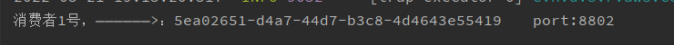


#### 持久化

```
就是当服务挂了,怎么消费没有消费的数据??


这里,先将8802移除A组,

​		然后将02,03服务关闭

此时生产者开启,发送3条消息

​		此时重启02,03

​		可以看到,当02退出A组后,它就获取不到在它宕机的时间段内的数据

​		但是03重启后,直接获取到了宕机期间它没有消费的数据,并且消费了

总结:
		也就是,当我们没有配置分组时,会出现消息漏消费的问题

​		而配置分组后,我们可以自动获取未消费的数据
```

通过上述，解决了重复消费问题，再看看持久化

停止8802/8803并去除掉8802的分组group:lxykA，8803的分组group:atguiguA没有去掉

8801先发送4条信息到rabbitmq

先启动8802，无分组属性配置，后台没有打出来消息

先启动8803，有分组属性配置，后台打出来了MQ上的消息

------


## 11.SpringCloud Sleuth分布式请求链路追踪

### 概述：

为什么会出现这个技术？需要解决哪些问题？

#### 问题？


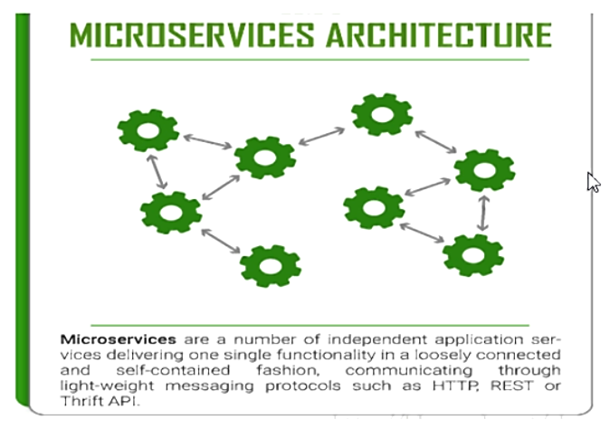


#### 是什么？

https://github.com/spring-cloud/spring-cloud-sleuth

Spring Cloud Sleuth提供了一套完整的服务跟踪的解决方案

在分布式系统中提供追踪解决方案并且兼容支持了zipkin


#### 解决？


### 搭建链路监控步骤

#### 1.zipkin

SpringCloud从F版起已不需要自己构建Zipkin server了，只需要调用jar包即可

https://dl.bintray.com/openzipkin/maven/io/zipkin/java/zipkin-server/

zipkin-server-2.12.9.exec.jar


**运行jar**


**运行控制台**

http://localhost:9411/zipkin/


完整的调用链路


**上图what**


**名词解释**

Trace:类似于树结构的Span集合，表示一条调用链路，存在唯一标识

span:表示调用链路来源，通俗的理解span就是一次请求信息


#### 2.服务提供者

cloud-provider-payment8001

POM

```xml
<!--包含了sleuth+zipkin-->
        <dependency>
            <groupId>org.springframework.cloud</groupId>
            <artifactId>spring-cloud-starter-zipkin</artifactId>
        </dependency>
```

YML

```properties
server:
  port: 8001


spring:
  application:
    name: cloud-payment-service
  zipkin:
    base-url: http://localhost:9411
  sleuth:
    sampler:
    #采样率值介于0到1之间，1则表示全部采集
    probability: 1
  datasource:
    type: com.alibaba.druid.pool.DruidDataSource
    driver-class-name: org.gjt.mm.mysql.Driver
    url: 
    username: root
    password: 

mybatis:
  mapperLocations: classpath:mapper/*.xml
  type-aliases-package: com.atguigu.springcloud.entities


eureka:
  client:
    register-with-eureka: true
    fetchRegistry: true
    service-url:
      defaultZone: http://eureka7001.com:7001/eureka,http://eureka7002.com:7002/eureka  #集群版
  instance:
    instance-id: payment8001
    prefer-ip-address: true
```

业务类PaymentController

```java
 @GetMapping("/payment/zipkin")
    public String paymentZipkin()
    {
        return "hi ,i'am paymentzipkin server fall back，welcome to atguigu，O(∩_∩)O哈哈~";
    }
```


#### 3.服务消费者（调用方）

cloud-consumer-order80

POM

```xml
 <!--包含了sleuth+zipkin-->
        <dependency>
            <groupId>org.springframework.cloud</groupId>
            <artifactId>spring-cloud-starter-zipkin</artifactId>
        </dependency>
```

YML

```properties
server:
  port: 80
 
spring:
    application:
        name: cloud-order-service
    zipkin:
      base-url: http://localhost:9411
    sleuth:
      sampler:
        probability: 1
 
eureka:
  client:
    #表示是否将自己注册进EurekaServer默认为true。
    register-with-eureka: false
    #是否从EurekaServer抓取已有的注册信息，默认为true。单节点无所谓，集群必须设置为true才能配合ribbon使用负载均衡
    fetchRegistry: true
    service-url:
      #单机
      #defaultZone: http://localhost:7001/eureka
      # 集群
      defaultZone: http://eureka7001.com:7001/eureka,http://eureka7002.com:7002/eureka  # 集群版
 
 
```

业务类OrderController

```java
 // ====================> zipkin+sleuth
    @GetMapping("/consumer/payment/zipkin")
    public String paymentZipkin()
    {
        String result = restTemplate.getForObject("http://localhost:8001"+"/payment/zipkin/", String.class);
        return result;
    }
```


#### 4.依次启动eureka7001/8001/80

80调用8001几次测试下

访问：http://localhost/consumer/payment/zipkin


#### 5.打开浏览器访问:http:localhost:9411

会出现以下界面


查看


原理


------


## 12.SpringCloud Alibaba入门简介

### why会出现SpringCloud alibaba

Spring Cloud Netflix项目进入维护模式

https://spring.io/blog/2018/12/12/spring-cloud-greenwich-rc1-available-now


SpringCloud NetFlix Projects Entering Maintenance Mode

什么是维护模式


进入维护模式意味着什么呢？


### SpringCloud alibaba带来了什么？

是什么

https://github.com/alibaba/spring-cloud-alibaba/blob/master/README-zh.md


能干嘛


去哪下

https://github.com/alibaba/spring-cloud-alibaba/blob/master/README-zh.md

怎么玩

>
> Sentinel：把流量作为切入点，从流量控制、熔断降级、系统负载保护等多个维度保护服务的稳定性。
>
> Nacos：一个更易于构建云原生应用的动态服务发现、配置管理和服务管理平台。
>
> RocketMQ：一款开源的分布式消息系统，基于高可用分布式集群技术，提供低延时的、高可靠的消息发布与订阅服务。
>
> Dubbo：Apache Dubbo™ 是一款高性能 Java RPC 框架。
>
> Seata：阿里巴巴开源产品，一个易于使用的高性能微服务分布式事务解决方案。
>
> Alibaba Cloud ACM：一款在分布式架构环境中对应用配置进行集中管理和推送的应用配置中心产品。
>
> Alibaba Cloud OSS: 阿里云对象存储服务（Object Storage Service，简称 OSS），是阿里云提供的海量、安全、低成本、高可靠的云存储服务。您可以在任何应用、任何时间、任何地点存储和访问任意类型的数据。
>
> Alibaba Cloud SchedulerX: 阿里中间件团队开发的一款分布式任务调度产品，提供秒级、精准、高可靠、高可用的定时（基于 Cron 表达式）任务调度服务。
>
> Alibaba Cloud SMS: 覆盖全球的短信服务，友好、高效、智能的互联化通讯能力，帮助企业迅速搭建客户触达通道。


### SpringCloud alibaba学习资料获取

https://spring.io/projects/spring-cloud-alibaba#overview

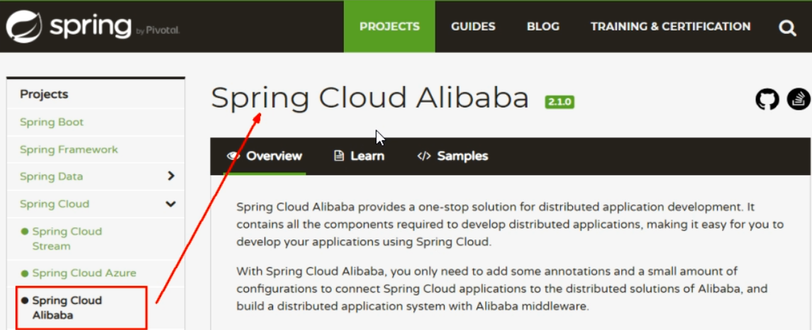


英文

https://github.com/alibaba/spring-cloud-alibaba

https://spring-cloud-alibaba-group.github.io/github-pages/greenwich/spring-cloud-alibaba.html

中文

https://github.com/alibaba/spring-cloud-alibaba/blob/master/README-zh.md

------


## 13.SpringCloud Alibaba Nacos服务注册和配置中心

### Nacos简介

#### **为什么叫Nacos**

前四个字母分别为Naming和Configuration的前两个字母，最后的s为Service


#### 是什么

一个更易于构建云原生应用的动态服务发现，配置管理和服务管理中心

Nacos：Dynamic Naming and Configuration Service

Nacos就是注册中心+配置中心的组合

等价于：Nacos = Eureka+Config+Bus


#### 能干嘛

替代Eureka做服务注册中心

替代Config做服务配置中心


#### 去哪下

https://github.com/alibaba/Nacos

官网文档

https://nacos.io/zh-cn/index.html

https://spring-cloud-alibaba-group.github.io/github-pages/greenwich/spring-cloud-alibaba.html#_spring_cloud_alibaba_nacos_discovery


#### 各种注册中心比较

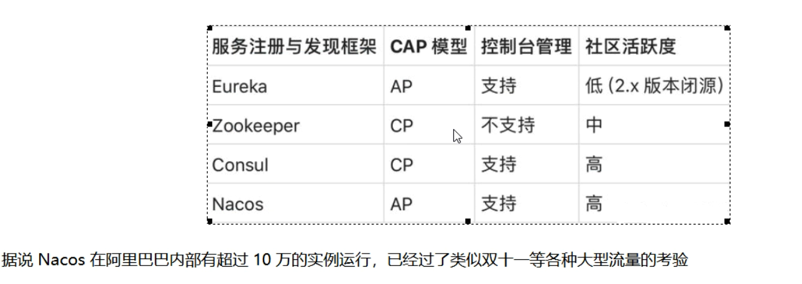

------


### 安装并运行Nacos

本地Java8+Maven环境已经OK ，jdk：1.8+  Maven：3.2+

先从官网下载Nacos

https://github.com/alibaba/nacos/releases/tag/1.1.4

解压安装包，直接运行bin目录下的startup.cmd


命令运行成功后直接访问http://localhost:8848/nacos

默认账号密码都是nacos

结果页面


------


### Nacos作为服务注册中心演示

#### 基于Nacos的服务提供者

##### 新建Module：

cloudalibaba-provider-payment9001

##### 父POM

```xml
<!--spring cloud alibaba 2.1.0.RELEASE-->
<dependency>
  <groupId>com.alibaba.cloud</groupId>
  <artifactId>spring-cloud-alibaba-dependencies</artifactId>
  <version>2.1.0.RELEASE</version>
  <type>pom</type>
  <scope>import</scope>
</dependency>
```


##### 本模块POM

```XML
<dependencies>
    <dependency>
        <groupId>com.alibaba.cloud</groupId>
        <artifactId>spring-cloud-starter-alibaba-nacos-discovery</artifactId>
    </dependency>
    <dependency>
        <groupId>org.springframework.boot</groupId>
        <artifactId>spring-boot-starter-web</artifactId>
    </dependency>
    <dependency>
        <groupId>org.springframework.boot</groupId>
        <artifactId>spring-boot-starter-actuator</artifactId>
    </dependency>
    <dependency>
        <groupId>org.springframework.boot</groupId>
        <artifactId>spring-boot-devtools</artifactId>
        <scope>runtime</scope>
        <optional>true</optional>
    </dependency>
    <dependency>
        <groupId>org.projectlombok</groupId>
        <artifactId>lombok</artifactId>
        <optional>true</optional>
    </dependency>
    <dependency>
        <groupId>org.springframework.boot</groupId>
        <artifactId>spring-boot-starter-test</artifactId>
        <scope>test</scope>
    </dependency><dependency>
    <groupId>com.alibaba</groupId>
    <artifactId>fastjson</artifactId>
    <version>1.2.62</version>
</dependency>
 </dependencies>
```


##### YML

```properties
server:
  port: 9001

spring:
  application:
    name: nacos-payment-provider
  cloud:
    nacos:
      discovery:
        server-addr: localhost:8848 #配置Nacos地址

management:
  endpoints:
    web:
      exposure:
        include: '*'
```


##### 主启动

```java
@EnableDiscoveryClient
@SpringBootApplication
public class PaymentMain9001 {
    public static void main(String[] args) {
        SpringApplication.run(PaymentMain9001.class,args);
    }
}
```


##### 业务类

```java
@RestController
public class PaymentController
{
    @Value("${server.port}")
    private String serverPort;

    @GetMapping(value = "/payment/nacos/{id}")
    public String getPayment(@PathVariable("id") Integer id)
    {
        return "nacos registry, serverPort: "+ serverPort+"\t id"+id;
    }
}

```


##### 测试

访问：http://lcoalhost:9001/payment/nacos/1

nacos控制台


nacos服务注册中心+服务提供者9001都ok了


##### 为了下一章节演示nacos的负载均衡，参照9001新建9002

新建cloudalibaba-provider-payment9002

9002其他步骤你懂的

或者取巧不想新建重复体力劳动，直接拷贝虚拟端口映射


访问：http://localhost:9001/payment/nacos/1


访问：http://localhost:9011/payment/nacos/1


<font color='red'>我们这里还是老老实实的新建9002   复制9001即可</font>

省略......


#### 基于Nacos的服务消费者

##### 新建Module

cloudalibaba-consumer-nacos-order83

##### POM

```xml
<dependencies>
    <!--SpringCloud ailibaba nacos -->
    <dependency>
        <groupId>com.alibaba.cloud</groupId>
        <artifactId>spring-cloud-starter-alibaba-nacos-discovery</artifactId>
    </dependency>
        <dependency>
        <groupId>com.lxyk.springcloud</groupId>
        <artifactId>cloud-api-commons</artifactId>
        <version>${project.version}</version>
    </dependency>
    <dependency>
        <groupId>org.springframework.boot</groupId>
        <artifactId>spring-boot-starter-web</artifactId>
    </dependency>
    <dependency>
        <groupId>org.springframework.boot</groupId>
        <artifactId>spring-boot-starter-actuator</artifactId>
    </dependency>
    <dependency>
        <groupId>org.springframework.boot</groupId>
        <artifactId>spring-boot-devtools</artifactId>
        <scope>runtime</scope>
        <optional>true</optional>
    </dependency>
    <dependency>
        <groupId>org.projectlombok</groupId>
        <artifactId>lombok</artifactId>
        <optional>true</optional>
    </dependency>
    <dependency>
        <groupId>org.springframework.boot</groupId>
        <artifactId>spring-boot-starter-test</artifactId>
        <scope>test</scope>
    </dependency>
</dependencies>

```

为什么nacos支持负载均衡


##### YML

```properties
server:
  port: 83


spring:
  application:
    name: nacos-order-consumer
  cloud:
    nacos:
      discovery:
        server-addr: localhost:8848

#消费者将要去访问的微服务名称（注册成功进nacos的微服务提供者）
service-url:
  nacos-user-service: http://nacos-payment-provider
```


##### 主启动

```java
@EnableDiscoveryClient
@SpringBootApplication
public class OrderNacosMain83
{
    public static void main(String[] args)
    {
        SpringApplication.run(OrderNacosMain83.class,args);
    }
}
```


##### 业务类

<font color='red'>ApplicationContextBean</font>

```java
@Configuration
public class ApplicationContextConfig
{
    @Bean
    @LoadBalanced
    public RestTemplate getRestTemplate()
    {
        return new RestTemplate();
    }
}
 
```

<font color='red'>OrderNacosController</font>

```java
@RestController
@Slf4j
public class OrderNacosController
{
    @Resource
    private RestTemplate restTemplate;

    @Value("${service-url.nacos-user-service}")
    private String serverURL;

    @GetMapping(value = "/consumer/payment/nacos/{id}")
    public String paymentInfo(@PathVariable("id") Long id)
    {
        return restTemplate.getForObject(serverURL+"/payment/nacos/"+id,String.class);
    }

}

```

nacos控制台


##### 测试

访问：http://localhost:83/consumer/payment/nacos/1

<font color='red'>83访问9001/9002，轮询负载OK</font>


#### 服务注册中心对比

Nacos全景图所示


Nacos和CAP


Nacos支持AP和CP模式的切换


curl -X PUT '$NACOS_SERVER:8848/nacos/v1/ns/operator/switches?entry=serverMode&value=CP'

------


### Nacos作为服务配置中心演示

#### Nacos作为配置中心-基础配置

##### 新建Module

cloudalibaba-config-nacos-client3377

##### POM

```xml
<dependencies>
    <!--nacos-config-->
    <dependency>
        <groupId>com.alibaba.cloud</groupId>
        <artifactId>spring-cloud-starter-alibaba-nacos-config</artifactId>
    </dependency>
    <!--nacos-discovery-->
    <dependency>
        <groupId>com.alibaba.cloud</groupId>
        <artifactId>spring-cloud-starter-alibaba-nacos-discovery</artifactId>
    </dependency>
    <!--web + actuator-->
    <dependency>
        <groupId>org.springframework.boot</groupId>
        <artifactId>spring-boot-starter-web</artifactId>
    </dependency>
    <dependency>
        <groupId>org.springframework.boot</groupId>
        <artifactId>spring-boot-starter-actuator</artifactId>
    </dependency>
    <!--一般基础配置-->
    <dependency>
        <groupId>org.springframework.boot</groupId>
        <artifactId>spring-boot-devtools</artifactId>
        <scope>runtime</scope>
        <optional>true</optional>
    </dependency>
    <dependency>
        <groupId>org.projectlombok</groupId>
        <artifactId>lombok</artifactId>
        <optional>true</optional>
    </dependency>
    <dependency>
        <groupId>org.springframework.boot</groupId>
        <artifactId>spring-boot-starter-test</artifactId>
        <scope>test</scope>
    </dependency>
</dependencies>
```

##### YML

<font color='red'>why配置两个</font>

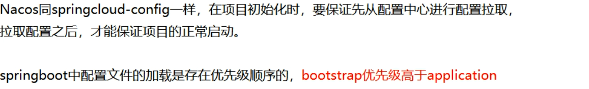

<font color='red'>bootstrap</font>

```properties
server:
  port: 3377

spring:
  application:
    name: nacos-config-client
  cloud:
    nacos:
      discovery:
        server-addr: localhost:8848 #服务注册中心地址
      config:
        server-addr: localhost:8848 #配置中心地址
        file-extension: yaml #指定yaml格式的配置
```

<font color='red'>application</font>

```properties
spring:
  profiles:
    active: dev   #表示开发环境
```


##### 主启动

```java
@EnableDiscoveryClient
@SpringBootApplication
public class NacosConfigClientMain3377
{
    public static void main(String[] args) {
        SpringApplication.run(NacosConfigClientMain3377.class, args);
    }
}
```

##### 业务类

```java
@RestController
@RefreshScope  //支持Nacos的动态刷新功能
public class ConfigClientController
{
    @Value("${config.info}")
    private String configInfo;

    @GetMapping("/config/info")
    public String getConfigInfo() {
        return configInfo;
    }
}

```

@RefreshScope


##### 在Nacos中添加配置信息

**Nacos中的匹配规则**

**<font color='red'>理论</font>**

Nacos中的dataid的组成格式与SpringBoot配置文件中的匹配规则

官网： https://nacos.io/zh-cn/docs/quick-start-spring-cloud.html


**<font color='red'>实操</font>**

配置新增


Nacos界面配置对应

```properties
config:
    info: nacos config center,version = 1
 
from nacos config center, nacos-config-client-dev.yaml, version=1
```


设置DataId

公式：

${spring.application.name}-${spring.profile.active}.${spring.cloud.nacos.config.file-extension}


prefix默认为spring.application.name的值

spring.profile.active既为当前环境对应的profile,可以通过配置项spring.profile.active 

file-exetension为配置内容的数据格式，可以通过配置项spring.cloud.nacos.config.file-extension配置

小总结说明


##### 测试

启动前需要在nacos客户端-配置管理-配置管理栏目下有没有对应的yaml配置文件

运行cloud-config-nacos-client3377的主启动类

调用接口查看配置信息：http://localhost:3377/config/info


##### 自带动态刷新

修改下Nacos中的yaml配置文件，再次调用查看配置的接口，就会发现配置已经刷新


------


#### Nacos作为配置中心-分类配置

##### 问题？

多环境多项目管理


##### Nacos的图形化管理界面

配置管理


命名空间


##### Namespace+Group+Data ID三者关系？为什么这么设计？


##### Case

**<font color='red'>DataID方案</font>**

指定spring.profile.active和配置文件的DataID来使不同环境下读取不同的配置

**默认空间+默认分组+新建dev和test两个DataID**

新建dev配置DataID


新建test配置DataID


通过spring.profile.active属性就能进行多环境下配置文件的读取


**测试**

访问：http://localhost:3377/config/info

配置是什么就加载什么：test


**<font color='red'>Group方案</font>**

通过Group实现环境区分

新建Group


在nacos图形界面控制台上面新建配置文件DataID

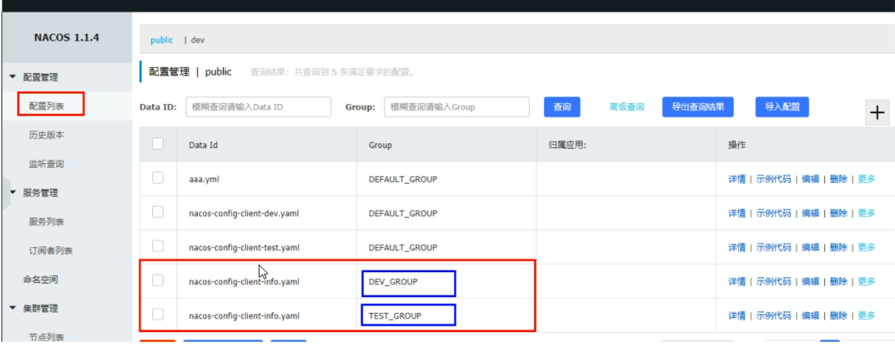

bootstrap+application


```properties
        group: TEST_GROUP
```

在config下增加一条group的配置即可。可配置为DEV_GROUP或TEST_GROUP

访问：http://localhost:3377/config/info


**<font color='red'>Namespace方案</font>**

新建dev/test的Namespace


回到服务管理-服务列表查看


按照域名配置填写


YML

bootstrap

```properties
namespace: 1fd376c6-8528-4ea2-b556-619ca56d32f8
```


application


nacos控制台


dev命名空间下


继续新建：DEV_GROUP


TEST_GROUP


新建三个


启动：cloudalibaba-config-nacos-client3377

访问：http://localhost:3377/config/info


------


### Nacos集群和持久化配置（重要）

#### 官网说明

https://nacos.io/zh-cn/docs/cluster-mode-quick-start.html

官网架构图（写的(┬＿┬)）


上图官网翻译，真实情况

                


说明


按照上述，我们需要mysql数据库

官网说明

https://nacos.io/zh-cn/docs/deployment.html

重点说明


------

#### Nacos持久化配置解释

**Nacos默认自带的是嵌入式数据库derby**

https://github.com/alibaba/nacos/blob/develop/config/pom.xml


**derby到mysql切换配置步骤**

nacos-server-1.1.4\nacos\conf目录下找到sql脚本

nacos-mysql.sql


执行脚本

在我们mysql数据库执行


```sql
 
CREATE DATABASE nacos_config;
USE nacos_config;
 
/*   数据库全名 = nacos_config   */
/*   表名称 = config_info   */
/******************************************/
CREATE TABLE `config_info` (
  `id` bigint(20) NOT NULL AUTO_INCREMENT COMMENT 'id',
  `data_id` varchar(255) NOT NULL COMMENT    'data_id',
  `group_id` varchar(255) DEFAULT NULL,
  `content` longtext NOT NULL COMMENT 'content',
  `md5` varchar(32) DEFAULT NULL COMMENT 'md5',
  `gmt_create` datetime NOT NULL DEFAULT '2010-05-05 00:00:00' COMMENT '创建时间',
  `gmt_modified` datetime NOT NULL DEFAULT '2010-05-05 00:00:00' COMMENT '修改时间',
  `src_user` text COMMENT 'source user',
  `src_ip` varchar(20) DEFAULT NULL COMMENT 'source ip',
  `app_name` varchar(128) DEFAULT NULL,
  `tenant_id` varchar(128) DEFAULT '' COMMENT '租户字段',
  `c_desc` varchar(256) DEFAULT NULL,
  `c_use` varchar(64) DEFAULT NULL,
  `effect` varchar(64) DEFAULT NULL,
  `type` varchar(64) DEFAULT NULL,
  `c_schema` text,
  PRIMARY KEY (`id`),
  UNIQUE KEY `uk_configinfo_datagrouptenant` (`data_id`,`group_id`,`tenant_id`)
) ENGINE=InnoDB DEFAULT CHARSET=utf8 COLLATE=utf8_bin COMMENT='config_info';
 
/******************************************/
/*   数据库全名 = nacos_config   */
/*   表名称 = config_info_aggr   */
/******************************************/
CREATE TABLE `config_info_aggr` (
  `id` bigint(20) NOT NULL AUTO_INCREMENT COMMENT 'id',
  `data_id` varchar(255) NOT NULL COMMENT 'data_id',
  `group_id` varchar(255) NOT NULL COMMENT 'group_id',
  `datum_id` varchar(255) NOT NULL COMMENT 'datum_id',
  `content` longtext NOT NULL COMMENT '内容',
  `gmt_modified` datetime NOT NULL COMMENT '修改时间',
  `app_name` varchar(128) DEFAULT NULL,
  `tenant_id` varchar(128) DEFAULT '' COMMENT '租户字段',
  PRIMARY KEY (`id`),
  UNIQUE KEY `uk_configinfoaggr_datagrouptenantdatum` (`data_id`,`group_id`,`tenant_id`,`datum_id`)
) ENGINE=InnoDB DEFAULT CHARSET=utf8 COLLATE=utf8_bin COMMENT='增加租户字段';
 
 
/******************************************/
/*   数据库全名 = nacos_config   */
/*   表名称 = config_info_beta   */
/******************************************/
CREATE TABLE `config_info_beta` (
  `id` bigint(20) NOT NULL AUTO_INCREMENT COMMENT 'id',
  `data_id` varchar(255) NOT NULL COMMENT 'data_id',
  `group_id` varchar(128) NOT NULL COMMENT 'group_id',
  `app_name` varchar(128) DEFAULT NULL COMMENT 'app_name',
  `content` longtext NOT NULL COMMENT 'content',
  `beta_ips` varchar(1024) DEFAULT NULL COMMENT 'betaIps',
  `md5` varchar(32) DEFAULT NULL COMMENT 'md5',
  `gmt_create` datetime NOT NULL DEFAULT '2010-05-05 00:00:00' COMMENT '创建时间',
  `gmt_modified` datetime NOT NULL DEFAULT '2010-05-05 00:00:00' COMMENT '修改时间',
  `src_user` text COMMENT 'source user',
  `src_ip` varchar(20) DEFAULT NULL COMMENT 'source ip',
  `tenant_id` varchar(128) DEFAULT '' COMMENT '租户字段',
  PRIMARY KEY (`id`),
  UNIQUE KEY `uk_configinfobeta_datagrouptenant` (`data_id`,`group_id`,`tenant_id`)
) ENGINE=InnoDB DEFAULT CHARSET=utf8 COLLATE=utf8_bin COMMENT='config_info_beta';
 
/******************************************/
/*   数据库全名 = nacos_config   */
/*   表名称 = config_info_tag   */
/******************************************/
CREATE TABLE `config_info_tag` (
  `id` bigint(20) NOT NULL AUTO_INCREMENT COMMENT 'id',
  `data_id` varchar(255) NOT NULL COMMENT 'data_id',
  `group_id` varchar(128) NOT NULL COMMENT 'group_id',
  `tenant_id` varchar(128) DEFAULT '' COMMENT 'tenant_id',
  `tag_id` varchar(128) NOT NULL COMMENT 'tag_id',
  `app_name` varchar(128) DEFAULT NULL COMMENT 'app_name',
  `content` longtext NOT NULL COMMENT 'content',
  `md5` varchar(32) DEFAULT NULL COMMENT 'md5',
  `gmt_create` datetime NOT NULL DEFAULT '2010-05-05 00:00:00' COMMENT '创建时间',
  `gmt_modified` datetime NOT NULL DEFAULT '2010-05-05 00:00:00' COMMENT '修改时间',
  `src_user` text COMMENT 'source user',
  `src_ip` varchar(20) DEFAULT NULL COMMENT 'source ip',
  PRIMARY KEY (`id`),
  UNIQUE KEY `uk_configinfotag_datagrouptenanttag` (`data_id`,`group_id`,`tenant_id`,`tag_id`)
) ENGINE=InnoDB DEFAULT CHARSET=utf8 COLLATE=utf8_bin COMMENT='config_info_tag';
 
/******************************************/
/*   数据库全名 = nacos_config   */
/*   表名称 = config_tags_relation   */
/******************************************/
CREATE TABLE `config_tags_relation` (
  `id` bigint(20) NOT NULL COMMENT 'id',
  `tag_name` varchar(128) NOT NULL COMMENT 'tag_name',
  `tag_type` varchar(64) DEFAULT NULL COMMENT 'tag_type',
  `data_id` varchar(255) NOT NULL COMMENT 'data_id',
  `group_id` varchar(128) NOT NULL COMMENT 'group_id',
  `tenant_id` varchar(128) DEFAULT '' COMMENT 'tenant_id',
  `nid` bigint(20) NOT NULL AUTO_INCREMENT,
  PRIMARY KEY (`nid`),
  UNIQUE KEY `uk_configtagrelation_configidtag` (`id`,`tag_name`,`tag_type`),
  KEY `idx_tenant_id` (`tenant_id`)
) ENGINE=InnoDB DEFAULT CHARSET=utf8 COLLATE=utf8_bin COMMENT='config_tag_relation';
 
/******************************************/
/*   数据库全名 = nacos_config   */
/*   表名称 = group_capacity   */
/******************************************/
CREATE TABLE `group_capacity` (
  `id` bigint(20) unsigned NOT NULL AUTO_INCREMENT COMMENT '主键ID',
  `group_id` varchar(128) NOT NULL DEFAULT '' COMMENT 'Group ID，空字符表示整个集群',
  `quota` int(10) unsigned NOT NULL DEFAULT '0' COMMENT '配额，0表示使用默认值',
  `usage` int(10) unsigned NOT NULL DEFAULT '0' COMMENT '使用量',
  `max_size` int(10) unsigned NOT NULL DEFAULT '0' COMMENT '单个配置大小上限，单位为字节，0表示使用默认值',
  `max_aggr_count` int(10) unsigned NOT NULL DEFAULT '0' COMMENT '聚合子配置最大个数，，0表示使用默认值',
  `max_aggr_size` int(10) unsigned NOT NULL DEFAULT '0' COMMENT '单个聚合数据的子配置大小上限，单位为字节，0表示使用默认值',
  `max_history_count` int(10) unsigned NOT NULL DEFAULT '0' COMMENT '最大变更历史数量',
  `gmt_create` datetime NOT NULL DEFAULT '2010-05-05 00:00:00' COMMENT '创建时间',
  `gmt_modified` datetime NOT NULL DEFAULT '2010-05-05 00:00:00' COMMENT '修改时间',
  PRIMARY KEY (`id`),
  UNIQUE KEY `uk_group_id` (`group_id`)
) ENGINE=InnoDB DEFAULT CHARSET=utf8 COLLATE=utf8_bin COMMENT='集群、各Group容量信息表';
 
/******************************************/
/*   数据库全名 = nacos_config   */
/*   表名称 = his_config_info   */
/******************************************/
CREATE TABLE `his_config_info` (
  `id` bigint(64) unsigned NOT NULL,
  `nid` bigint(20) unsigned NOT NULL AUTO_INCREMENT,
  `data_id` varchar(255) NOT NULL,
  `group_id` varchar(128) NOT NULL,
  `app_name` varchar(128) DEFAULT NULL COMMENT 'app_name',
  `content` longtext NOT NULL,
  `md5` varchar(32) DEFAULT NULL,
  `gmt_create` datetime NOT NULL DEFAULT '2010-05-05 00:00:00',
  `gmt_modified` datetime NOT NULL DEFAULT '2010-05-05 00:00:00',
  `src_user` text,
  `src_ip` varchar(20) DEFAULT NULL,
  `op_type` char(10) DEFAULT NULL,
  `tenant_id` varchar(128) DEFAULT '' COMMENT '租户字段',
  PRIMARY KEY (`nid`),
  KEY `idx_gmt_create` (`gmt_create`),
  KEY `idx_gmt_modified` (`gmt_modified`),
  KEY `idx_did` (`data_id`)
) ENGINE=InnoDB DEFAULT CHARSET=utf8 COLLATE=utf8_bin COMMENT='多租户改造';
 
 
/******************************************/
/*   数据库全名 = nacos_config   */
/*   表名称 = tenant_capacity   */
/******************************************/
CREATE TABLE `tenant_capacity` (
  `id` bigint(20) unsigned NOT NULL AUTO_INCREMENT COMMENT '主键ID',
  `tenant_id` varchar(128) NOT NULL DEFAULT '' COMMENT 'Tenant ID',
  `quota` int(10) unsigned NOT NULL DEFAULT '0' COMMENT '配额，0表示使用默认值',
  `usage` int(10) unsigned NOT NULL DEFAULT '0' COMMENT '使用量',
  `max_size` int(10) unsigned NOT NULL DEFAULT '0' COMMENT '单个配置大小上限，单位为字节，0表示使用默认值',
  `max_aggr_count` int(10) unsigned NOT NULL DEFAULT '0' COMMENT '聚合子配置最大个数',
  `max_aggr_size` int(10) unsigned NOT NULL DEFAULT '0' COMMENT '单个聚合数据的子配置大小上限，单位为字节，0表示使用默认值',
  `max_history_count` int(10) unsigned NOT NULL DEFAULT '0' COMMENT '最大变更历史数量',
  `gmt_create` datetime NOT NULL DEFAULT '2010-05-05 00:00:00' COMMENT '创建时间',
  `gmt_modified` datetime NOT NULL DEFAULT '2010-05-05 00:00:00' COMMENT '修改时间',
  PRIMARY KEY (`id`),
  UNIQUE KEY `uk_tenant_id` (`tenant_id`)
) ENGINE=InnoDB DEFAULT CHARSET=utf8 COLLATE=utf8_bin COMMENT='租户容量信息表';
 
 
CREATE TABLE `tenant_info` (
  `id` bigint(20) NOT NULL AUTO_INCREMENT COMMENT 'id',
  `kp` varchar(128) NOT NULL COMMENT 'kp',
  `tenant_id` varchar(128) default '' COMMENT 'tenant_id',
  `tenant_name` varchar(128) default '' COMMENT 'tenant_name',
  `tenant_desc` varchar(256) DEFAULT NULL COMMENT 'tenant_desc',
  `create_source` varchar(32) DEFAULT NULL COMMENT 'create_source',
  `gmt_create` bigint(20) NOT NULL COMMENT '创建时间',
  `gmt_modified` bigint(20) NOT NULL COMMENT '修改时间',
  PRIMARY KEY (`id`),
  UNIQUE KEY `uk_tenant_info_kptenantid` (`kp`,`tenant_id`),
  KEY `idx_tenant_id` (`tenant_id`)
) ENGINE=InnoDB DEFAULT CHARSET=utf8 COLLATE=utf8_bin COMMENT='tenant_info';
 
CREATE TABLE users (
    username varchar(50) NOT NULL PRIMARY KEY,
    password varchar(500) NOT NULL,
    enabled boolean NOT NULL
);
 
CREATE TABLE roles (
    username varchar(50) NOT NULL,
    role varchar(50) NOT NULL
);
 
INSERT INTO users (username, password, enabled) VALUES ('nacos', '$2a$10$EuWPZHzz32dJN7jexM34MOeYirDdFAZm2kuWj7VEOJhhZkDrxfvUu', TRUE);
 
INSERT INTO roles (username, role) VALUES ('nacos', 'ROLE_ADMIN');
 

```

nacos-server-1.1.4\nacos\conf目录下找到application.properties

```properties
spring.datasource.platform=mysql
 
db.num=1
db.url.0=jdbc:mysql://11.162.196.16:3306/nacos_devtest?characterEncoding=utf8&connectTimeout=1000&socketTimeout=3000&autoReconnect=true
db.user=nacos_devtest
db.password=youdontknow
 
##################################################
 
spring.datasource.platform=mysql
 
db.num=1
db.url.0=jdbc:mysql://localhost:3306/nacos_config?characterEncoding=utf8&connectTimeout=1000&socketTimeout=3000&autoReconnect=true
db.user=root
db.password=root

```


启动nacos，可以看到是个全新的空记录界面，以前是记录进derby


嵌入式数据库已经切换到mysql数据库


------


## 14.SpringCloud Alibaba Sentinel实现熔断与限流

### Sentinel

官网：https://github.com/alibaba/Sentinel

中文：https://github.com/alibaba/Sentinel/wiki/%E4%BB%8B%E7%BB%8D

是什么：一句话解释，之前我们讲解过的Hystrix


去哪下：https://github.com/alibaba/Sentinel/releases


能干嘛


怎么玩

https://spring-cloud-alibaba-group.github.io/github-pages/greenwich/spring-cloud-alibaba.html#_spring_cloud_alibaba_sentinel

服务使用中的各种问题

> 服务雪崩
>
> 服务降级
>
> 服务熔断
>
> 服务限流


### 安装Sentinel控制台

sentinel组件由2部分组成


后台

前台：8080

##### **<font color='red'>安装步骤</font>**

下载

https://github.com/alibaba/Sentinel/releases

下载到本地sentinel-dashboard-1.7.0.jar


**运行命令**

前提

java8环境OK

8080端口不能被占用

命令：java -jar sentinel-dashboard-1.7.0.jar


**访问sentinel管理界面**

http://localhost:8080

登录账号密码均为sentinel


------


### 初始化演示工程

#### 启动Nacos8848成功

http://localhost:8848/nacos/#/login


#### Module

cloudalibaba-sentinel-service8401

POM

```xml
 <dependencies>
        <dependency>
            <groupId>com.lxyk.springcloud</groupId>
            <artifactId>cloud-api-commons</artifactId>
            <version>${project.version}</version>
        </dependency>

        <dependency>
            <groupId>com.alibaba.cloud</groupId>
            <artifactId>spring-cloud-starter-alibaba-nacos-discovery</artifactId>
        </dependency>

        <dependency>
            <groupId>com.alibaba.csp</groupId>
            <artifactId>sentinel-datasource-nacos</artifactId>
        </dependency>

        <dependency>
            <groupId>com.alibaba.cloud</groupId>
            <artifactId>spring-cloud-starter-alibaba-sentinel</artifactId>
        </dependency>

        <dependency>
            <groupId>org.springframework.cloud</groupId>
            <artifactId>spring-cloud-starter-openfeign</artifactId>
        </dependency>

        <dependency>
            <groupId>org.springframework.boot</groupId>
            <artifactId>spring-boot-starter-web</artifactId>
        </dependency>
        <dependency>
            <groupId>org.springframework.boot</groupId>
            <artifactId>spring-boot-starter-actuator</artifactId>
        </dependency>
      
        <dependency>
            <groupId>org.springframework.boot</groupId>
            <artifactId>spring-boot-devtools</artifactId>
            <scope>runtime</scope>
            <optional>true</optional>
        </dependency>
        <dependency>
            <groupId>cn.hutool</groupId>
            <artifactId>hutool-all</artifactId>
            <version>4.6.3</version>
        </dependency>
        <dependency>
            <groupId>org.projectlombok</groupId>
            <artifactId>lombok</artifactId>
            <optional>true</optional>
        </dependency>
        <dependency>
            <groupId>org.springframework.boot</groupId>
            <artifactId>spring-boot-starter-test</artifactId>
            <scope>test</scope>
        </dependency>

    </dependencies>

```

YML

```properties
server:
  port: 8401

spring:
  application:
    name: cloudalibaba-sentinel-service
  cloud:
    nacos:
      discovery:
       #Nacos服务注册中心地址
        server-addr: localhost:8848
    sentinel:
      transport:
      #配置Sentinel  dashboard地址
        dashboard: localhost:8080
        port: 8719  #默认8719，假如被占用了会自动从8719开始依次+1扫描。直至找到未被占用的端口

management:
  endpoints:
    web:
      exposure:
        include: '*'

```

主启动

```java
@EnableDiscoveryClient
@SpringBootApplication
public class MainApp8401
{
    public static void main(String[] args) {
        SpringApplication.run(MainApp8401.class, args);
    }
}

```

业务类FlowLimitController

```java
@RestController
public class FlowLimitController
{
    @GetMapping("/testA")
    public String testA() {
         //暂停毫秒
        /*try {
            TimeUnit.MICROSECONDS.sleep(1000);
        } catch (InterruptedException e) {
            e.printStackTrace();
        }*/

        return "------testA";
    }

    @GetMapping("/testB")
    public String testB() {

        return "------testB";
    }

}
```


#### 启动Sentinel8080

java -jar sentinel-dashboard-1.7.0

启动微服务8401

启动8401微服务后查看sentienl控制台

空空如也，啥都没有

Sentinel采用的懒加载说明

> 执行一次访问即可
>
> http://localhost:8401/testA
>
> http://localhost:8401/testB

效果


结论

**<font color='red'>sentinel8080正在监控微服务8401</font>**


### 流控规则

基本介绍


进一步解释说明


##### **<font color='red'>流控模式</font>**

直接->快速失败：系统默认

配置及说明


**测试**

快速点击访问http://localhost:8401/testA

结果：Blocked by Sentinel (flow limiting)      直接->快速失败：系统默认

思考？？？

直接调用默认报错信息，技术方面OK but，是否应该有我们自己的后续处理

类似有一个fallback的兜底方法？


QPS：拒之门外

线程数：关门打狗


**是什么？**

> 当关联的资源达到阈值时，就限流自己
>
> 当与A关联的资源B达到阈值后，就限流自己
>
> B惹事，A挂了

**配置A**


**postman模拟并发密集访问testB**


**访问testB成功**


**postman里新建多线程集合组**


**将访问地址添加进新线程组**


**Run**

大批量线程高并发访问B，导致A失效了


运行后发现testA挂了

点击访问http://localhost:8401/testA

Blocked by Sentinel (flow limiting)


##### **<font color='red'>流控效果</font>**

**直接->快速失败（默认的流控处理）**

直接失败，抛出异常：Blocked by Sentinel (flow limiting)

源码：com.alibaba.csp.sentinel.slots.block.flow.controller.DefaultController


**<font style="background-color:#FF0;">预热</font>**

说明

公式：阈值除以coldFactor（默认值为3），经过预热时长后才会达到阈值

官网


默认coldFactor为3，即请求QPS从threshold/3开始，经预热时长逐渐升至设定的QPS阈值。


限流 冷启动：https://github.com/alibaba/Sentinel/wiki/%E9%99%90%E6%B5%81---%E5%86%B7%E5%90%AF%E5%8A%A8


**<font style="background-color:#FF0;">源码</font>**

com.alibaba.csp.sentinel.slots.block.flow.controller.WarmUpController


**<font style="background-color:#FF0;">Warmup配置</font>**


多次点击http://localhost:8401/testB

刚开始不行，后续慢慢OK


五秒钟之后每秒OK


**<font style="background-color:#FF0;">应用场景</font>**


**<font color='red'>排队等待</font>**


**<font style="background-color:#FF0;">匀速排队，阈值必须设置为QPS</font>**

官网


源码

com.alibaba.csp.sentinel.slots.block.flow.controller.RateLimiterController

测试


```java
 @GetMapping("/testB")
    public String testB() {
        log.info(Thread.currentThread().getName()+"\t"+"....testB");
        return "------testB";
    }
```


### 降级规则

##### **<font color='red'>基本介绍</font>**


**进一步说明**


**Sentinel的断路器是没有半开状态的**

> 半开的状态系统自动去检测是否请求有异常，没有异常就关闭断路器恢复使用，有异常则继续打开断路器不可用。具体可以参考Hystrix

复习Hystrix

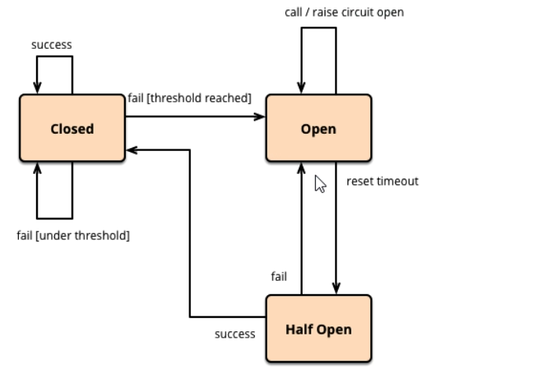


##### **<font color='red'>降级策略实战</font>**

**<font style="background-color:#FF0;">RT</font>**

是什么

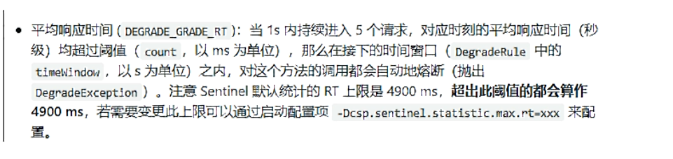


测试

代码

```java

    @GetMapping("/testD")
    public String testD()
    {
        try { TimeUnit.SECONDS.sleep(1); } catch (InterruptedException e) { e.printStackTrace(); }
        log.info("testD 测试RT");

        return "------testD";
    }
 
```

配置


**<font color='red'>200毫秒以内处理完成，搞的定完成，搞不定，在未来的一秒钟之内，跳闸断电，保护系统</font>**


jmeter压测


**结论**


**<font style="background-color:#FF0;">异常比例</font>**

是什么？


测试

代码

```java
@GetMapping("/testD")
    public String testD()
    {

        log.info("testD 测试异常比例");
        int age = 10/0;
        return "------testD";
    }
```

配置


jmeter


结论


**<font style="background-color:#FF0;">异常数</font>**

是什么？

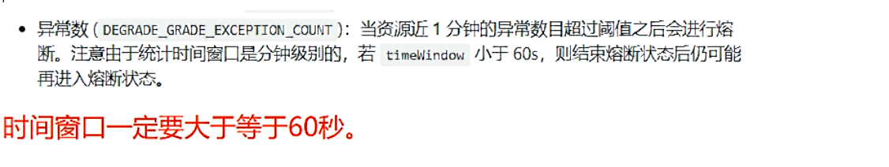


异常数是按照分钟统计的

代码

```java
@GetMapping("/testE")
public String testE()
{
    log.info("testE 测试异常数");
    int age = 10/0;
    return "------testE 测试异常数";
}
```


配置


访问五次，保险丝跳闸断电


### 热点key限流

##### 基本介绍，是什么？


官网：https://github.com/alibaba/Sentinel/wiki/热点参数限流


##### 承上启下复习start   

@SentinelResource

代码

```java
@GetMapping("/testHotKey")
@SentinelResource(value = "testHotKey",blockHandler = "deal_testHotKey")
public String testHotKey(@RequestParam(value = "p1",required = false) String p1,
                         @RequestParam(value = "p2",required = false) String p2) {
    //int age = 10/0;
    return "------testHotKey";
}
 
//兜底方法
public String deal_testHotKey (String p1, String p2, BlockException exception){
    return "------deal_testHotKey,o(╥﹏╥)o";  
}
 
```

http://localhost:8401/testHotKey


http://localhost:8401/testHotKey?p1=a&p2=b


com.alibaba.csp.sentinel.slots.block.BlockException


##### **<font color='red'>配置</font>**


@SentinelResource(value = "testHotKey")

异常打到了前台用户界面看不到，不友好


访问：http://localhost:8401/testHotKey?p1=a

一秒一次正常，狂点，马上降级处理，用了我们自己定义的


@SentinelResource(value = "testHotKey",blockHandler = "deal_testHotKey")

方法testHostKey里面第一个参数只要QPS超过每秒1次，马上降级处理，用了我们自己定义的

我们用第二种


##### **<font color='red'>测试</font>**

p1只要狂点就会报错，违背了控制台的规则

http://localhost:8401/testHotKey?p1=abc


http://localhost:8401/testHotKey?p1=abc&p2=33


p2随便点都没事，控制台没有设置

http://localhost:8401/testHotKey?p2=abc


##### **<font color='red'>参数例外项</font>**

上述案例演示了第一个参数p1,当QPS超过1秒1次点击后马上被限流

**特殊情况**


配置


添加按钮不能忘


测试

http://localhost:8401/testHotKey?p1=5

一秒一次，和狂点都不会出现问题，我们设置了参数值为5的时候，QPS=200


http://localhost:8401/testHotKey?p1=3

一秒一次，没问题，狂点出现问题


java程序异常，不管。


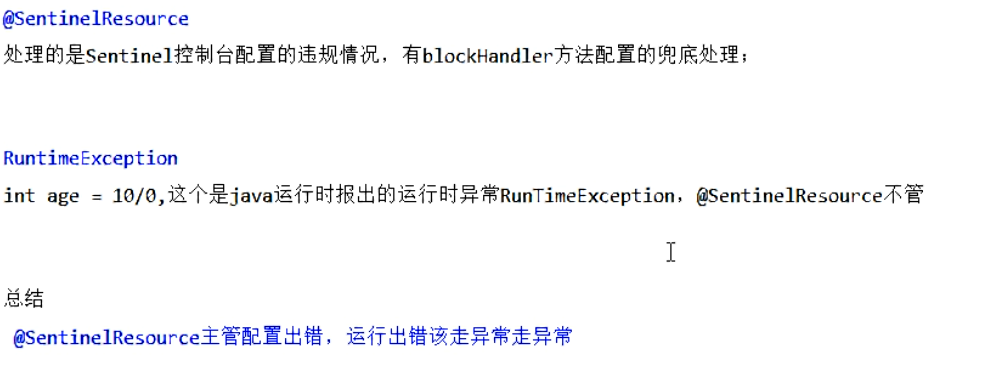


### 系统规则

https://github.com/alibaba/Sentinel/wiki/%E7%B3%BB%E7%BB%9F%E8%87%AA%E9%80%82%E5%BA%94%E9%99%90%E6%B5%81


配置全局QPS


访问：http://localhost:8401/testA

访问：http://localhost:8401/testB

一秒一次没问题，狂点就降级


没有分门别类，全局的地址，人口级别的，大家作为连接即可~！


### @SentinelResource

#### 按资源名称限流+后续处理

启动Nacos成功

启动Sentinel成功

##### Module

修改：cloudalibaba-sentinel-service8401

POM

```xml
<dependency>
    <groupId>com.lxyk.springcloud</groupId>
    <artifactId>cloud-api-commons</artifactId>
    <version>${project.version}</version>
</dependency>

```

YML

```properties
server:
  port: 8401

spring:
  application:
    name: cloudalibaba-sentinel-service
  cloud:
    nacos:
      discovery:
        server-addr: localhost:8848
    sentinel:
      transport:
        dashboard: localhost:8080
        port: 8719  #默认8719，假如被占用了会自动从8719开始依次+1扫描。直至找到未被占用的端口

management:
  endpoints:
    web:
      exposure:
        include: '*'
```

业务类RateLimitController

```java
@RestController
public class RateLimitController
{
    @GetMapping("/byResource")
    @SentinelResource(value = "byResource",blockHandler = "handleException")
    public CommonResult byResource()
    {
        return new CommonResult(200,"按资源名称限流测试OK",new Payment(2020L,"serial001"));
    }
    public CommonResult handleException(BlockException exception)
    {
        return new CommonResult(444,exception.getClass().getCanonicalName()+"\t 服务不可用");
    }
}
```

主启动

```java
@EnableDiscoveryClient
@SpringBootApplication
public class MainApp8401
{
    public static void main(String[] args) {
        SpringApplication.run(MainApp8401.class, args);
    }

} 
```

访问：http://localhost:8401/byResource


配置流控规则

配置步骤


一秒一下，正常，狂点出事


图形配置和代码关系

表示1秒钟内查询次数大于1，就跑到我们自定义的处流，限流


测试


**额外问题**

此时关闭微服务8401看看


Sentinel控制台，流控规则消失了？？？？？

临时/持久？


#### 按照Url地址限流+后续处理

通过访问的URL来限流，会返回Sentinel自带默认的限流处理信息

业务类RateLimitController

```java
@GetMapping("/rateLimit/byUrl")
@SentinelResource(value = "byUrl")
public CommonResult byUrl()
{
    return new CommonResult(200,"按url限流测试OK",new Payment(2020L,"serial002"));
}

```

访问一次

http://localhost:8401/rateLimit/byUrl


Sentinel控制台配置

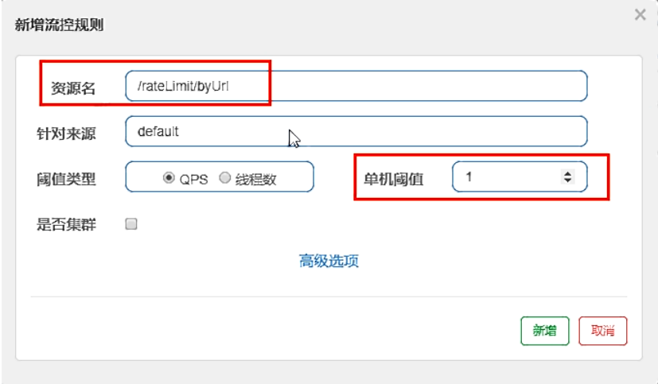

测试

疯狂点击http://localhost:8401/rateLimit/byUrl

结果


#### 上面兜底方法面临的问题


#### 客户自定义限流处理逻辑

创建customerBlockHandler类用于自定义限流处理逻辑

自定义限流处理类：CustomerBlockHandler


```java
public class CustomerBlockHandler {
    public static CommonResult handleException(BlockException exception) {
        return new CommonResult(4444, "自定义限流处理信息....CustomerBlockHandler---1");
    }

    public static CommonResult handleException2(BlockException exception) {
        return new CommonResult(4444, "自定义限流处理信息....CustomerBlockHandler---2");
    }
}

```


RateLimitController

```java
@GetMapping("/rateLimit/customerBlockHandler")
@SentinelResource(value = "customerBlockHandler",
        blockHandlerClass = CustomerBlockHandler.class,
        blockHandler = "handlerException2")
public CommonResult customerBlockHandler()
{
    return new CommonResult(200,"按客戶自定义",new Payment(2020L,"serial003"));
}

```

启动微服务后先调用一次

http://localhost:8401/rateLimit/customerBlockHandler


Sentinel控制台配置


狂点：http://localhost:8401/rateLimit/customerBlockHandler


测试后我们自定义的出来了

进一步说明


#### 更多注解属性说明


多说一句


Sentinel主要有三个核心API

SphU定义资源

Tracer定义统计

ContextUtil定义了上下文


### 服务熔断功能

sentinel整合ribbon+openFeign+fallback


#### Ribbon系

启动nacos和sentinel

##### 提供者9003/9004

新建cloudalibaba-provider-payment9003/9004

POM

```xml
<dependencies>
        <!--SpringCloud ailibaba nacos -->
        <dependency>
            <groupId>com.alibaba.cloud</groupId>
            <artifactId>spring-cloud-starter-alibaba-nacos-discovery</artifactId>
        </dependency>
        <dependency><!-- 引入自己定义的api通用包，可以使用Payment支付Entity -->
            <groupId>com.lxyk.springcloud</groupId>
            <artifactId>cloud-api-commons</artifactId>
            <version>1.0-SNAPSHOTa</version>
        </dependency>
        <!-- SpringBoot整合Web组件 -->
        <dependency>
            <groupId>org.springframework.boot</groupId>
            <artifactId>spring-boot-starter-web</artifactId>
        </dependency>
        <dependency>
            <groupId>org.springframework.boot</groupId>
            <artifactId>spring-boot-starter-actuator</artifactId>
        </dependency>
        <!--日常通用jar包配置-->
        <dependency>
            <groupId>org.springframework.boot</groupId>
            <artifactId>spring-boot-devtools</artifactId>
            <scope>runtime</scope>
            <optional>true</optional>
        </dependency>
        <dependency>
            <groupId>org.projectlombok</groupId>
            <artifactId>lombok</artifactId>
            <optional>true</optional>
        </dependency>
        <dependency>
            <groupId>org.springframework.boot</groupId>
            <artifactId>spring-boot-starter-test</artifactId>
            <scope>test</scope>
        </dependency>
    </dependencies>
```

YML：记得修改不同的端口号

```properties
server:
  port: 9003

spring:
  application:
    name: nacos-payment-provider
  cloud:
    nacos:
      discovery:
        server-addr: localhost:8848 #配置Nacos地址

management:
  endpoints:
    web:
      exposure:
        include: '*'

```

主启动

```java
@SpringBootApplication
@EnableDiscoveryClient
public class PaymentMain9003
{
    public static void main(String[] args) {
        SpringApplication.run(PaymentMain9003.class, args);
    }
}
```

业务类

```java
@RestController
public class PaymentController
{
    @Value("${server.port}")
    private String serverPort;

    public static HashMap<Long, Payment> hashMap = new HashMap<>();
    static{
        hashMap.put(1L,new Payment(1L,"28a8c1e3bc2742d8848569891fb42181"));
        hashMap.put(2L,new Payment(2L,"bba8c1e3bc2742d8848569891ac32182"));
        hashMap.put(3L,new Payment(3L,"6ua8c1e3bc2742d8848569891xt92183"));
    }

    @GetMapping(value = "/paymentSQL/{id}")
    public CommonResult<Payment> paymentSQL(@PathVariable("id") Long id){
        Payment payment = hashMap.get(id);
        CommonResult<Payment> result = new CommonResult(200,"from mysql,serverPort:  "+serverPort,payment);
        return result;
    }
}
```

启动：9003,9004

测试地址：http://localhost:9003/paymentSQL/1


##### 消费者84

新建cloudalibaba-consumer-nacos-order84

POM

```xml
<dependencies>
        <dependency>
            <groupId>org.springframework.cloud</groupId>
            <artifactId>spring-cloud-starter-openfeign</artifactId>
        </dependency>
        <dependency>
            <groupId>com.alibaba.cloud</groupId>
            <artifactId>spring-cloud-starter-alibaba-nacos-discovery</artifactId>
        </dependency>
        <dependency>
            <groupId>com.alibaba.cloud</groupId>
            <artifactId>spring-cloud-starter-alibaba-sentinel</artifactId>
        </dependency>
        <dependency>
            <groupId>com.lxyk.springcloud</groupId>
            <artifactId>cloud-api-commons</artifactId>
            <version>${project.version}</version>
        </dependency>
        <dependency>
            <groupId>org.springframework.boot</groupId>
            <artifactId>spring-boot-starter-web</artifactId>
        </dependency>
        <dependency>
            <groupId>org.springframework.boot</groupId>
            <artifactId>spring-boot-starter-actuator</artifactId>
        </dependency>
        <dependency>
            <groupId>org.springframework.boot</groupId>
            <artifactId>spring-boot-devtools</artifactId>
            <scope>runtime</scope>
            <optional>true</optional>
        </dependency>
        <dependency>
            <groupId>org.projectlombok</groupId>
            <artifactId>lombok</artifactId>
            <optional>true</optional>
        </dependency>
        <dependency>
            <groupId>org.springframework.boot</groupId>
            <artifactId>spring-boot-starter-test</artifactId>
            <scope>test</scope>
        </dependency>
    </dependencies>


```

YML

```properties
server:
  port: 84


spring:
  application:
    name: nacos-order-consumer
  cloud:
    nacos:
      discovery:
        server-addr: localhost:8848
    sentinel:
      transport:
        dashboard: localhost:8080
        port: 8719

service-url:
  nacos-user-service: http://nacos-payment-provider


```

主启动

```java
@EnableDiscoveryClient
@SpringBootApplication
@EnableFeignClients
public class OrderNacosMain84
{
    public static void main(String[] args) {
        SpringApplication.run(OrderNacosMain84.class, args);
    }
}
```

业务类

ApplicationContextConfig

```java
@Configuration
public class ApplicationContextConfig
{
    @Bean
    @LoadBalanced
    public RestTemplate getRestTemplate()
    {
        return new RestTemplate();
    }
}
```

CircleBreakerController

```java
@RestController
@Slf4j
public class CircleBreakerController {

    public static final String SERVICE_URL = "http://nacos-payment-provider";

    @Resource
    private RestTemplate restTemplate;


    @RequestMapping("/consumer/fallback/{id}")
    @SentinelResource(value = "fallback") //没有配置
    public CommonResult<Payment> fallback(@PathVariable Long id) {
        CommonResult<Payment> result = restTemplate.getForObject(SERVICE_URL + "/paymentSQL/"+id, CommonResult.class,id);

        if (id == 4) {
            throw new IllegalArgumentException ("IllegalArgumentException,非法参数异常....");
        }else if (result.getData() == null) {
            throw new NullPointerException ("NullPointerException,该ID没有对应记录,空指针异常");
        }
        return result;
    }

}

```

CircleBreakerController的全部源码

```java
@RestController
@Slf4j
public class CircleBreakerController {
   
    public static final String SERVICE_URL = "http://nacos-payment-provider";

    @Resource
    private RestTemplate restTemplate;

   
    
    @RequestMapping("/consumer/fallback/{id}")
    //@SentinelResource(value = "fallback") //没有配置
    //@SentinelResource(value = "fallback",fallback = "handlerFallback") //fallback只负责业务异常
    //@SentinelResource(value = "fallback",blockHandler = "blockHandler") //blockHandler只负责sentinel控制台配置违规
    @SentinelResource(value = "fallback",fallback = "handlerFallback",blockHandler = "blockHandler",
            exceptionsToIgnore = {IllegalArgumentException.class})
    public CommonResult<Payment> fallback(@PathVariable Long id) {
        CommonResult<Payment> result = restTemplate.getForObject(SERVICE_URL + "/paymentSQL/"+id, CommonResult.class,id);

        if (id == 4) {
            throw new IllegalArgumentException ("IllegalArgumentException,非法参数异常....");
        }else if (result.getData() == null) {
            throw new NullPointerException ("NullPointerException,该ID没有对应记录,空指针异常");
        }

        return result;
    }
  
    //fallback
    public CommonResult handlerFallback(@PathVariable  Long id,Throwable e) {
        Payment payment = new Payment(id,"null");
        return new CommonResult<>(444,"兜底异常handlerFallback,exception内容  "+e.getMessage(),payment);
    }
  
    //blockHandler
    public CommonResult blockHandler(@PathVariable  Long id,BlockException blockException) {
        Payment payment = new Payment(id,"null");
        return new CommonResult<>(445,"blockHandler-sentinel限流,无此流水: blockException  "+blockException.getMessage(),payment);
    }


}

```


启动：9003,9004,84

访问：http://localhost:84/consumer/fallback/1    负载均衡效果


访问：http://localhost:84/consumer/fallback/1

1,2,3没问题 4及以上报错

没有任何配置，给客户error页面，不友好


只配置fallback,改造

```java
@RestController
@Slf4j
public class CircleBreakerController {

    public static final String SERVICE_URL = "http://nacos-payment-provider";

    @Resource
    private RestTemplate restTemplate;


    @RequestMapping("/consumer/fallback/{id}")
    //@SentinelResource(value = "fallback") //没有配置
    @SentinelResource(value = "fallback",fallback = "handlerFallback") //fallback只负责业务异常
    public CommonResult<Payment> fallback(@PathVariable Long id) {
        CommonResult<Payment> result = restTemplate.getForObject(SERVICE_URL + "/paymentSQL/"+id, CommonResult.class,id);

        if (id == 4) {
            throw new IllegalArgumentException ("IllegalArgumentException,非法参数异常....");
        }else if (result.getData() == null) {
            throw new NullPointerException ("NullPointerException,该ID没有对应记录,空指针异常");
        }
        return result;
    }


    //fallback
    public CommonResult handlerFallback(@PathVariable  Long id,Throwable e) {
        Payment payment = new Payment(id,"null");
        return new CommonResult<>(444,"兜底异常handlerFallback,exception内容  "+e.getMessage(),payment);
    }

}

```

访问：http://localhost:84/consumer/fallback/4


只配置blockHandler

```java
@RestController
@Slf4j
public class CircleBreakerController {

    public static final String SERVICE_URL = "http://nacos-payment-provider";

    @Resource
    private RestTemplate restTemplate;


    @RequestMapping("/consumer/fallback/{id}")
    //@SentinelResource(value = "fallback") //没有配置
    //@SentinelResource(value = "fallback",fallback = "handlerFallback") //fallback只负责业务异常
    @SentinelResource(value = "fallback",blockHandler = "blockHandler") //blockHandler只负责sentinel控制台配置违规
    public CommonResult<Payment> fallback(@PathVariable Long id) {
        CommonResult<Payment> result = restTemplate.getForObject(SERVICE_URL + "/paymentSQL/"+id, CommonResult.class,id);

        if (id == 4) {
            throw new IllegalArgumentException ("IllegalArgumentException,非法参数异常....");
        }else if (result.getData() == null) {
            throw new NullPointerException ("NullPointerException,该ID没有对应记录,空指针异常");
        }
        return result;
    }


    //fallback
   /* public CommonResult handlerFallback(@PathVariable  Long id,Throwable e) {
        Payment payment = new Payment(id,"null");
        return new CommonResult<>(444,"兜底异常handlerFallback,exception内容  "+e.getMessage(),payment);
    }*/

    //blockHandler
    public CommonResult blockHandler(@PathVariable  Long id,BlockException blockException) {
        Payment payment = new Payment(id,"null");
        return new CommonResult<>(445,"blockHandler-sentinel限流,无此流水: blockException  "+blockException.getMessage(),payment);
    }

}

```


疯狂访问，超过两次以上：http://localhost:84/consumer/fallback/4


fallback和blockHandler都配置

```java
@RestController
@Slf4j
public class CircleBreakerController {

    public static final String SERVICE_URL = "http://nacos-payment-provider";

    @Resource
    private RestTemplate restTemplate;


    @RequestMapping("/consumer/fallback/{id}")
    //@SentinelResource(value = "fallback") //没有配置
    //@SentinelResource(value = "fallback",fallback = "handlerFallback") //fallback只负责业务异常
    //@SentinelResource(value = "fallback",blockHandler = "blockHandler") //blockHandler只负责sentinel控制台配置违规
    @SentinelResource(value = "fallback",fallback = "handlerFallback",blockHandler = "blockHandler")//fallback和blockHandler都配置

    public CommonResult<Payment> fallback(@PathVariable Long id) {
        CommonResult<Payment> result = restTemplate.getForObject(SERVICE_URL + "/paymentSQL/"+id, CommonResult.class,id);

        if (id == 4) {
            throw new IllegalArgumentException ("IllegalArgumentException,非法参数异常....");
        }else if (result.getData() == null) {
            throw new NullPointerException ("NullPointerException,该ID没有对应记录,空指针异常");
        }
        return result;
    }


    //fallback
    public CommonResult handlerFallback(@PathVariable  Long id,Throwable e) {
        Payment payment = new Payment(id,"null");
        return new CommonResult<>(444,"兜底异常handlerFallback,exception内容  "+e.getMessage(),payment);
    }

    //blockHandler
    public CommonResult blockHandler(@PathVariable  Long id,BlockException blockException) {
        Payment payment = new Payment(id,"null");
        return new CommonResult<>(445,"blockHandler-sentinel限流,无此流水: blockException  "+blockException.getMessage(),payment);
    }

}

```


疯狂访问：http://localhost:84/consumer/fallback/1


疯狂访问：http://localhost:84/consumer/fallback/4

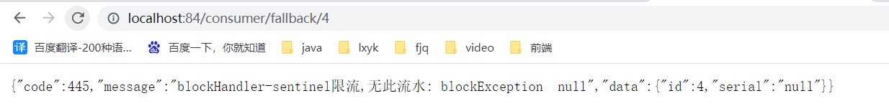

结果：


忽略属性


```java
  @SentinelResource(value = "fallback",fallback = "handlerFallback",blockHandler = "blockHandler",
            exceptionsToIgnore = {IllegalArgumentException.class})

```


访问：http://localhost:84/consumer/fallback/4


访问：http://localhost:84/consumer/fallback/5


#### Feign系列

#### 熔断框架比较


修改84模块

POM

```xml
<dependency>
    <groupId>org.springframework.cloud</groupId>
    <artifactId>spring-cloud-starter-openfeign</artifactId>
</dependency>
```

YML

```properties
server:
  port: 84


spring:
  application:
    name: nacos-order-consumer
  cloud:
    nacos:
      discovery:
        server-addr: localhost:8848
    sentinel:
      transport:
        dashboard: localhost:8080
        port: 8719

service-url:
  nacos-user-service: http://nacos-payment-provider

#对Feign的支持
feign:
  sentinel:
    enabled: true
 

```

业务类

带@FeignClient注解的业务接口

```java
@FeignClient(value = "nacos-payment-provider",fallback = PaymentFallbackService.class)
public interface PaymentService
{
    @GetMapping(value = "/paymentSQL/{id}")
    public CommonResult<Payment> paymentSQL(@PathVariable("id") Long id);
}
 
```

fallback = PaymentFallbackService.class

PaymentFallbackService实现类

```java
@Component
public class PaymentFallbackService implements PaymentService
{
    @Override
    public CommonResult<Payment> paymentSQL(Long id)
    {
        return new CommonResult<>(44444,"服务降级返回,---PaymentFallbackService",new Payment(id,"errorSerial"));
    }
}
 

```

Controller

```java
// OpenFeign
@Resource
private PaymentService paymentService;

@GetMapping(value = "/consumer/paymentSQL/{id}")
public CommonResult<Payment> paymentSQL(@PathVariable("id") Long id) {
    return paymentService.paymentSQL(id);
}
 
```

主启动

添加@EnableFeignClients启动Feign的功能

```java
@EnableDiscoveryClient
@SpringBootApplication
@EnableFeignClients
public class OrderNacosMain84
{
    public static void main(String[] args) {
        SpringApplication.run(OrderNacosMain84.class, args);
    }
}

```


访问：http://localhost:84/consumer/paymentSQL/1


测试84调用9003，此时故意关闭9003微服务提供者，看84消费侧自动降级，不会被耗死

访问：http://localhost:84/consumer/paymentSQL/1

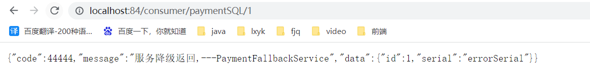


### 规则持久化

是什么：一旦我们重启应用，Sentinel规则将消失，生产环境需要将配置规则进行持久化

怎么玩：将限流配置规则持久化进Nacos保存，只要刷新8401某个rest地址，sentinel控制台的流控规则就能看到，只要Nacos里面的配置不删除，针对8401上Sentinel上的流控规则持续有效


步骤

修改cloudalibaba-sentinel-service8401

POM

```xml
<dependency>
    <groupId>com.alibaba.csp</groupId>
    <artifactId>sentinel-datasource-nacos</artifactId>
</dependency>
 
```

YML

```properties
server:
  port: 8401

spring:
  application:
    name: cloudalibaba-sentinel-service
  cloud:
    nacos:
      discovery:
        server-addr: localhost:8848 #Nacos服务注册中心地址
    sentinel:
      transport:
        dashboard: localhost:8080 #配置Sentinel dashboard地址
        port: 8719
        datasource:
          ds1:
            nacos:
              server-addr: localhost:8848
              dataId: cloudalibaba-sentinel-service
              groupId: DEFAULT_GROUP
              data-type: json
              rule-type: flow 
management:
  endpoints:
    web:
      exposure:
        include: '*'

feign:
  sentinel:
    enabled: true # 激活Sentinel对Feign的支持
```

添加Nacos数据源配置

```properties
spring:
   cloud:
    sentinel:
    datasource:
     ds1:
      nacos:
        server-addr:localhost:8848
        dataid:${spring.application.name}
        groupid:DEFAULT_GROUP
        data-type:json
            rule-type:flow
 

```


添加Nacos业务规则配置


内容解析

```properties
[
    {
         "resource": "/retaLimit/byUrl",
         "limitApp": "default",
         "grade":   1,
         "count":   1,
         "strategy": 0,
         "controlBehavior": 0,
         "clusterMode": false    
    }
]
 

```


启动8401后刷新sentinel发现业务规则有了

访问：http://localhost:8401/rateLimit/byUrl


快速访问测试接口

http://localhost:8401/rateLimit/byUrl


停止8401再看sentinel


重新启动8401再看sentinel

扎一看还是没有，稍等一会儿

多次调用：http://localhost:8401/rateLimit/byUrl

重新配置出现了，持久化验证通过


## 15.SpringCloud Alibaba Seata处理分布式事务

### **分布式事务问题**


分布式之后


一句话：一次业务操作需要跨多个数据源或需要跨多个系统进行远程调用，就会产生分布式事务问题


### Seata简介

#### **是什么**

Seata是一款开源的分布式事务解决方案，致力于在微服务架构下提供高性能和简单易用的分布式事务服务

官网地址：http://seata.io/zh-cn/


#### **能干嘛**

一个典型的分布式事务过程

分布式事务处理过程的-ID+三组件模型

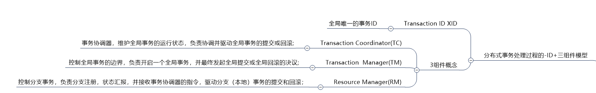


#### 处理过程


#### **去哪下**

发布说明:https://github.com/seata/seata/releases

**怎么玩**

Spring 本地@Transactional

全局@GlobalTransactional

SEATA的分布式交易解决方案


### Seata-Server安装

#### 1.官网地址：http://seata.io/zh-cn/

#### 3.seata-server-0.9.0.zip解压到指定目录并修改conf目录下的file.conf配置文件


service模块

```
vgroup_mapping.my_test_tx_group = "fsp_tx_group"
```


store模块


```
mode = "db"
 
  url = "jdbc:mysql://127.0.0.1:3306/seata"
  user = "root"
  password = "你自己的密码"
```


#### 4.mysql5.7数据库新建库seata


#### 5.在seata库里建表

建表db_store.sql在\seata-server-0.9.0\seata\conf目录里面：db_store.sql

SQL

```sql
-- the table to store GlobalSession data
drop table if exists `global_table`;
create table `global_table` (
  `xid` varchar(128)  not null,
  `transaction_id` bigint,
  `status` tinyint not null,
  `application_id` varchar(32),
  `transaction_service_group` varchar(32),
  `transaction_name` varchar(128),
  `timeout` int,
  `begin_time` bigint,
  `application_data` varchar(2000),
  `gmt_create` datetime,
  `gmt_modified` datetime,
  primary key (`xid`),
  key `idx_gmt_modified_status` (`gmt_modified`, `status`),
  key `idx_transaction_id` (`transaction_id`)
);
 
-- the table to store BranchSession data
drop table if exists `branch_table`;
create table `branch_table` (
  `branch_id` bigint not null,
  `xid` varchar(128) not null,
  `transaction_id` bigint ,
  `resource_group_id` varchar(32),
  `resource_id` varchar(256) ,
  `lock_key` varchar(128) ,
  `branch_type` varchar(8) ,
  `status` tinyint,
  `client_id` varchar(64),
  `application_data` varchar(2000),
  `gmt_create` datetime,
  `gmt_modified` datetime,
  primary key (`branch_id`),
  key `idx_xid` (`xid`)
);
 
-- the table to store lock data
drop table if exists `lock_table`;
create table `lock_table` (
  `row_key` varchar(128) not null,
  `xid` varchar(96),
  `transaction_id` long ,
  `branch_id` long,
  `resource_id` varchar(256) ,
  `table_name` varchar(32) ,
  `pk` varchar(36) ,
  `gmt_create` datetime ,
  `gmt_modified` datetime,
  primary key(`row_key`)
);
 

```

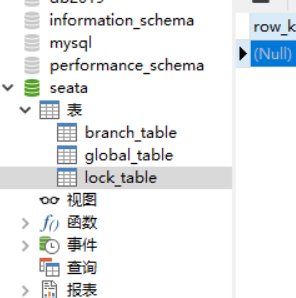

#### 6.修改seata-server-0.9.0\seata\conf目录下的registry.conf配置文件


```
registry {
  # file 、nacos 、eureka、redis、zk、consul、etcd3、sofa
  type = "nacos"
 
  nacos {
    serverAddr = "localhost:8848"
    namespace = ""
    cluster = "default"
  }
目的是：指明注册中心为nacos，及修改nacos连接信息
```


#### 7.先启动Nacos端口号8848


#### 8.再启动seata-server

softs\seata-server-0.9.0\seata\bin：seata-server.bat


### 订单/库存/账户业务数据库准备

以下演示都需要先启动Nacos后启动Seata，保证两个都OK

Seata没启动报错no available server to connect


#### 分布式事务业务说明

业务说明


下订单-->扣库存-->减账户（余额）


#### 创建业务数据库

seata_order: 存储订单的数据库

seata_storage:存储库存的数据库

seata_account: 存储账户信息的数据库

建表SQL

```sql
CREATE DATABASE seata_order; 

CREATE DATABASE seata_storage;
 
CREATE DATABASE seata_account;
```


#### 按照上述3库分别建对应业务表

seata_order库下建t_order表

```sql
CREATE TABLE t_order(
    `id` BIGINT(11) NOT NULL AUTO_INCREMENT PRIMARY KEY,
    `user_id` BIGINT(11) DEFAULT NULL COMMENT '用户id',
    `product_id` BIGINT(11) DEFAULT NULL COMMENT '产品id',
    `count` INT(11) DEFAULT NULL COMMENT '数量',
    `money` DECIMAL(11,0) DEFAULT NULL COMMENT '金额',
    `status` INT(1) DEFAULT NULL COMMENT '订单状态：0：创建中; 1：已完结'
) ENGINE=INNODB AUTO_INCREMENT=7 DEFAULT CHARSET=utf8;
 
SELECT * FROM t_order;

```

seata_storage库下建t_storage表

```sql
CREATE TABLE t_storage(
    `id` BIGINT(11) NOT NULL AUTO_INCREMENT PRIMARY KEY,
    `product_id` BIGINT(11) DEFAULT NULL COMMENT '产品id',
   `'total` INT(11) DEFAULT NULL COMMENT '总库存',
    `used` INT(11) DEFAULT NULL COMMENT '已用库存',
    `residue` INT(11) DEFAULT NULL COMMENT '剩余库存'
) ENGINE=INNODB AUTO_INCREMENT=2 DEFAULT CHARSET=utf8;
 
INSERT INTO seata_storage.t_storage(`id`,`product_id`,`total`,`used`,`residue`)
VALUES('1','1','100','0','100');
 
 
SELECT * FROM t_storage;

```

seata_account库下建t_account表

```sql
CREATE TABLE t_account(
    `id` BIGINT(11) NOT NULL AUTO_INCREMENT PRIMARY KEY COMMENT 'id',
    `user_id` BIGINT(11) DEFAULT NULL COMMENT '用户id',
    `total` DECIMAL(10,0) DEFAULT NULL COMMENT '总额度',
    `used` DECIMAL(10,0) DEFAULT NULL COMMENT '已用余额',
    `residue` DECIMAL(10,0) DEFAULT '0' COMMENT '剩余可用额度'
) ENGINE=INNODB AUTO_INCREMENT=2 DEFAULT CHARSET=utf8;
 
INSERT INTO seata_account.t_account(`id`,`user_id`,`total`,`used`,`residue`) VALUES('1','1','1000','0','1000')
 
 
 
SELECT * FROM t_account;

```


#### 按照上述3库分别建对应的回滚日志表

订单-库存-账户3个库下都需要建各自的回滚日志表

\seata-server-0.9.0\seata\conf目录下的db_undo_log.sql 

建表SQL

```sql
drop table `undo_log`;
CREATE TABLE `undo_log` (
  `id` bigint(20) NOT NULL AUTO_INCREMENT,
  `branch_id` bigint(20) NOT NULL,
  `xid` varchar(100) NOT NULL,
  `context` varchar(128) NOT NULL,
  `rollback_info` longblob NOT NULL,
  `log_status` int(11) NOT NULL,
  `log_created` datetime NOT NULL,
  `log_modified` datetime NOT NULL,
  `ext` varchar(100) DEFAULT NULL,
  PRIMARY KEY (`id`),
  UNIQUE KEY `ux_undo_log` (`xid`,`branch_id`)
) ENGINE=InnoDB AUTO_INCREMENT=1 DEFAULT CHARSET=utf8;

```


#### 最终效果


### 订单/库存/账户业务微服务准备

#### 业务需求

下订单->减库存->扣余额->改（订单）状态


#### 新建订单Order-Module

1.seata-order-service2001

2.POM

```xml
 <dependencies>
        <!--nacos-->
        <dependency>
            <groupId>com.alibaba.cloud</groupId>
            <artifactId>spring-cloud-starter-alibaba-nacos-discovery</artifactId>
        </dependency>
        <!--seata-->
        <dependency>
            <groupId>com.alibaba.cloud</groupId>
            <artifactId>spring-cloud-starter-alibaba-seata</artifactId>
            <exclusions>
                <exclusion>
                    <artifactId>seata-all</artifactId>
                    <groupId>io.seata</groupId>
                </exclusion>
            </exclusions>
        </dependency>
      <!--版本 和自己用的最好一致-->
        <dependency>
            <groupId>io.seata</groupId>
            <artifactId>seata-all</artifactId>
            <version>0.9.0</version>
        </dependency>
        <!--feign-->
        <dependency>
            <groupId>org.springframework.cloud</groupId>
            <artifactId>spring-cloud-starter-openfeign</artifactId>
        </dependency>
        <!--web-actuator-->
        <dependency>
            <groupId>org.springframework.boot</groupId>
            <artifactId>spring-boot-starter-web</artifactId>
        </dependency>
        <dependency>
            <groupId>org.springframework.boot</groupId>
            <artifactId>spring-boot-starter-actuator</artifactId>
        </dependency>
        <!--mysql-druid-->
        <dependency>
            <groupId>mysql</groupId>
            <artifactId>mysql-connector-java</artifactId>
            <version>5.1.37</version>
        </dependency>
        <dependency>
            <groupId>com.alibaba</groupId>
            <artifactId>druid-spring-boot-starter</artifactId>
            <version>1.1.10</version>
        </dependency>
        <dependency>
            <groupId>org.mybatis.spring.boot</groupId>
            <artifactId>mybatis-spring-boot-starter</artifactId>
            <version>2.0.0</version>
        </dependency>
        <dependency>
            <groupId>org.springframework.boot</groupId>
            <artifactId>spring-boot-starter-test</artifactId>
            <scope>test</scope>
        </dependency>
        <dependency>
            <groupId>org.projectlombok</groupId>
            <artifactId>lombok</artifactId>
            <optional>true</optional>
        </dependency>
    </dependencies>
```

3.YML

```properties
server:
  port: 2001
 
spring:
  application:
    name: seata-order-service
  cloud:
    alibaba:
      seata:
        #自定义事务组名称需要与seata-server中的对应
        tx-service-group: fsp_tx_group
    nacos:
      discovery:
        server-addr: localhost:8848
  datasource:
    driver-class-name: com.mysql.jdbc.Driver
    url: jdbc:mysql://localhost:3306/seata_order
    username: root
    password: root
 
feign:
  hystrix:
    enabled: false
 
logging:
  level:
    io:
      seata: info
 
mybatis:
  mapperLocations: classpath:mapper/*.xml

```

4.file.conf

```properties
transport {
  # tcp udt unix-domain-socket
  type = "TCP"
  #NIO NATIVE
  server = "NIO"
  #enable heartbeat
  heartbeat = true
  #thread factory for netty
  thread-factory {
    boss-thread-prefix = "NettyBoss"
    worker-thread-prefix = "NettyServerNIOWorker"
    server-executor-thread-prefix = "NettyServerBizHandler"
    share-boss-worker = false
    client-selector-thread-prefix = "NettyClientSelector"
    client-selector-thread-size = 1
    client-worker-thread-prefix = "NettyClientWorkerThread"
    # netty boss thread size,will not be used for UDT
    boss-thread-size = 1
    #auto default pin or 8
    worker-thread-size = 8
  }
  shutdown {
    # when destroy server, wait seconds
    wait = 3
  }
  serialization = "seata"
  compressor = "none"
}
 
service {
 
  vgroup_mapping.fsp_tx_group = "fsp_tx_group" 
 
  default.grouplist = "127.0.0.1:8091"
  enableDegrade = false
  disable = false
  max.commit.retry.timeout = "-1"
  max.rollback.retry.timeout = "-1"
  disableGlobalTransaction = false
}
 
 
client {
  async.commit.buffer.limit = 10000
  lock {
    retry.internal = 10
    retry.times = 30
  }
  report.retry.count = 5
  tm.commit.retry.count = 1
  tm.rollback.retry.count = 1
}
 
## transaction log store
store {
  ## store mode: file、db
  mode = "db"
 
  ## file store
  file {
    dir = "sessionStore"
 
    # branch session size , if exceeded first try compress lockkey, still exceeded throws exceptions
    max-branch-session-size = 16384
    # globe session size , if exceeded throws exceptions
    max-global-session-size = 512
    # file buffer size , if exceeded allocate new buffer
    file-write-buffer-cache-size = 16384
    # when recover batch read size
    session.reload.read_size = 100
    # async, sync
    flush-disk-mode = async
  }
 
  ## database store
  db {
    ## the implement of javax.sql.DataSource, such as DruidDataSource(druid)/BasicDataSource(dbcp) etc.
    datasource = "dbcp"
    ## mysql/oracle/h2/oceanbase etc.
    db-type = "mysql"
    driver-class-name = "com.mysql.jdbc.Driver"
    url = "jdbc:mysql://127.0.0.1:3306/seata"
    user = "root"
    password = "root"
    min-conn = 1
    max-conn = 3
    global.table = "global_table"
    branch.table = "branch_table"
    lock-table = "lock_table"
    query-limit = 100
  }
}
lock {
  ## the lock store mode: local、remote
  mode = "remote"
 
  local {
    ## store locks in user's database
  }
 
  remote {
    ## store locks in the seata's server
  }
}
recovery {
  #schedule committing retry period in milliseconds
  committing-retry-period = 1000
  #schedule asyn committing retry period in milliseconds
  asyn-committing-retry-period = 1000
  #schedule rollbacking retry period in milliseconds
  rollbacking-retry-period = 1000
  #schedule timeout retry period in milliseconds
  timeout-retry-period = 1000
}
 
transaction {
  undo.data.validation = true
  undo.log.serialization = "jackson"
  undo.log.save.days = 7
  #schedule delete expired undo_log in milliseconds
  undo.log.delete.period = 86400000
  undo.log.table = "undo_log"
}
 
## metrics settings
metrics {
  enabled = false
  registry-type = "compact"
  # multi exporters use comma divided
  exporter-list = "prometheus"
  exporter-prometheus-port = 9898
}
 
support {
  ## spring
  spring {
    # auto proxy the DataSource bean
    datasource.autoproxy = false
  }
}

```

5.registry.conf

```properties
registry {
  # file 、nacos 、eureka、redis、zk、consul、etcd3、sofa
  type = "nacos"
 
  nacos {
    serverAddr = "localhost:8848"
    namespace = ""
    cluster = "default"
  }
  eureka {
    serviceUrl = "http://localhost:8761/eureka"
    application = "default"
    weight = "1"
  }
  redis {
    serverAddr = "localhost:6379"
    db = "0"
  }
  zk {
    cluster = "default"
    serverAddr = "127.0.0.1:2181"
    session.timeout = 6000
    connect.timeout = 2000
  }
  consul {
    cluster = "default"
    serverAddr = "127.0.0.1:8500"
  }
  etcd3 {
    cluster = "default"
    serverAddr = "http://localhost:2379"
  }
  sofa {
    serverAddr = "127.0.0.1:9603"
    application = "default"
    region = "DEFAULT_ZONE"
    datacenter = "DefaultDataCenter"
    cluster = "default"
    group = "SEATA_GROUP"
    addressWaitTime = "3000"
  }
  file {
    name = "file.conf"
  }
}
 
config {
  # file、nacos 、apollo、zk、consul、etcd3
  type = "file"
 
  nacos {
    serverAddr = "localhost"
    namespace = ""
  }
  consul {
    serverAddr = "127.0.0.1:8500"
  }
  apollo {
    app.id = "seata-server"
    apollo.meta = "http://192.168.1.204:8801"
  }
  zk {
    serverAddr = "127.0.0.1:2181"
    session.timeout = 6000
    connect.timeout = 2000
  }
  etcd3 {
    serverAddr = "http://localhost:2379"
  }
  file {
    name = "file.conf"
  }
}
```

6.domain

CommonResult

```java
@Data
@AllArgsConstructor
@NoArgsConstructor
public class CommonResult<T>
{
    private Integer code;
    private String  message;
    private T       data;

    public CommonResult(Integer code, String message)
    {
        this(code,message,null);
    }
}
```

Order

```java
@Data
@AllArgsConstructor
@NoArgsConstructor
public class Order
{
    private Long id;

    private Long userId;

    private Long productId;

    private Integer count;

    private BigDecimal money;

    private Integer status; //订单状态：0：创建中；1：已完结
}
```

7.Dao接口及实现

OrderDao

```java
@Mapper
public interface OrderDao
{
    //新建订单
    void create(Order order);

    //修改订单状态，从零改为1
    void update(@Param("userId") Long userId, @Param("status") Integer status);
}
```

resources文件夹下新建mapper文件夹后添加

OrderMapper.xml

```xml
<?xml version="1.0" encoding="UTF-8" ?>
<!DOCTYPE mapper PUBLIC "-//mybatis.org//DTD Mapper 3.0//EN" "http://mybatis.org/dtd/mybatis-3-mapper.dtd" >

<mapper namespace="com.lxyk.springcloud.dao.OrderDao">

    <resultMap id="BaseResultMap" type="com.lxyk.springcloud.alibaba.domain.Order">
        <id column="id" property="id" jdbcType="BIGINT"/>
        <result column="user_id" property="userId" jdbcType="BIGINT"/>
        <result column="product_id" property="productId" jdbcType="BIGINT"/>
        <result column="count" property="count" jdbcType="INTEGER"/>
        <result column="money" property="money" jdbcType="DECIMAL"/>
        <result column="status" property="status" jdbcType="INTEGER"/>
    </resultMap>

    <insert id="create">
        insert into t_order (id,user_id,product_id,count,money,status)
        values (null,#{userId},#{productId},#{count},#{money},0);
    </insert>


    <update id="update">
        update t_order set status = 1
        where user_id=#{userId} and status = #{status};
    </update>

</mapper>
```

8.Service接口及实现

OrderService

```java
public interface OrderService {
    void create(Order order);
}
```

OrderServiceImpl

```java
@Service
@Slf4j
public class OrderServiceImpl implements OrderService
{
    @Resource
    private OrderDao orderDao;
    @Resource
    private StorageService storageService;
    @Resource
    private AccountService accountService;

    /**
     * 创建订单->调用库存服务扣减库存->调用账户服务扣减账户余额->修改订单状态
     */

    @Override
    //@GlobalTransactional(name = "fbb-create-order",rollbackFor = Exception.class)
    public void create(Order order){
        log.info("----->开始新建订单");
        //新建订单
        orderDao.create(order);

        //扣减库存
        log.info("----->订单微服务开始调用库存，做扣减Count");
        storageService.decrease(order.getProductId(),order.getCount());
        log.info("----->订单微服务开始调用库存，做扣减end");

        //扣减账户
        log.info("----->订单微服务开始调用账户，做扣减Money");
        accountService.decrease(order.getUserId(),order.getMoney());
        log.info("----->订单微服务开始调用账户，做扣减end");


        //修改订单状态，从零到1代表已经完成
        log.info("----->修改订单状态开始");
        orderDao.update(order.getUserId(),0);
        log.info("----->修改订单状态结束");

        log.info("----->下订单结束了");

    }
}
```

StorageService

```java
@FeignClient(value = "seata-storage-service")
public interface StorageService{
    @PostMapping(value = "/storage/decrease")
    CommonResult decrease(@RequestParam("productId") Long productId, @RequestParam("count") Integer count);
}
```

AccountService

```java
@FeignClient(value = "seata-account-service")
public interface AccountService{
    @PostMapping(value = "/account/decrease")
    CommonResult decrease(@RequestParam("userId") Long userId, @RequestParam("money") BigDecimal money);
}
```

9.Controller

```java
@RestController
public class OrderController{
    @Resource
    private OrderService orderService;


    @GetMapping("/order/create")
    public CommonResult create(Order order)
    {
        orderService.create(order);
        return new CommonResult(200,"订单创建成功");
    }
}
```

10.Config配置

MyBatisConfig

```java
@Configuration
@MapperScan({"com.lxyk.springcloud.dao"})
public class MyBatisConfig {

}
```

DataSourceProxyConfig

```java
//使用Seata对数据源进行代理
@Configuration
public class DataSourceProxyConfig {


    @Value("${mybatis.mapperLocations}")
    private String mapperLocations;


    @Bean
    @ConfigurationProperties(prefix = "spring.datasource")
    public DataSource druidDataSource(){
        return new DruidDataSource();
    }


    @Bean
    public DataSourceProxy dataSourceProxy(DataSource dataSource) {
        return new DataSourceProxy(dataSource);
    }


    @Bean
    public SqlSessionFactory sqlSessionFactoryBean(DataSourceProxy dataSourceProxy) throws Exception {
        SqlSessionFactoryBean sqlSessionFactoryBean = new SqlSessionFactoryBean();
        sqlSessionFactoryBean.setDataSource(dataSourceProxy);
        sqlSessionFactoryBean.setMapperLocations(new PathMatchingResourcePatternResolver().getResources(mapperLocations));
        sqlSessionFactoryBean.setTransactionFactory(new SpringManagedTransactionFactory());
        return sqlSessionFactoryBean.getObject();
    }

}
```

11.主启动

```java
@EnableDiscoveryClient
@EnableFeignClients
@SpringBootApplication(exclude = DataSourceAutoConfiguration.class)//取消数据源自动创建的配置
public class SeataOrderMainApp2001{
 
    public static void main(String[] args)
    {
        SpringApplication.run(SeataOrderMainApp2001.class, args);
    }
}

```


#### 新建库存Storage-Module

1.seata-order-service2002

2.POM

```xml
 <dependencies>
        <!--nacos-->
        <dependency>
            <groupId>com.alibaba.cloud</groupId>
            <artifactId>spring-cloud-starter-alibaba-nacos-discovery</artifactId>
        </dependency>
        <!--seata-->
        <dependency>
            <groupId>com.alibaba.cloud</groupId>
            <artifactId>spring-cloud-starter-alibaba-seata</artifactId>
            <exclusions>
                <exclusion>
                    <artifactId>seata-all</artifactId>
                    <groupId>io.seata</groupId>
                </exclusion>
            </exclusions>
        </dependency>
        <dependency>
            <groupId>io.seata</groupId>
            <artifactId>seata-all</artifactId>
            <version>0.9.0</version>
        </dependency>
        <!--feign-->
        <dependency>
            <groupId>org.springframework.cloud</groupId>
            <artifactId>spring-cloud-starter-openfeign</artifactId>
        </dependency>
        <dependency>
            <groupId>org.springframework.boot</groupId>
            <artifactId>spring-boot-starter-web</artifactId>
        </dependency>
        <dependency>
            <groupId>org.springframework.boot</groupId>
            <artifactId>spring-boot-starter-test</artifactId>
            <scope>test</scope>
        </dependency>
        <dependency>
            <groupId>org.mybatis.spring.boot</groupId>
            <artifactId>mybatis-spring-boot-starter</artifactId>
            <version>2.0.0</version>
        </dependency>
        <dependency>
            <groupId>mysql</groupId>
            <artifactId>mysql-connector-java</artifactId>
            <version>5.1.37</version>
        </dependency>
        <dependency>
            <groupId>com.alibaba</groupId>
            <artifactId>druid-spring-boot-starter</artifactId>
            <version>1.1.10</version>
        </dependency>
        <dependency>
            <groupId>org.projectlombok</groupId>
            <artifactId>lombok</artifactId>
            <optional>true</optional>
        </dependency>
    </dependencies>

```

3.YML

```properties
server:
  port: 2002

spring:
  application:
    name: seata-storage-service
  cloud:
    alibaba:
      seata:
        tx-service-group: fsp_tx_group
    nacos:
      discovery:
        server-addr: localhost:8848
  datasource:
    driver-class-name: com.mysql.jdbc.Driver
    url: jdbc:mysql://localhost:3306/seata_storage
    username: root
    password: root

logging:
  level:
    io:
      seata: info

mybatis:
  mapperLocations: classpath:mapper/*.xml
 
```

4.file.conf

```properties
transport {
  # tcp udt unix-domain-socket
  type = "TCP"
  #NIO NATIVE
  server = "NIO"
  #enable heartbeat
  heartbeat = true
  #thread factory for netty
  thread-factory {
    boss-thread-prefix = "NettyBoss"
    worker-thread-prefix = "NettyServerNIOWorker"
    server-executor-thread-prefix = "NettyServerBizHandler"
    share-boss-worker = false
    client-selector-thread-prefix = "NettyClientSelector"
    client-selector-thread-size = 1
    client-worker-thread-prefix = "NettyClientWorkerThread"
    # netty boss thread size,will not be used for UDT
    boss-thread-size = 1
    #auto default pin or 8
    worker-thread-size = 8
  }
  shutdown {
    # when destroy server, wait seconds
    wait = 3
  }
  serialization = "seata"
  compressor = "none"
}

service {
  #vgroup->rgroup
  vgroup_mapping.fsp_tx_group = "default"
  #only support single node
  default.grouplist = "127.0.0.1:8091"
  #degrade current not support
  enableDegrade = false
  #disable
  disable = false
  #unit ms,s,m,h,d represents milliseconds, seconds, minutes, hours, days, default permanent
  max.commit.retry.timeout = "-1"
  max.rollback.retry.timeout = "-1"
  disableGlobalTransaction = false
}

client {
  async.commit.buffer.limit = 10000
  lock {
    retry.internal = 10
    retry.times = 30
  }
  report.retry.count = 5
  tm.commit.retry.count = 1
  tm.rollback.retry.count = 1
}

transaction {
  undo.data.validation = true
  undo.log.serialization = "jackson"
  undo.log.save.days = 7
  #schedule delete expired undo_log in milliseconds
  undo.log.delete.period = 86400000
  undo.log.table = "undo_log"
}

support {
  ## spring
  spring {
    # auto proxy the DataSource bean
    datasource.autoproxy = false
  }
}
```

5.registry.conf

```properties
registry {
  # file 、nacos 、eureka、redis、zk
  type = "nacos"
 
  nacos {
    serverAddr = "localhost:8848"
    namespace = ""
    cluster = "default"
  }
  eureka {
    serviceUrl = "http://localhost:8761/eureka"
    application = "default"
    weight = "1"
  }
  redis {
    serverAddr = "localhost:6381"
    db = "0"
  }
  zk {
    cluster = "default"
    serverAddr = "127.0.0.1:2181"
    session.timeout = 6000
    connect.timeout = 2000
  }
  file {
    name = "file.conf"
  }
}
 
config {
  # file、nacos 、apollo、zk
  type = "file"
 
  nacos {
    serverAddr = "localhost"
    namespace = ""
    cluster = "default"
  }
  apollo {
    app.id = "fescar-server"
    apollo.meta = "http://192.168.1.204:8801"
  }
  zk {
    serverAddr = "127.0.0.1:2181"
    session.timeout = 6000
    connect.timeout = 2000
  }
  file {
    name = "file.conf"
  }
}
```

6.domain

CommonResult

```java
@Data
@AllArgsConstructor
@NoArgsConstructor
public class CommonResult<T>
{
    private Integer code;
    private String  message;
    private T       data;

    public CommonResult(Integer code, String message)
    {
        this(code,message,null);
    }
}
```

Storage

```java
@Data
public class Storage {
 
    private Long id;
 
    // 产品id
    private Long productId;
 
    //总库存
    private Integer total;
 
 
    //已用库存
    private Integer used;
 
  
    //剩余库存
    private Integer residue;
}
 
```

7.Dao接口及实现

StorageDao

```java
@Mapper
public interface StorageDao {
    
    //扣减库存信息
    void decrease(@Param("productId") Long productId, @Param("count") Integer count);
}
```

resources文件夹下新建mapper文件夹后添加

StorageMapper.xml

```xml
<?xml version="1.0" encoding="UTF-8" ?>
<!DOCTYPE mapper PUBLIC "-//mybatis.org//DTD Mapper 3.0//EN" "http://mybatis.org/dtd/mybatis-3-mapper.dtd" >


<mapper namespace="com.lxyk.springcloud.alibaba.dao.StorageDao">

    <resultMap id="BaseResultMap" type="com.lxyk.springcloud.alibaba.domain.Storage">
        <id column="id" property="id" jdbcType="BIGINT"/>
        <result column="product_id" property="productId" jdbcType="BIGINT"/>
        <result column="total" property="total" jdbcType="INTEGER"/>
        <result column="used" property="used" jdbcType="INTEGER"/>
        <result column="residue" property="residue" jdbcType="INTEGER"/>
    </resultMap>

    <update id="decrease">
        UPDATE
            t_storage
        SET
            used = used + #{count},residue = residue - #{count}
        WHERE
            product_id = #{productId}
    </update>

</mapper>
```

8.Service接口及实现

StorageService

```java
public interface StorageService {
    // 扣减库存
    void decrease(Long productId, Integer count);
}
```

StorageServiceImpl

```java
@Service
public class StorageServiceImpl implements StorageService {

    private static final Logger LOGGER = LoggerFactory.getLogger(StorageServiceImpl.class);

    @Resource
    private StorageDao storageDao;

    // 扣减库存
    @Override
    public void decrease(Long productId, Integer count) {
        LOGGER.info("------->storage-service中扣减库存开始");
        storageDao.decrease(productId,count);
        LOGGER.info("------->storage-service中扣减库存结束");
    }
}
```

9.Controller

```java
@RestController
public class StorageController {

    @Autowired
    private StorageService storageService;


    //扣减库存
    @RequestMapping("/storage/decrease")
    public CommonResult decrease(Long productId, Integer count) {
        storageService.decrease(productId, count);
        return new CommonResult(200,"扣减库存成功！");
    }
}
```

10.Config配置

MyBatisConfig

```java
@Configuration
@MapperScan({"com.lxyk.springcloud.com.lxyk.springcloud.alibaba.dao"})
public class MyBatisConfig {

}
```

DataSourceProxyConfig

```java
//使用Seata对数据源进行代理
@Configuration
public class DataSourceProxyConfig {


    @Value("${mybatis.mapperLocations}")
    private String mapperLocations;


    @Bean
    @ConfigurationProperties(prefix = "spring.datasource")
    public DataSource druidDataSource(){
        return new DruidDataSource();
    }


    @Bean
    public DataSourceProxy dataSourceProxy(DataSource dataSource) {
        return new DataSourceProxy(dataSource);
    }


    @Bean
    public SqlSessionFactory sqlSessionFactoryBean(DataSourceProxy dataSourceProxy) throws Exception {
        SqlSessionFactoryBean sqlSessionFactoryBean = new SqlSessionFactoryBean();
        sqlSessionFactoryBean.setDataSource(dataSourceProxy);
        sqlSessionFactoryBean.setMapperLocations(new PathMatchingResourcePatternResolver().getResources(mapperLocations));
        sqlSessionFactoryBean.setTransactionFactory(new SpringManagedTransactionFactory());
        return sqlSessionFactoryBean.getObject();
    }

}
```

11.主启动

```java
@SpringBootApplication(exclude = DataSourceAutoConfiguration.class)
@EnableDiscoveryClient
@EnableFeignClients
public class SeataStorageServiceApplication2002 {

    public static void main(String[] args)
    {
        SpringApplication.run(SeataStorageServiceApplication2002.class, args);
    }
}
```


#### 新建账户Account-Module

1.seata-order-service2003

2.POM

```xml
 <dependencies>
        <!--nacos-->
        <dependency>
            <groupId>com.alibaba.cloud</groupId>
            <artifactId>spring-cloud-starter-alibaba-nacos-discovery</artifactId>
        </dependency>
        <!--seata-->
        <dependency>
            <groupId>com.alibaba.cloud</groupId>
            <artifactId>spring-cloud-starter-alibaba-seata</artifactId>
            <exclusions>
                <exclusion>
                    <artifactId>seata-all</artifactId>
                    <groupId>io.seata</groupId>
                </exclusion>
            </exclusions>
        </dependency>
        <dependency>
            <groupId>io.seata</groupId>
            <artifactId>seata-all</artifactId>
            <version>0.9.0</version>
        </dependency>
        <!--feign-->
        <dependency>
            <groupId>org.springframework.cloud</groupId>
            <artifactId>spring-cloud-starter-openfeign</artifactId>
        </dependency>
        <dependency>
            <groupId>org.springframework.boot</groupId>
            <artifactId>spring-boot-starter-web</artifactId>
        </dependency>
        <dependency>
            <groupId>org.springframework.boot</groupId>
            <artifactId>spring-boot-starter-test</artifactId>
            <scope>test</scope>
        </dependency>
        <dependency>
            <groupId>org.mybatis.spring.boot</groupId>
            <artifactId>mybatis-spring-boot-starter</artifactId>
            <version>2.0.0</version>
        </dependency>
        <dependency>
            <groupId>mysql</groupId>
            <artifactId>mysql-connector-java</artifactId>
            <version>5.1.37</version>
        </dependency>
        <dependency>
            <groupId>com.alibaba</groupId>
            <artifactId>druid-spring-boot-starter</artifactId>
            <version>1.1.10</version>
        </dependency>
        <dependency>
            <groupId>org.projectlombok</groupId>
            <artifactId>lombok</artifactId>
            <optional>true</optional>
        </dependency>
    </dependencies>
```

3.YML

```properties
server:
  port: 2003

spring:
  application:
    name: seata-account-service
  cloud:
    alibaba:
      seata:
        tx-service-group: fsp_tx_group
    nacos:
      discovery:
        server-addr: localhost:8848
  datasource:
    driver-class-name: com.mysql.jdbc.Driver
    url: jdbc:mysql://localhost:3306/seata_account
    username: root
    password: root

feign:
  hystrix:
    enabled: false

logging:
  level:
    io:
      seata: info

mybatis:
  mapperLocations: classpath:mapper/*.xml

```

4.file.conf

```properties
transport {
  # tcp udt unix-domain-socket
  type = "TCP"
  #NIO NATIVE
  server = "NIO"
  #enable heartbeat
  heartbeat = true
  #thread factory for netty
  thread-factory {
    boss-thread-prefix = "NettyBoss"
    worker-thread-prefix = "NettyServerNIOWorker"
    server-executor-thread-prefix = "NettyServerBizHandler"
    share-boss-worker = false
    client-selector-thread-prefix = "NettyClientSelector"
    client-selector-thread-size = 1
    client-worker-thread-prefix = "NettyClientWorkerThread"
    # netty boss thread size,will not be used for UDT
    boss-thread-size = 1
    #auto default pin or 8
    worker-thread-size = 8
  }
  shutdown {
    # when destroy server, wait seconds
    wait = 3
  }
  serialization = "seata"
  compressor = "none"
}

service {

  vgroup_mapping.fsp_tx_group = "default" #修改自定义事务组名称

  default.grouplist = "127.0.0.1:8091"
  enableDegrade = false
  disable = false
  max.commit.retry.timeout = "-1"
  max.rollback.retry.timeout = "-1"
  disableGlobalTransaction = false
}


client {
  async.commit.buffer.limit = 10000
  lock {
    retry.internal = 10
    retry.times = 30
  }
  report.retry.count = 5
  tm.commit.retry.count = 1
  tm.rollback.retry.count = 1
}

## transaction log store
store {
  ## store mode: file、db
  mode = "db"

  ## file store
  file {
    dir = "sessionStore"

    # branch session size , if exceeded first try compress lockkey, still exceeded throws exceptions
    max-branch-session-size = 16384
    # globe session size , if exceeded throws exceptions
    max-global-session-size = 512
    # file buffer size , if exceeded allocate new buffer
    file-write-buffer-cache-size = 16384
    # when recover batch read size
    session.reload.read_size = 100
    # async, sync
    flush-disk-mode = async
  }

  ## database store
  db {
    ## the implement of javax.sql.DataSource, such as DruidDataSource(druid)/BasicDataSource(dbcp) etc.
    datasource = "dbcp"
    ## mysql/oracle/h2/oceanbase etc.
    db-type = "mysql"
    driver-class-name = "com.mysql.jdbc.Driver"
    url = "jdbc:mysql://127.0.0.1:3306/seata"
    user = "root"
    password = "123456"
    min-conn = 1
    max-conn = 3
    global.table = "global_table"
    branch.table = "branch_table"
    lock-table = "lock_table"
    query-limit = 100
  }
}
lock {
  ## the lock store mode: local、remote
  mode = "remote"

  local {
    ## store locks in user's database
  }

  remote {
    ## store locks in the seata's server
  }
}
recovery {
  #schedule committing retry period in milliseconds
  committing-retry-period = 1000
  #schedule asyn committing retry period in milliseconds
  asyn-committing-retry-period = 1000
  #schedule rollbacking retry period in milliseconds
  rollbacking-retry-period = 1000
  #schedule timeout retry period in milliseconds
  timeout-retry-period = 1000
}

transaction {
  undo.data.validation = true
  undo.log.serialization = "jackson"
  undo.log.save.days = 7
  #schedule delete expired undo_log in milliseconds
  undo.log.delete.period = 86400000
  undo.log.table = "undo_log"
}

## metrics settings
metrics {
  enabled = false
  registry-type = "compact"
  # multi exporters use comma divided
  exporter-list = "prometheus"
  exporter-prometheus-port = 9898
}

support {
  ## spring
  spring {
    # auto proxy the DataSource bean
    datasource.autoproxy = false
  }
}
```

5.registry.conf

```properties
registry {
  # file 、nacos 、eureka、redis、zk、consul、etcd3、sofa
  type = "nacos"
 
  nacos {
    serverAddr = "localhost:8848"
    namespace = ""
    cluster = "default"
  }
  eureka {
    serviceUrl = "http://localhost:8761/eureka"
    application = "default"
    weight = "1"
  }
  redis {
    serverAddr = "localhost:6379"
    db = "0"
  }
  zk {
    cluster = "default"
    serverAddr = "127.0.0.1:2181"
    session.timeout = 6000
    connect.timeout = 2000
  }
  consul {
    cluster = "default"
    serverAddr = "127.0.0.1:8500"
  }
  etcd3 {
    cluster = "default"
    serverAddr = "http://localhost:2379"
  }
  sofa {
    serverAddr = "127.0.0.1:9603"
    application = "default"
    region = "DEFAULT_ZONE"
    datacenter = "DefaultDataCenter"
    cluster = "default"
    group = "SEATA_GROUP"
    addressWaitTime = "3000"
  }
  file {
    name = "file.conf"
  }
}
 
config {
  # file、nacos 、apollo、zk、consul、etcd3
  type = "file"
 
  nacos {
    serverAddr = "localhost"
    namespace = ""
  }
  consul {
    serverAddr = "127.0.0.1:8500"
  }
  apollo {
    app.id = "seata-server"
    apollo.meta = "http://192.168.1.204:8801"
  }
  zk {
    serverAddr = "127.0.0.1:2181"
    session.timeout = 6000
    connect.timeout = 2000
  }
  etcd3 {
    serverAddr = "http://localhost:2379"
  }
  file {
    name = "file.conf"
  }
}
```

6.domain

CommonResult

```java
@Data
@AllArgsConstructor
@NoArgsConstructor
public class CommonResult<T>
{
    private Integer code;
    private String  message;
    private T       data;
 
    public CommonResult(Integer code, String message)
    {
        this(code,message,null);
    }
}
```

Account

```java
@Data
@AllArgsConstructor
@NoArgsConstructor
public class Account {
 
    private Long id;
 
    /**
     * 用户id
     */
    private Long userId;
 
    /**
     * 总额度
     */
    private BigDecimal total;
 
    /**
     * 已用额度
     */
    private BigDecimal used;
 
    /**
     * 剩余额度
     */
    private BigDecimal residue;
}
 
```

7.Dao接口及实现

StorageDao

```java
@Mapper
public interface AccountDao {
 
    /**
     * 扣减账户余额
     */
    void decrease(@Param("userId") Long userId, @Param("money") BigDecimal money);
}
```

resources文件夹下新建mapper文件夹后添加

StorageMapper.xml

```xml
<?xml version="1.0" encoding="UTF-8" ?>
<!DOCTYPE mapper PUBLIC "-//mybatis.org//DTD Mapper 3.0//EN" "http://mybatis.org/dtd/mybatis-3-mapper.dtd" >

<mapper namespace="com.lxyk.springcloud.dao.AccountDao">

    <resultMap id="BaseResultMap" type="com.lxyk.springcloud.domain.Account">
        <id column="id" property="id" jdbcType="BIGINT"/>
        <result column="user_id" property="userId" jdbcType="BIGINT"/>
        <result column="total" property="total" jdbcType="DECIMAL"/>
        <result column="used" property="used" jdbcType="DECIMAL"/>
        <result column="residue" property="residue" jdbcType="DECIMAL"/>
    </resultMap>

    <update id="decrease">
        UPDATE t_account
        SET
          residue = residue - #{money},used = used + #{money}
        WHERE
          user_id = #{userId};
    </update>

</mapper>
```

8.Service接口及实现

StorageService

```java
public interface AccountService {

    /**
     * 扣减账户余额
     */
    void decrease(@RequestParam("userId") Long userId, @RequestParam("money") BigDecimal money);
}
```

StorageServiceImpl

```java
/**
 * 账户业务实现类
 */
@Service
public class AccountServiceImpl implements AccountService {

    private static final Logger LOGGER = LoggerFactory.getLogger(AccountServiceImpl.class);


    @Resource
    AccountDao accountDao;

    /**
     * 扣减账户余额
     */
    @Override
    public void decrease(Long userId, BigDecimal money) {

        LOGGER.info("------->account-service中扣减账户余额开始");
        //模拟超时异常，全局事务回滚
        //try { TimeUnit.SECONDS.sleep(20); } catch (InterruptedException e) { e.printStackTrace(); }
        accountDao.decrease(userId,money);
        LOGGER.info("------->account-service中扣减账户余额结束");
    }
}
 
```

9.Controller

```java
@RestController
public class AccountController {
 
    @Resource
    AccountService accountService;
 
    /**
     * 扣减账户余额
     */
    @RequestMapping("/account/decrease")
    public CommonResult decrease(@RequestParam("userId") Long userId, @RequestParam("money") BigDecimal money){
        accountService.decrease(userId,money);
        return new CommonResult(200,"扣减账户余额成功！");
    }
}

```

10.Config配置

MyBatisConfig

```java
@Configuration
@MapperScan({"com.lxyk.springcloud.alibaba.dao"})
public class MyBatisConfig {
 
}

```

DataSourceProxyConfig

```java
@Configuration
public class DataSourceProxyConfig {
 
    @Value("${mybatis.mapperLocations}")
    private String mapperLocations;
 
    @Bean
    @ConfigurationProperties(prefix = "spring.datasource")
    public DataSource druidDataSource(){
        return new DruidDataSource();
    }
 
    @Bean
    public DataSourceProxy dataSourceProxy(DataSource dataSource) {
        return new DataSourceProxy(dataSource);
    }
 
    @Bean
    public SqlSessionFactory sqlSessionFactoryBean(DataSourceProxy dataSourceProxy) throws Exception {
        SqlSessionFactoryBean sqlSessionFactoryBean = new SqlSessionFactoryBean();
        sqlSessionFactoryBean.setDataSource(dataSourceProxy);
        sqlSessionFactoryBean.setMapperLocations(new PathMatchingResourcePatternResolver().getResources(mapperLocations));
        sqlSessionFactoryBean.setTransactionFactory(new SpringManagedTransactionFactory());
        return sqlSessionFactoryBean.getObject();
    }
 
}
 

```

11.主启动

```java
@SpringBootApplication(exclude = DataSourceAutoConfiguration.class)
@EnableDiscoveryClient
@EnableFeignClients
public class SeataAccountMainApp2003
{
    public static void main(String[] args)
    {
        SpringApplication.run(SeataAccountMainApp2003.class, args);
    }
}
```


### Test

下订单->减库存->扣余额->改（订单）状态


数据库初始情况


正常下单

启动Nacos，Seata，2001,2002,2003

http://localhost:2001/order/create?userId=1&productId=1&count=10&money=100

数据库情况


超时异常，没加@GlobalTransactional

2003实现类  模拟超时异常


访问：http://localhost:2001/order/create?userId=1&productId=1&count=10&money=100


数据库情况


故障情况

当库存和账户余额扣减后，订单状态并没有设置为已经完成，没有从零改为1

而且由于feign的重试机制，账户余额还有可能被多次扣减


**超时异常，添加@GlobalTransactional**

AccountServiceImpl添加超时

2001添加注解

OrderServiceImpl@GlobalTransactional


下单后数据库数据并没有任何改变，记录都添加不进来

出现异常回滚，不会提交写操作，前端报错，错误数据不会进数据库，控制住了

**我们只需要使用一个@GlobalTransactional，注解在业务方法上，就可以解决全局分布式的夸数据库的多个微服务的全局事务控制问题**


### Seata之原理简介


09版不支持集群


再看TC/TM/RM三大组件


**seata提供了四个模式:**


==第一阶段:==


==二阶段之提交==:


==二阶段之回滚:==


==断点==:


**可以看到,他们的xid全局事务id是一样的,证明他们在一个事务下**


**before 和 after的原理就是**


**在更新数据之前,先解析这个更新sql,然后查询要更新的数据,进行保存**


断点全部走完


日志全部删除了


轻轻的我来了，轻轻地我走了.............


补充


